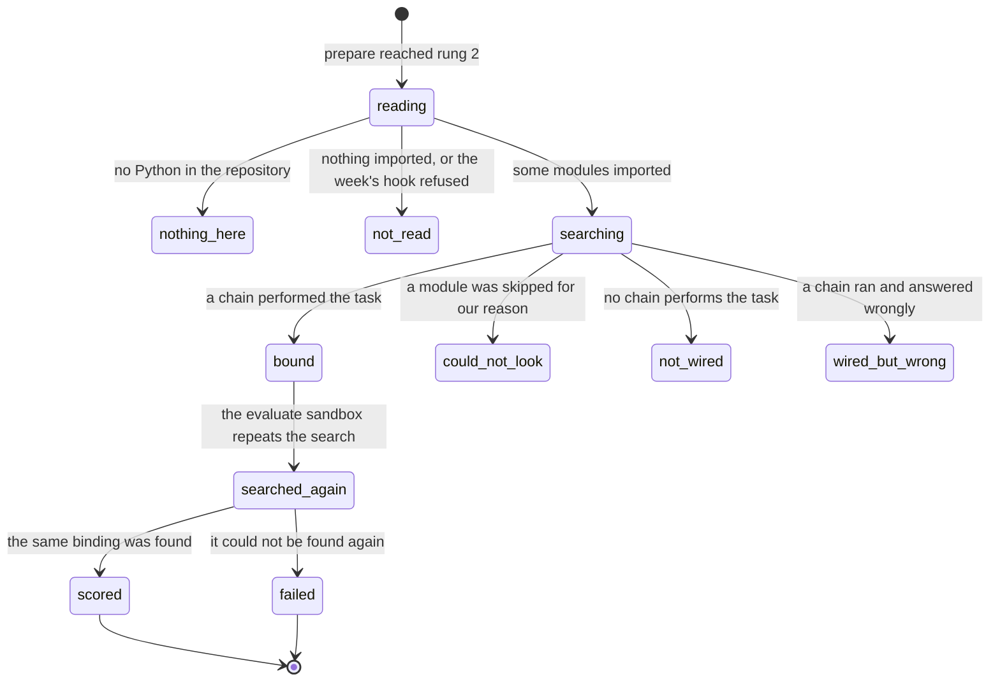

# Discovery

> **In flight.** `python/cogbench/src/cogbench/resolve.py`, `discover.py`, `verdict.py`, and
> `discovery_spec.py` were all being edited while this was written, as uncommitted work on top of
> `f74e087`, so every line number here is a working-tree number and several will have moved. Two
> changes landed mid-pass: the pairing search was rewritten to ask "can this store take an
> enrolment" once per store rather than once per pair, and `DiscoverySpec.reset` became
> `DiscoverySpec.grades`. Separately, `Verdict` grew an `errors` field of `Raised` records, "What
> their code raised while the search tried it, with the file and line inside their repository"
> (`verdict.py:225`), backed by a new `raised.py`. Re-read those four files.

## Summary

Discovery is how the platform finds a team's code when nothing in their repository says where it
is. It imports every module it can read, then calls their functions with inputs the benchmark
manufactured, passing each one's real output to the next, until a chain of them performs the
week's task. It is not static analysis. It runs the code, and the run is the proof. For every
repository in the 2026 corpus this is what happens, because none of the thirteen audited carries
a `pyproject.toml`, a `setup.py`, or a root `submission.py`. So the search is not a fallback; it
is the normal path, and the score a team reads rests on an inference the platform made about
which of their functions is the peak finder.

A student never sees it happen: it runs inside the prepare sandbox, under the `Install` node of the
pipeline rail, with no progress and no log. What a student sees is the result, a wiring trace on a
successful run or a refusal card on a run that found nothing. Everything before the search is
[`prepare.md`](prepare.md); everything after the binding is
[`scoring-and-refusals.md`](scoring-and-refusals.md).

## The simple case

A team's repository has `fingerprint.py` with `make_spectrogram`, `find_peaks`, and
`fingerprints_from_peaks`, plus `database.py` with `add_song` and `identify`. Nobody told the
platform any of that. Discovery imports both modules, hands the benchmark's fixture audio to every
function that will take it, keeps the ones whose output the next stage accepts, then tries pairs
of the remaining functions until one stores a song and names it back.

The run succeeds. On the run page, above the number, a panel headed "Your code, as it was run"
(`apps/portal/src/components/WiringTrace.tsx:43`) lists each step: the benchmark's name for the
stage on the left, `fingerprint.make_spectrogram` in the middle, and underneath it `took a list of
2 arrays · returned an array of shape (1025, 171)` (`WiringTrace.tsx:58`). That line is the
platform's whole claim about how it read their repository, and it is there so a team can tell a
wrong choice from a low score.

## The ask, event by event

### Asking

Discovery starts only when both declaration rungs came back empty, guarded on
`if resolved_by is None:` (`apps/runner-modal/src/cogworks_runner/modal_app.py:483`). It is handed
the unpacked project directory and the benchmark's own description of its task, a `DiscoverySpec`
(`python/cogbench/src/cogbench/discovery_spec.py:30`), which names the stages, supplies a fixture
real enough that working code succeeds on it, and supplies the week's acceptance test. The
resolver holds no week-specific code, so a benchmark with no `discovery()` cannot be searched and
the surfaces say so. One directory is then picked, at most two levels below the repository root
(`discover.py:161`): one whose name matches the week's hint, else the one the rest of the code
imports from, else the one holding the most importable files (`discover.py:456`). The choice is
recorded with its reason, which nothing on the run page shows.

### Answered without work

Two outcomes end the search before any of the team's functions is called with a benchmark input,
and both are verdicts rather than errors:

- **Nothing here.** "There is no Python in {repository} yet."
  (`python/cogbench/src/cogbench/verdict.py:440`), next step "Push your capstone code and run this
  again."
- **Not read.** Every module failed to import, and the headline names the worst one: "{module}
  could not be imported: {reason}" (`verdict.py:432`). The next step is named only when the
  platform honestly knows it: a missing package it can name, or "Fix the syntax error above, then
  push again." A module that raises on import gets none, because which line is wrong is theirs.

### The work begins

The first student module is imported. From that instant the team's code has run: import scope does
real work in this corpus, and one repository tunes a threshold across 25 iterations while being
imported. Nothing can be undone from there, which is why import is bounded at 30 seconds per module
(`discover.py:173`) and a module that exceeds it is skipped and named rather than left to hang.

### While it works

Nothing reaches the student. `resolve` takes an optional progress reporter and the default does
nothing, "which is what a library call wants: `resolve` is used by the Modal runner and the portal
worker as well as the terminal, and neither of those has anywhere to put a spinner"
(`python/cogbench/src/cogbench/progress.py:57`). So the whole search shows as the `Install` node,
lit, with a clock; the CLI's spinner and its "at most" estimate exist for `cogworks check` and
never appear in a hosted run.

**What bound means.** A stage is *bound* when one of the team's functions performed it and the
platform recorded how to call it: which function, which stage it filled, and the argument order
used. A binding is only ever accepted by the week's own acceptance test, never by a name match,
and the search is capped at 20,000 pairing attempts across the whole search rather than per chain
(`resolve.py:67`).

**What skipped means.** A module discovery could not read. Every skip carries an owner, and the
owner decides what the platform may say afterwards (`discover.py:297`):

| Owner | What it means | Does a verdict stand? |
| --- | --- | --- |
| `ours` | A package the graded run installs but this machine lacks, or a loader defect. | No. `read_enough_to_judge` is false and the run refuses to judge. |
| `environment` | A package genuinely absent from the graded run too. | Yes, and the skip is worth naming: the graded run fails the same way. |
| `theirs` | A syntax error, or a module that raises on import. | Yes, and the attribution is now true. |

The owner is decided per benchmark, because the three images differ. Without a benchmark the union
of all three is used, which errs toward calling a skip `ours`, the safe direction: it withholds a
verdict rather than asserting a wrong one. Four packages absent from every image are stubbed
rather than treated as missing, so a module importing one for a demo stays readable: `streamlit`,
`microphone`, `pyaudio`, `camera` (`discover.py:137`). The list is checked against the real
environment at every run, because `networkx` was once on it while the Week 2 image installed
`networkx==3.1`, and replacing a real package with a stand-in reported a team's own working
clustering as broken.

### How it ends

The search reaches one of five verdicts, each calling for something different, so collapsing them
into "it failed" would throw away the only information the student needs. Definitions live in
[`../foundations/what-the-portal-claims.md`](../foundations/what-the-portal-claims.md#the-five-verdicts);
below is the sentence discovery writes.

| Verdict | The headline the student reads |
| --- | --- |
| `scored` | "Your code is wired up and ready to score." (`resolve.py:1856`), replaced by the scorer's own sentence before the run page renders. |
| `wired_but_wrong` | "Your code ran end to end. On {task}, it answered {got} where the answer is {expected}." (`verdict.py:332`) |
| `not_wired` | "Nothing in your repository took {last returned} for the {stage} step, which is what {function} returned." (`verdict.py:375`), or, when nothing ran at all, "Nothing in your repository accepted the input the {stage} step passes." |
| `not_read` | "{module} could not be imported: {reason}" (`verdict.py:432`) |
| `nothing_here` | "There is no Python in {repository} yet." (`verdict.py:440`) |

Plus the refusal that is not a verdict. When any skip is owned by `ours`, `not_wired` refuses to be
written at all and returns `could_not_look` instead (`verdict.py:371`): "This check could not read
{n} of your files, because this machine is missing packages they import. That is a limit of this
check and not a problem with your repository: the graded run installs those packages and will read
them." A week with a database splits `not_wired` once more: when every chain offered was complete
and none could be paired, the refusal says so in the week's own terms rather than blaming the
algorithm, with "The benchmark found your fingerprinting but no pair of functions that stores a
song and then names it back." (`resolve.py:747`).

**Ready.** `Submission.ready` (`resolve.py:150`) decides whether prepare treats the search as
successful. A week whose task ends in a database needs a bound store and a bound query. A week
that is a straight pipeline, like Week 2's clustering, is ready as soon as its chain is: photos
in, one label per photo out, nothing kept between calls. A week whose role is several branches
over one pool is ready when the verdict says `scored`, because branches leave the chain empty on
purpose. Whatever it reaches, the record is written to `/tmp/discovery.json` inside the prepare
sandbox (`modal_app.py:524`), and prepare's failure raises "No adapter found in {project}, and no
set of functions in it performed the benchmark's task.{detail}" (`modal_app.py:535`), where detail
is a space plus the first 300 characters of the headline.

### The refusal that reaches the run page

`_refusal_from` (`modal_app.py:798`) reads `/tmp/discovery.json` back out of the sandbox and keeps
four fields: a status capped at 40 characters, a headline capped at 600, a next step capped at
600, and a trace capped at 16 steps. That object is attached to the `adapter_missing` failure and
to nothing else, which makes it the only structured refusal on the platform. The run page renders
it under the heading "WHAT THE BENCHMARK LOOKED FOR"
(`apps/portal/src/components/RefusalCard.tsx:39`): the headline in serif at the top, the next step
below it when there is one, and the trace at the bottom through the same component the successful
run uses, with `incomplete` set, so the heading reads "How far your code was followed"
(`WiringTrace.tsx:43`). The next step is present only when the platform honestly knows one, and it
is absent for a bug in the team's own code.

### The wiring trace

An `Observation` is four fields: `stage`, `function`, `received`, `returned` (`verdict.py:136`).
`function` is `module.function` exactly as it appears in their repository. `received` and
`returned` are `describe()`d shapes, not values: "an array of shape (1025, 171)", "a list of 5158
pairs" (`verdict.py:96`). Shape comes before contents because "what a reader checks is whether the
shape is the one their next function expects", and memory addresses are stripped (`verdict.py:89`)
so two runs of the same repository write identical bytes.

The trace reaches a successful run page by a different route from the refusal's. Prepare's binding
does not survive the process boundary, so `_discovered_factory` re-runs the whole search inside
the evaluate sandbox (`modal_app.py:635`) and writes the steps it bound there to
`/tmp/cog-wiring.json` (`modal_app.py:673`), appending two more rows for a database week, `store`
and `query`, naming the accepted pairing (`modal_app.py:671`). The write sits inside `try` /
`except Exception: pass`, commented "the score is the point; the explanation is worth less than
it" (`modal_app.py:676`). The controller reads it back, caps it at 16 steps (`modal_app.py:1717`),
and attaches it to the result only when non-empty (`modal_app.py:2394`). It renders only on a run
that succeeded, above the metrics.

> Technical note: the second search is not a formality. If it does not bind, the run fails with
> "The functions found when preparing this repository could not be found again: {headline}"
> (`modal_app.py:655`). Both searches read the same bytes and the search is deterministic, so a
> disagreement means the two sandboxes differ, which is what a student cannot debug.

## Modifiers

| Modifier | Set before the ask | Changed while it works |
| --- | --- | --- |
| Who you are | No effect. The search reads a directory and calls functions; it has no notion of a person, and an instructor reading the trace sees what the team sees. | No effect. |
| Where your team and repository stand | The entire input. An empty repository gets `nothing_here`; one whose modules will not import gets `not_read`; one whose best implementation sits in a skipped module gets a real number computed from a weaker candidate, which no verdict describes and only coverage does. | No effect. The repository was unpacked from one immutable archive before the search began. |
| Which week's benchmark | Decides the spec, the fixture, the acceptance test, and which package list a skip is judged against. Week 2 is a straight pipeline and is ready when its chain is; Week 1 and Week 3 end in a database and need a store and a query. Week 3 declares branches, so a repository can bind half of it. | No effect. |
| Practice or leaderboard | A practice run searches. An official run reuses the prepared artifact, so its prepare-time search never happens; the evaluate-time search in `_discovered_factory` still runs, because that is where the binding is rebuilt. | No effect. |
| Flags, options, and where you are typing | Nothing a student sets reaches a hosted search. `remember`, which caches a binding and replays it, is off by default because "a graded run should search: the point of an official score is that it was computed, not recalled" (`resolve.py:546`); only `cogworks check` turns it on. | No effect. |

## Cancel and interrupt

| Event | Before the work begins | While it works |
| --- | --- | --- |
| You stop it yourself | Cancelling before the first import leaves nothing: no module loaded, no function called. | The team's code has already run inside the sandbox. Nothing of it escapes, because the sandbox is discarded, but the search is not told to stop and no partial trace is written. |
| You do something else mid-way | No effect. The search is not attached to a browser. | No effect. Closing the run page stops the poll; the search continues. |
| A teammate acts at the same time | A second run on the same benchmark is refused with `active_run_exists` before a second search could start. | A push mid-search does not reach it: the archive was fetched once and the search reads the unpacked copy. |
| The portal fails | No search has started, so nothing is lost. | The search does not talk to the portal at all, so a portal outage is invisible to it. What is lost is the `installing` heartbeat, so the rail stops updating while the search runs on. |
| The process goes away | Nothing to lose. | Everything is lost, including the verdict: `/tmp/discovery.json` lives in the sandbox filesystem, and `_refusal_from` reads it only when the prepare process exits non-zero and the sandbox is still alive. A killed container produces `provider`, with no refusal attached. |
| The thing being measured changes | The commit is resolved before the archive is fetched. | No effect. Both searches, the prepare one and the evaluate one, read the same unpacked bytes. |
| Refused, or out of credit | Quota was settled before the run started. | Not reachable. The search spends nothing and consults nothing. A refusal produced here is a verdict about the repository, not a quota decision. |

A search that ends in a refusal still costs the practice slot: that was spent when the run row
was written, and `adapter_missing` is not marked as the platform's fault, so nothing is refunded.

## Interactions with other systems

**Who may do this.** No role gate. The search runs because a run runs, and it produces the same
trace for whoever reads it.

**The team owns it.** Every function named in a trace belongs to the team, and the trace names
functions rather than people. That is what keeps it inside the no-per-person-numbers rule: it says
what ran, never who wrote it.

**Credit.** The search neither spends nor refunds. Its verdict decides which failure category
prepare raises, and that decides the refund; see
[`../cross-cutting/credit-and-quota.md`](../cross-cutting/credit-and-quota.md).

**What the portal claims.** Discovery produces most of the platform's vocabulary: the five
verdicts, `could_not_look`, and the coverage that qualifies all of them. It has one rule, stated
at `verdict.py:34`: report what ran and what came back, never why it is wrong or what to change.

**What the benchmark supplied.** The search records everything it handed the team's code that
did not come out of their code: the name of each item, a GloVe table, a folder pointed at the
benchmark's files, an id-to-name table over the enrolled songs (`resolve.py:362`). It reaches
`/tmp/discovery.json` under `supplied` and goes no further; see the open questions.

**Live updates and reconnection.** None of its own; the only signal is prepare's `installing`
heartbeat every 2.0 seconds, which says nothing about the search's progress.

**Discord.** Nothing during; a refusal headline reaches a channel truncated to 300 characters when
the run settles. See [`../discord/channel-messages.md`](../discord/channel-messages.md).

**Configuration.** None a student can reach. The constants are 20,000 attempts (`resolve.py:67`),
30 seconds per import (`discover.py:173`), two directory levels (`discover.py:161`), and 16 trace
steps, capped in three places and never reported: the sandbox (`modal_app.py:1717`), the wire
schema (`packages/contracts/src/protocol.ts:126`), and the refusal (`modal_app.py:798`).

## Edge cases

- **A `scored` run can still be wrong for the repository.** If a team's best implementation sits
  in a module that failed to import, the search binds a weaker candidate from what is left and
  publishes a real number. Only coverage describes that, which is why coverage travels with every
  verdict rather than only with failures (`verdict.py:222`).
- **The wiring panel and the refusal card never appear together.** The panel renders only inside
  `run.status === "succeeded"` (`apps/portal/src/routes/RunDetailPage.tsx:246`); the refusal card
  only inside `run.failure` (`RunDetailPage.tsx:178`). Both use the same component, so the only
  difference a student sees is the heading. A malformed trace costs the panel and not the page:
  `parseWiring` (`apps/portal/worker/http/serializers.ts:183`) validates the stored JSON and
  returns an empty list on any failure.
- **The trace is safe on an official run for the same reason diagnostics are.** It names their code
  and the shapes it passed, never the hidden data (`serializers.ts:144`), so the sanitized log is
  suppressed on an official run and the wiring is not. `describe()` reports a shape and never a
  value, which is also what makes two runs of the same repository byte-identical (`verdict.py:96`).

## Open questions and verification

- **The record carries two student-facing things the run page has no field for.** `resolve.py:275`
  comments "A run page shows this under 'supplied', because a score computed with a resource we
  provided is a different claim from one computed without it", and the record does carry `supplied`
  into `/tmp/discovery.json`. The new `errors` field (`verdict.py:225`) carries the file and line
  inside their repository where their code raised. Neither reaches the browser: `_refusal_from`
  keeps only the four refusal fields (`modal_app.py:798`), `_collect_wiring` only the four wiring
  fields (`modal_app.py:1703`), and grepping `supplied` or `"errors"` across `apps/portal/src` and
  `packages/contracts/src` returns nothing. The `supplied` case is a bug: a comment asserts
  behavior the wire does not implement. The `errors` case is in flight.
- **`_WIRING` is module-level mutable state on a reused container.** Declared at
  `modal_app.py:1260`, cleared and refilled by `_collect_wiring` (`:1612`, `:1618`), and
  `execute_job` assigns the list itself into the result rather than a copy (`:2338`). Modal reuses
  containers across inputs. This is not a live cross-team leak at this commit, for a narrow and
  undocumented reason: `execute_job` declares no concurrency (`@app.function` at
  `modal_app.py:2304` carries no `@modal.concurrent`), so one input runs at a time, and all four
  evaluate paths call `_collect_wiring`, which clears first, before the result is built. Adding a
  concurrency decorator would publish one team's function names on another team's run, and nothing
  in the file or its tests records that dependency. A latent bug, not an active one. **Unverified**
  against Modal's runtime.
- The second search, in `_discovered_factory`, doubles the search cost for every discovered
  repository and is the only place "could not be found again" can be raised. How often it disagrees
  with the first search was not measured. **Unverified.**
- The 20,000-attempt ceiling produces a `not_wired` verdict indistinguishable from a genuine
  absence of a binding, and nothing says it was reached. A gap.
- Nothing about the search was observed running: the wiring panel, the refusal card, and every
  headline above are read from source, not from a browser. **Unverified.**

Verified against Cog\*Portal commit `f74e087`.
