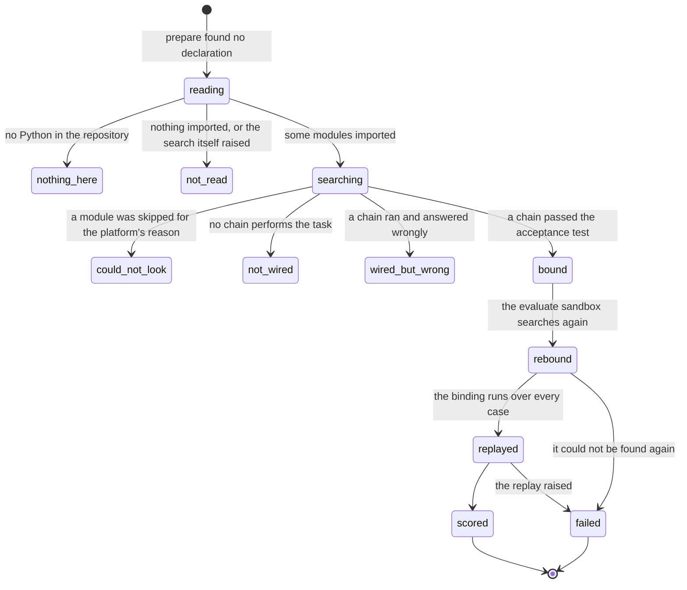

# Discovery

## Summary

Discovery is how the platform finds a team's code when nothing in their repository says where it is.
It imports every module it can read, then calls the team's functions with inputs the benchmark made
up, passing each one's real output to the next, until a chain of them passes the benchmark's own
acceptance test. It is not static analysis: it runs the code, and the run is the proof. None of the
thirteen audited 2026 repositories carries packaging or a root `submission.py`, so this is the
normal path, and every hosted score rests on the platform's choice of which function is, say, the
peak finder.

A practice run searches twice. The prepare sandbox searches to decide whether there is anything to
score; the evaluate sandbox searches again to rebuild the binding it then runs over every case. An
official attempt reuses its practice run's prepared environment, so it searches only in Evaluate. A
student never watches either search. They see the result: a wiring trace on a successful run, a
refusal card on a run where nothing could be bound, or an ordinary failure card when the bound
pipeline broke during evaluation. Everything before the search is [`prepare.md`](prepare.md);
metrics and scoring refusals are [`scoring-and-refusals.md`](scoring-and-refusals.md).

## The simple case

A Week 1 repository has `fingerprint.py` with `make_spectrogram`, `find_peaks` and
`fingerprints_from_peaks`, and `database.py` with `add_song` and `identify`. Nothing tells the
platform that. Discovery imports both modules, feeds the benchmark's fixture audio to every function
that will take it, keeps the ones whose output the next stage accepts, then tries pairs until one
function stores a song and another names it back.

The run succeeds. Under the finding, a list headed "Your code, as it was run"
(`apps/portal/src/components/WiringTrace.tsx:42`) names each stage, the team's `module.function`, and
a line such as `took an array of shape (132300,), 44100 · returned an array of shape (1025, 171)`
(`WiringTrace.tsx:62`), then two rows, `store` and `query`, naming the pair
(`apps/runner-modal/src/cogworks_runner/modal_app.py:882`). That list is the platform's whole claim
about how it read the repository, there so a team can tell a wrong choice from a low score.

Observed on the hosted beta for a vision-recognition repository (`run_f93ba19397`,
beta-qa `hosted-run_f93ba19397/succeeded-ui.txt`, in the pre-redesign layout): `descriptors`,
`get_descriptor.file_descriptors`, "took a tuple of 6, starting with an array of shape (218, 178, 3)
returned a list of 6, starting with an array of shape (1, 512)"; `store`,
`vector_db.VectorDatabase().add`; `query`, `vector_db.VectorDatabase().predict`. The store and query
rows carry no shapes.

## The ask, event by event

```mermaid
stateDiagram-v2
    [*] --> reading : prepare found no declaration
    reading --> nothing_here : no Python in the repository
    reading --> not_read : nothing imported, or the search itself raised
    reading --> searching : some modules imported
    searching --> could_not_look : a module was skipped for the platform's reason
    searching --> not_wired : no chain performs the task
    searching --> wired_but_wrong : a chain ran and answered wrongly
    searching --> bound : a chain passed the acceptance test
    bound --> rebound : the evaluate sandbox searches again
    rebound --> replayed : the binding runs over every case
    rebound --> failed : it could not be found again
    replayed --> scored
    replayed --> failed : the replay raised
    scored --> [*]
    failed --> [*]
```

### Asking

Discovery starts only when packaging and a root file both came back empty
(`modal_app.py:688`). The prepare script loads the benchmark plugin, asks it for its `discovery()`
description (which stages, a fixture real enough that working code succeeds on it, the acceptance
test, and any resources), and calls `from_spec` with the benchmark id so missing-package advice is
judged against this track's image (`modal_app.py:696` to `:713`). Then one code directory is chosen,
at most two levels below the root (`python/cogbench/src/cogbench/discover.py:138`): one whose name
matches the week, else the one the rest of the code imports from, else the one with the most
importable files (`discover.py:486` to `:535`). The reason is recorded and nothing on the run page
shows it.

### Answered without work

Two verdicts end the search before any team function receives a benchmark input:

- **Nothing here.** "There is no Python in {repository} yet." with "Push your capstone code and run
  this again." (`python/cogbench/src/cogbench/verdict.py:496`).
- **Not read.** "{module} could not be imported: {reason}" (`verdict.py:488`). A next step appears
  only when the platform knows one: a missing package it can name, or "Fix the syntax error above,
  then push again." (`resolve.py:3707`).

If the search itself raises, prepare writes a `not_read` record headed "The search for your code
could not finish: {error}" and fills an empty next step with "Run cogworks check --benchmark {id}
locally to inspect the search." (`modal_app.py:721`, `:731`). Platform bugs in the search land here,
and the failure copy deliberately claims only that scoring was not reached (`failures.ts:67`).

### The work begins

The first team module is imported. Import scope does real work in this corpus (one repository tunes
a threshold across 25 iterations while being imported), so from here the team's code has run. Each
import is bounded at 30 seconds (`discover.py:149`); a module that exceeds it is skipped and named.

### While it works

Nothing reaches the student. The whole search shows as `Install`, lit, with a clock. On the hosted
beta, Install for one vision-recognition repository took 88.0 s and 63.8 s on two runs, and that
includes pip.

**Bound.** A stage is bound when a team function performed it and the platform recorded how to call
it: which function, which stage, which argument order, and, when the function returns a tuple, which
part of it the next stage reads. Only the benchmark's acceptance test accepts a binding, never a name
match. The search stops after 20,000 pairing attempts in total (`resolve.py:105`).

**Skipped.** Every skipped module carries an owner (`discover.py:280`):

| Owner | When | What it does to the verdict |
| --- | --- | --- |
| `ours` | A package would not import, or the file could not be loaded under any available name. | Blocks a verdict: the result is `could_not_look`. |
| `theirs` | A syntax error, a module that raised on import, or one that took longer than 30 seconds. | The verdict stands; the skip is shown with its reason. |

`environment` still exists in the vocabulary and in old records, and blocks a verdict like `ours`
(`verdict.py:207`), but nothing produces it: claiming a package is absent from the graded image
needs that image's full package set, which the search cannot see (`discover.py:289`). Four packages
absent from every image are stubbed so a module that imports one for a demo stays readable:
`streamlit`, `microphone`, `pyaudio`, `camera` (`discover.py:114`).

### How it ends

| Verdict | Headline the student reads |
| --- | --- |
| `scored` | Never shown as a headline; the run page leads with the scorer's finding. |
| `wired_but_wrong` | "Your code ran end to end. On {task}, it answered {got} where the answer is {expected}." (`verdict.py:386`) |
| `not_wired` | "Nothing the search tried took {value} for the {stage} step, which is what {function} returned." or "Nothing the search tried accepted the input the {stage} step passes." (`verdict.py:428`, `:440`) |
| `could_not_look` | "This check could not read {one of your files / N of your files}, so it could not finish looking for the code this task needs." (`verdict.py:473`) |
| `not_read` | "{module} could not be imported: {reason}" |
| `nothing_here` | "There is no Python in {repository} yet." |

On a week with a database, a `not_wired` whose every chain was complete but could not be paired
carries the next step "Check that two of your functions take what {function} returns: one that
stores it under a name, and one that looks up a new one and returns the name." (`resolve.py:2148`).

**Ready.** A database week needs a bound store and query; a straight pipeline is ready when its
chain is and the verdict is `scored`; a week made of branches is ready when the verdict is `scored`
(`resolve.py:333`). Anything short of ready writes the record to `/tmp/discovery.json` and fails
prepare with "No adapter found in {project}, and no set of functions in it performed the
benchmark's task. {headline}" (`modal_app.py:746`), which becomes E-ADAPTER.

### The refusal that reaches the run page

The controller reads the record back and keeps the status, headline, next step, up to 16 trace
steps, 8 notes, 32 skipped modules with their owners, and 16 errors with file and line inside the
repository (`modal_app.py:1042`). The run page renders it inside the failure card
(`apps/portal/src/components/RefusalCard.tsx:95`): a mono line "refused at {stage}" (the stage read
out of the headline, else the rail node), the E-code and mode beside it, the headline in serif, then
labelled rows:

- `after`: "{function} returned {shape}", the last hand-off that worked.
- `not read`: "1 module, which may hold what the run looked for" or "{n} modules, any of which may
  hold what the run looked for", each with its reason, "(ours)" when the skip was the platform's,
  and a `fix` line for two recognized cases: "open the file inside the function, not at import" and
  "move the microphone call out of module scope" (`RefusalCard.tsx:57`).
- `raised`: `{file}:{line}` and the exception, "(in {function})".
- `next`: the verdict's next step when there is one, then always `cogworks check --benchmark {id}
  --update-setup` (`RefusalCard.tsx:226`).

Below, the same trace component as a successful run, headed "How far your code was followed"
(`WiringTrace.tsx:42`). Notes are carried but not rendered (`RefusalCard.tsx:24`). Observed locally
on fixture data (`/tmp/cogshots/rundetail-states/refusal-desk.png`); the fixture's headline is older
wording than the verdict module writes.

Status, `f03ebfa` (2026-10-03): the notes are drawn. The first sits under the headline; the rest fold
behind "{n} more notes from the search" (`RefusalCard.tsx:100-126`, `:177`). Seen on the local run
page with a synthetic refusal row carrying three notes
(`~/.long-run/cogportal/evidence/student-recovery/screens/runpage-not-wired-notes.png`).

### The second search and the replay

The binding found in prepare does not cross into the evaluate sandbox. `_discovered_factory`
searches again from the same unpacked bytes (`modal_app.py:847`), writes the steps it bound to
`/tmp/cog-wiring.json`, and hands the benchmark a submission built from that binding. If it cannot
bind, the run fails with "The functions found when preparing this repository could not be found
again: {headline}" (`modal_app.py:866`). The benchmark's driver then runs the bound functions over
every case through `cogbench.pipeline`, which replays each recorded call, including "read part *k* of
what this step returned" (`python/cogbench/src/cogbench/pipeline.py:812`).

Both of those run after the evaluate script has marked the step as the student's
(`modal_app.py:941`, `:972`, `:993`, `:1008`). Any exception from the second search or from the
replay, the platform's own included, is reported as E-RUNTIME "Your code raised an exception" with
the exception message as the detail.

That happened on the hosted beta. On `run_f5fc5babe5` (vision-recognition,
`SamGu-NRX/week2_capstone@29f9cf9`), the team's describe step returns a tuple for a face and `None`
for a photo with no face. The search binds it on the fixture, which has faces. The replay then reads
part *k* of every answer and fails on the first `None` with `'NoneType' object is not subscriptable`
(`pipeline.py:834` on the candidate). The beta run page read "Your code raised an exception",
"Evaluation started, but your submission raised an unhandled exception while processing benchmark
inputs.", and offered `cogworks run --benchmark vision-recognition`
(beta-qa `hosted-run_f5fc5babe5/failed-dom.txt`). Beta commit `468655c` passes `None` through; its
Retry `run_f93ba19397` scored 0.925. The candidate does not carry that fix.

## Modifiers

| Modifier | Set before the ask | Changed while it works |
| --- | --- | --- |
| Who you are | No effect. The search reads a directory; an instructor sees the trace the team sees. | No effect. |
| Where your team and repository stand | The entire input. An empty repository gets `nothing_here`; unimportable modules get `not_read`; a module skipped for a missing package gets `could_not_look`. The best implementation in a module that raised on import is skipped as `theirs`, and the search can bind a weaker candidate from what is left. | No effect. The repository was unpacked once. |
| Which week's benchmark | Decides the spec. `audio-identification`: a fingerprint chain, then a store and a query paired by trial. `vision-recognition`: a describe step from photos (as arrays or as file paths) to descriptors, with the course FaceNet model supplied as `model`, then a store and a query; a describe step that answers `None` for a faceless photo crashes the replay on the candidate. `vision-clustering`: a straight pipeline from photos to one label per photo, nothing stored. `language-search`: branches over one pool with GloVe supplied and the course artifacts mapped to local files; the image branch binds only when trained weights load, so a repository can bind half. Missing-package advice is judged against that track's image. | No effect. |
| Practice or leaderboard | A practice run searches twice. An official attempt skips prepare's search and still runs the evaluate-time search, because that is where the binding is rebuilt. | No effect. |
| Flags, options, and where you are typing | Nothing a student sets reaches a hosted search. Remembering a binding between runs is off by default; only `cogworks check` turns it on (`resolve.py:1480`, `cli.py:342`). | No effect. |

## Cancel and interrupt

| Event | Before the work begins | While it works |
| --- | --- | --- |
| You stop it yourself | There is no cancel. | The team's code has run inside the sandbox; nothing escapes it, and no partial trace is kept. |
| You do something else mid-way | No effect. The search is not attached to a browser. | No effect. Leaving the run page stops the poll. |
| A teammate acts at the same time | A second run on the same benchmark is refused with `active_run_exists`. | A push does not reach the search; it reads the unpacked copy. |
| The network or the portal fails | No effect. | The search never talks to the portal. A lost heartbeat only stops the rail updating. |
| The page or the process goes away | Nothing to lose. | A killed prepare sandbox loses the record with it; the student gets E-INSTALL or E-PROVIDER with no refusal (see [`timeouts-and-limits.md`](timeouts-and-limits.md)). |
| The thing being measured changes | The commit was recorded before the fetch. | No effect. Both searches read the same bytes. |
| The platform refuses or credit runs out | Admission reserved capacity; a failed execution uses no quota. | Not reachable. A refusal here is a verdict about the repository, not a quota decision. |

## Interactions with other systems

**Who may do this.** No role gate. The search runs because a run runs.

**The team owns it.** Every function in a trace belongs to the team, and the trace names functions,
never people, which keeps it inside the no-per-person-numbers rule.

**Credit.** A refusal or an evaluation failure uses no quota; see
[`../cross-cutting/credit-and-quota.md`](../cross-cutting/credit-and-quota.md).

**What the portal claims.** The verdicts and `could_not_look` are discovery's. Its rule: report what
ran and what came back, never why it is wrong (`verdict.py:33`). The evaluate-side attribution above
breaks that rule in the other direction, by telling the team its code raised when the platform did.

**What the benchmark supplied.** The search records what it handed the team's code that did not come
from it: the name of each item, a GloVe table, a folder pointed at the benchmark's files, an
id-to-name table (`resolve.py:1364` to `:1399`), written under `supplied` (`resolve.py:628`). It
reaches `cogworks check --json` and no hosted surface: neither the refusal nor the wiring carries it
(`packages/contracts/src/protocol.ts:118`).

**Live updates and reconnection.** None of its own; only prepare's `installing` heartbeat.

**Discord.** Nothing during. A refusal headline reaches the channel cut to 300 characters
(`apps/portal/worker/services/discord-messages.ts:233`).

**Configuration.** None a student can reach: 20,000 attempts, 30 seconds per import, two directory
levels, and 16 trace steps (capped in the sandbox, the wire schema and the refusal, and never
reported).

## Edge cases

- **A succeeded run can rest on a weaker candidate.** If the best implementation sits in a module
  that raised on import, the search binds what is left and publishes a real number. The trace names
  what ran; nothing on a succeeded run lists what was skipped.
- **The wiring list appears in two places.** On a succeeded run, under the readings
  (`RunDetailPage.tsx:517`); on a failed run that still recorded findings, under "Recorded before it
  stopped" inside the failure details (`RunDetailPage.tsx:221`). A malformed stored trace costs the
  list and not the page (`apps/portal/worker/http/serializers.ts:257`).
- **The trace is safe on an official run.** It names the team's functions and shapes, never values
  from the hidden split, so it is kept while the log is suppressed.
- **The refusal's next row can repeat itself.** A `not_read` refusal whose next step is the filled-in
  "Run cogworks check --benchmark {id} locally to inspect the search." is followed by the always-on
  `cogworks check --benchmark {id} --update-setup`. The flag on that second command does nothing when
  the check fails (B-16), which is the case that produced the refusal.
- **"This check" on a hosted page.** The `could_not_look` headline was written for the CLI and is
  shown unchanged on a hosted run.

## Open questions and verification

- Hosted beta (`4984730`) differs: the replay passes a per-item `None` through
  (`git -C <beta> show 4984730:python/cogbench/src/cogbench/pipeline.py`, lines 834 to 841) where the
  candidate indexes it (`pipeline.py:834`). Every other discovery source file is identical between the
  two builds.
- The evaluate-side owner rule assigns platform search and replay errors to the team. Prepare treats
  the same kind of error neutrally (`apps/runner-modal/tests/test_prepare_attribution.py:165`). Which
  wording evaluation should use is a product call; the observation is beta `run_f5fc5babe5`.
- The `supplied` record is still built and still dropped before the portal (B-04). The comment that
  promised a run page would show it is gone (`resolve.py:630`).
- `errors` and `skipped` now reach the run page; the earlier open question about them is closed.
- `_WIRING` is module-level state assigned into the result without a copy (`modal_app.py:1606`,
  `:2301`). It is safe only because `execute_job` declares no concurrency (`modal_app.py:2155`).
  Unchanged and still latent.
- How often the second search disagrees with the first was not measured.
- Reaching the 20,000-attempt ceiling produces a `not_wired` indistinguishable from a real absence.
- Nothing on the candidate was observed running. The refusal card and wiring list were seen on
  local fixture data only.

Read against Cog\*Portal commit `2ff32fa`.
