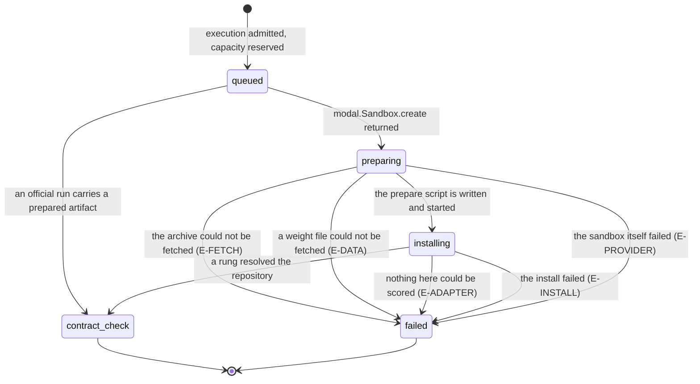

# Prepare

> **In flight.** Two areas changed under this document while it was written, so every
> `modal_app.py` line number here is a working-tree number as of 23:01 on the drafting day, not an
> `f74e087` number. Re-read the source rather than trusting the prose.
>
> - **Instructor adapters were removed.** At `f74e087` the images carried `benchmarks/adapters/`,
>   prepare staged one when a repository had none of its own, and it recorded
>   `resolved_by = "instructor_adapter:<slug>"`. That is gone: `benchmarks/adapters/` is deleted,
>   `apps/runner-modal/src/cogworks_runner/modal_app.py` no longer holds `STAGED_ADAPTER_DIR`,
>   `_repository_slug`, the `/opt/adapters` image copies, or the staging block, and
>   `apps/runner-modal/tests/test_prepare_rungs.py` and `test_archive_safety.py` were edited to
>   match. This document describes the source without them.
> - **`cogworks sync` uploading a local run's weights landed mid-pass and is now whole.** An
>   earlier draft said no such mechanism existed; that is wrong. `upload_weight` PUTs raw bytes to
>   `/api/v1/local-reports/{reportId}/weights/{path}` (`python/cogbench/src/cogbench/client.py:158`),
>   the worker registers that route (`apps/portal/worker/routes/local-reports.ts:26`) and a signed
>   read-back at `GET /v1/runs/:id/weights/*` (`apps/portal/worker/routes/runs.ts:57`), the job
>   carries a `weights` array (`protocol.py:33`), and prepare fetches each file. It has not been run.

## Summary

Prepare is the part of a hosted run between pressing "Start run" and the platform having something
it can score. It fetches the repository as an archive, unpacks it, pulls down any weight files the
team uploaded, works out how the repository declares what to run, installs what it can, and hands
the evaluate step a frozen filesystem. It has no screen of its own: a student meets it as two of
the seven nodes on the pipeline rail, `Prepare` and `Install`
(`apps/portal/src/lib/run-meta.ts:9`), the elapsed timer beside them, and, when it fails, a failure
card carrying one of five codes. This document owns everything up to the point where the platform
starts running the team's own functions to find them. The search itself is
[`discovery.md`](discovery.md).

## The simple case

A student presses "Start run". The run row is written with status `queued`
(`apps/portal/worker/services/run-actions.ts:278`), the run page opens, and the rail shows `Queued`
lit. A few seconds later the `Prepare` node lights, then `Install`, and `Install` stays lit for
anything from a few seconds to several minutes while the elapsed time counts up. Under the rail, a
practice run says "Updates every 2 s." (`apps/portal/src/routes/RunDetailPage.tsx:160`). Nothing
else is shown: no log, no line naming the archive, no package list, no note saying which rung
resolved the repository. The student sees a lit node and a clock, then `Contract check` lights.

## The ask, event by event

### Asking

The controller receives a signed job and validates it before any container exists. The job must
carry exactly ten fields, no more and no fewer
(`apps/runner-modal/src/cogworks_runner/protocol.py:23`), a forty-character commit, and an
archive URL beginning `https://api.github.com/repos/` (`protocol.py:46`). An official run must
already carry a prepared artifact: "Official runs require a prepared artifact."
(`protocol.py:42`). That last rule decides whether prepare happens at all:
`snapshot_id = job["preparedArtifactId"] or _prepare(job, reporter)` (`modal_app.py:2318`), so
a run with a prepared artifact never enters prepare and never emits `preparing` or
`installing`. It goes straight to `contract_check` (`modal_app.py:2322`), and on the rail an
official run's `Prepare` and `Install` nodes fill without ever having been the current node.

### Answered without work

A job that fails validation is refused before `modal.Sandbox.create` is called, so no container is
created and no event is emitted. From the run page's point of view prepare never started: the run
stays at `queued` until the worker's own failure path moves it. The two sentences a student can
meet here are the worker's, not the sandbox's, and both come after capacity has been reserved, because
the run row is written first: "The run could not be queued for Modal."
(`apps/portal/worker/services/run-actions.ts:168`) and "The run could not be queued. Try again."
(`run-actions.ts:176`). See [`../foundations/the-run.md`](../foundations/the-run.md).

### The work begins

`modal.Sandbox.create` returning. `reporter.status("preparing")` is the line immediately after it
(`modal_app.py:1205`), so the `Prepare` node lighting on the rail is the student's proof that a
container exists. Before that instant the run has reserved capacity but used no quota; after it, a
container is running against the team's repository. The sandbox is created with an outbound
allowlist of four fixed hosts, `api.github.com`, `codeload.github.com`, `pypi.org`,
`files.pythonhosted.org`, plus the portal's own hostname from the callback URL
(`modal_app.py:1189`). Nothing else is reachable. The portal is on the list only so prepare can
fetch weight files; every other request the sandbox could make is refused by the network.

### While it works

`reporter.status("installing")` is emitted once (`modal_app.py:1207`), then a heartbeat thread
re-emits it every 2.0 seconds for the whole of the prepare exec (`modal_app.py:948`). One node
covers everything below, and a student watching the rail cannot tell which step is running.

**The archive.** One `urllib` request with a 30 second socket timeout, read in 1 MiB chunks, capped
at 100 MiB. The cap is checked twice: against the declared `Content-Length` before a byte is read,
and against the running total while reading (`modal_app.py:327` and `:335`). Both raise "Source
archive is larger than 100 MiB.", and both are swallowed by the surrounding handler, which
re-raises "Source archive could not be downloaded safely." (`modal_app.py:338`). The student never
sees the size sentence: several distinct download failures wear one message so `_prepare` can
route on it.

**Extraction.** Every tar member is checked before anything is written. Three refusals:

- "Source archive contains a link or special file." (`modal_app.py:344`), for a symlink, a
  hardlink, or a device node.
- "Source archive contains an unsafe path." (`modal_app.py:347`), for a member resolving
  outside `/workspace`, including one disguised by a legitimate prefix, and an absolute path.
- "Source archive must contain one project root." (`modal_app.py:351`), when the archive does
  not unpack to exactly one directory, which is what GitHub's tarball endpoint returns.

> Technical note: all three contain the word "archive", which is load-bearing rather than
> stylistic. `_prepare` routes on `"source archive" in normalized` (`modal_app.py:1228`), so a
> refusal that dropped the word would be attributed to the team's packaging.

**Weight files.** A team whose trained weights are too large to commit uploads them with
`cogworks sync`, and prepare fetches them into the unpacked repository before anything imports it.
Each is capped at 200 MiB (`modal_app.py:355`), must land inside the project, and must arrive at
exactly the size the job declared. Four refusals, all naming the file: "Weight file has an unsafe
path: {path}" (`modal_app.py:364`), "Weight file is larger than 200 MiB: {path}"
(`modal_app.py:366`), "Weight file size changed from {n} to {m} bytes." (`modal_app.py:388`), and
the wrapper the student reads, "Weight file {path} could not be downloaded safely."
(`modal_app.py:392`). The request is HMAC-signed over the path, so the portal serves a run's own
weights and nothing else. A committed file is never uploaded: `cogworks sync` checks `git ls-files`
and prints "weights: {path} is committed and travels with the repository" (`cli.py:710`).

**Rung 0, packaging and an entry point.** If the repository root has a `pyproject.toml`,
`setup.py`, or `setup.cfg`, prepare runs `pip install -e` against it with a 420 second timeout
(`modal_app.py:427`). If that install succeeds and registers exactly one
`cogworks.submissions.v2` entry point named for this benchmark, the repository is resolved. More
than one raises "Submission adapter entry point is ambiguous." (`modal_app.py:471`). A build
failure here is fatal only when nothing else can resolve the repository, because failing it
"would spend one of three official attempts on our packaging preference" (`modal_app.py:430`).

**Rung 1, a declared file.** A `submission.py` or a `benchmark_adapter.py` at the repository root,
imported by path in the evaluate sandbox rather than installed here (`modal_app.py:409`). The
source prefers this rung on safety grounds: `pip install -e` executes the repository's own
`setup.py` in this sandbox, which still has PyPI access, while importing one file happens later
behind `block_network=True`.

**Between the rungs, `requirements.txt`.** A best-effort `pip install -r requirements.txt` with a
300 second timeout. Its failure is a warning and never stops the run: it writes
`COG_NOTE: requirements.txt did not install: <first 200 characters>` to stderr
(`modal_app.py:455`) and continues, because "the import that actually needs it will fail later in
the student's own frame, which names the module, rather than here in ours, which names pip."
Nothing surfaces that note, because prepare stderr is only read on a non-zero exit.

**Rung 2, discovery.** Guarded on `if resolved_by is None:` rather than merely ordered last
(`modal_app.py:483`), so a team that declared anything is scored by their declaration. Everything
from here is [`discovery.md`](discovery.md).

### How it ends

On success, `reporter.status("contract_check")` (`modal_app.py:1240`) and the sandbox filesystem
is snapshotted. Two files carry state forward: `/tmp/project-root.txt`, the directory the
repository unpacked into, and `/tmp/adapter-source.txt`, the string naming which rung won
(`modal_app.py:540`, `:541`). The evaluate step changes directory into the first and branches
on the second. On failure, `_prepare` takes one line from the process stderr and routes on it,
by substring, in a fixed order (`modal_app.py:1226`):

| Detail contains | Category | Reported phase | Platform's fault | What the student reads |
| --- | --- | --- | --- | --- |
| "source archive" | `repository_fetch` | `preparing` | no | E-FETCH, "Repository could not be fetched" |
| "weight file" | `data_download` | `preparing` | no | E-DATA, "Benchmark data is not ready" |
| "no adapter found" or "entry point" | `adapter_missing` | `contract_check` | no | E-ADAPTER, "Nothing here could be scored" |
| anything else | `dependency_install` | `installing` | no | E-INSTALL, "Dependency installation failed" |
| an exception around the sandbox | `provider` | `preparing` | **yes** | E-PROVIDER, "Execution provider failed" |

The codes, titles, and explanations are `packages/contracts/src/failures.ts:32`, `:54`, `:76`,
`:43`, and `:159`. Only the `adapter_missing` branch attaches a refusal object, and it is the only
route in the platform that does (`modal_app.py:1235`); see
[`discovery.md`](discovery.md#the-refusal-that-reaches-the-run-page). **No failed execution uses quota**, regardless of its category. The `infrastructure` flag
attributes a failure; it does not decide its cost. The `adapter_missing`
route reports phase `contract_check` even though the failure happened during `installing`, so the
rail marks it at the node whose name matches what went wrong.

> Technical note: the detail line comes from `_last_error_line` (`modal_app.py:2158`), which walks
> back to the last unindented line that is not a `File "..."` frame and strips a leading
> `ExceptionClass: ` prefix. Taking the last 240 characters instead yielded details like
> `line 144, in <module>`, which names the platform's script and tells a student nothing.

## Modifiers

| Modifier | Set before the ask | Changed while it works |
| --- | --- | --- |
| Who you are | No effect on prepare. The sandbox never sees a person: the job carries a team's repository, a commit, and a benchmark. An instructor watching another team's run sees the identical rail. | No effect. A role change mid-run does not reach a container that is already executing. |
| Where your team and repository stand | The whole input. Prepare is about one repository at one commit, resolved before the run started. A repository made private after the run began fails the fetch, because GitHub's archive endpoint stops answering. A repository with no packaging and no `submission.py` reaches rung 2. | No effect. The commit was resolved at the start and the archive is fetched once. A push mid-prepare changes nothing about this run. |
| Which week's benchmark | Decides the image and the interpreter. `language-search` and `audio-identification` get their own images and run the prepare script under the pinned CPython 3.8.20 venv; everything else gets the shared benchmark image on 3.11 (`modal_app.py:1140`, `:1154`). The images differ in installed packages, so a `requirements.txt` line can succeed on one week and fail on another. | No effect. The image is chosen when the sandbox is created. |
| Practice or leaderboard | A practice run always prepares. An official run never does: it requires a prepared artifact (`protocol.py:42`), reuses the snapshot a practice run left, and jumps to `contract_check` (`modal_app.py:2322`). So every prepare failure a student ever sees came from a practice run. | No effect. Mode is fixed in the job. |
| Flags, options, and where you are typing | Nothing a student types reaches prepare. There is no flag, no environment variable, and no configuration file the sandbox reads. The one input a repository controls is its own contents: a packaging file, a root `submission.py`, a `requirements.txt`. | No effect. |

## Cancel and interrupt

| Event | Before the work begins | While it works |
| --- | --- | --- |
| You stop it yourself | Admission already left an execution record. | Closing the view does not cancel the sandbox. The execution eventually completes or fails. |
| You do something else mid-way | Navigating away does not affect prepare. The run is durable and the sandbox is running in Modal, not in the browser. Starting a second run on the same benchmark is refused with `active_run_exists`. | The same. Closing the run page stops the 2 second poll and nothing else. |
| A teammate acts at the same time | A teammate starting a run on the same benchmark first takes the lock, and this ask is refused before anything is prepared. | A teammate pushing a commit does not change this run: the archive URL names a resolved commit, and it was already fetched. A teammate cancelling the run has the same effect as the student cancelling it. |
| The portal fails | The run never leaves `queued`, and the student reads "The run could not be queued. Try again." (`run-actions.ts:176`). | The sandbox keeps working. Its status events retry three times each on 429, 500, 502, 503, 504, and connection failures (`modal_app.py:870`), so a brief portal outage costs a heartbeat rather than the run. A callback that fails all three attempts raises inside the controller, and the run is left showing whatever phase last landed. |
| The process goes away | Nothing exists to lose. | A killed container surfaces as an exception around the sandbox, which becomes `provider` at phase `preparing` with `infrastructure: True`, so the team is not charged. A killed controller leaves the run stuck at its last reported phase with no failure event at all. **Unverified.** |
| The thing being measured changes | The branch moving before the run starts changes which commit is resolved. After it is resolved, nothing does. | No effect. The archive is one immutable tarball of one commit. A benchmark version change under a run in flight is caught later, at `contract_check`, not here (`modal_app.py:960`). |
| Refused, or out of credit | Admission checks capacity before dispatch. | Preparation does not change used quota. Any failed execution frees its reservation. |

After any interrupt, what survives is the run row and whatever phase events already landed. The
sandbox is ephemeral and its filesystem is discarded unless prepare finished and snapshotted it.

## Interactions with other systems

**Who may do this.** Nobody invokes prepare directly. It runs because a run was started, and the
permission question was settled there. The sandbox has no notion of a user.

**The team owns it.** Prepare reads the team's repository at the team's commit, and its output, the
filesystem snapshot, becomes the team's prepared artifact. That is what a later official run is
scored from, which is why a practice run is a prerequisite for promotion.

**Credit.** Preparation does not spend quota. A failed execution uses no quota in either mode; only a completed evaluation counts. See [credit and quota](../cross-cutting/credit-and-quota.md).

**What the portal claims.** Prepare produces no numbers and makes no claim about the repository,
with one exception: the `adapter_missing` route attaches a refusal, and a refusal is a claim. That
claim is discovery's to justify;
[`../foundations/what-the-portal-claims.md`](../foundations/what-the-portal-claims.md) owns
the vocabulary.

**What the benchmark supplied.** At `f74e087` prepare could supply a whole adapter and the run
disclosed it, prepending "scored through an instructor-supplied adapter; we supplied: {items}" read
off a module-scope `PROVENANCE` (`adapters.py:90`). With instructor adapters removed, prepare
supplies an environment and, now, the team's own uploaded weight files, which the run page names. See
[`../cross-cutting/what-the-benchmark-supplied.md`](../cross-cutting/what-the-benchmark-supplied.md).

**Live updates and reconnection.** Two events: `preparing` once, and `installing` every 2.0
seconds until the exec returns. The run page polls every 2 seconds, independently, so a
student sees the same phase for many polls. Reconnecting shows the current phase, never the
sequence, because nothing replays prepare.

**Discord.** Prepare posts nothing. The run bubble is written when the run starts and updated
when it settles; the phases between do not reach a channel. See
[`../discord/channel-messages.md`](../discord/channel-messages.md).

**Configuration.** None a student can reach. The limits are constants in the prepare script
(100 MiB, 30 s, 420 s, 300 s), and the sandbox's CPU, memory, and timeout come from the job's
`runtime` block, which the worker fills.

## Edge cases

- **A lit `Install` node covers two very different waits.** Installing a large `requirements.txt`
  is bounded at 300 seconds and cannot fail the run; searching a large repository is bounded only
  by the sandbox timeout and is the usual reason prepare is slow. Both look identical on the rail.
- **Two failures a student is never told about.** Rung 0's build failure is swallowed when a root
  `submission.py` exists (`modal_app.py:430`), and a `requirements.txt` that did not install writes
  only `COG_NOTE`. Both leave prepare succeeding, so a team meets the second later, as an import
  error inside discovery attributed to their own module.
- **The rung comment names a file the code never reads.** `modal_app.py:398` says the repository
  "declares its binding through `cogworks.toml` or a root `submission.py`". Prepare never opens a
  `cogworks.toml`, and nothing in the repository parses TOML. The only trace of the idea is the
  reason string "declared in cogworks.toml" (`python/cogbench/src/cogbench/discover.py:476`),
  reachable only by passing a root programmatically. A team that writes one is told nothing.
- **The 100 MiB ceiling is invisible.** A team whose repository carries model weights past the cap
  reads "Repository could not be fetched" and is told to check the repository is public and the
  branch exists (`failures.ts:38`), which is advice about a different problem.
- **Prepare runs under Python 3.8 for two of the three weeks.** `_student_python`
  (`modal_app.py:1154`) selects the pinned venv for `language-search` and `audio-identification`,
  so `pip install -e` resolves against 3.8 for those and 3.11 for Week 2. A dependency publishing
  only 3.9+ wheels fails on two weeks and installs on the third.
- **The prepare sandbox is the only one with a network.** The evaluate sandbox is created with
  `block_network=True` (`modal_app.py:1729`), so anything a repository needs has to arrive during
  prepare, from an allowed host, or not at all.

## Open questions and verification

- **Week 1's image does not pin `PYTHONHASHSEED`, and the test meant to catch that excludes it.**
  `benchmark_image` sets it (`modal_app.py:168`) and `week3_image` sets it (`modal_app.py:226`);
  `week1_image`'s environment is one line carrying only `PYTHONPATH` and `MPLBACKEND`
  (`modal_app.py:280`). `TheSandboxRunsUnderAPinnedHashSeed`
  (`apps/runner-modal/tests/test_prepare_rungs.py:198`) collects every `.env({...})` block, keeps
  those containing `"MPLBACKEND"` and a newline, and asserts there are two. That filter finds three
  blocks, all three belonging to images that run student code, and the one dropped for having no
  newline is Week 1's. The test's comment says it excludes the controller image; the controller
  image has no `.env` call at all. So the test passes while Week 1 student code runs under a
  randomized hash seed. Worth treating as a bug.
- **The weights path is complete in source and has never been run.** `RunDetailPage.tsx:144`
  renders `{run.weightsSupplied.join(", ")} from your local run at {run.shortSha}`, and
  `weightsSupplied` now exists on both schemas (`packages/contracts/src/schema.ts:252`,
  `protocol.ts:155`). During this pass it briefly did not, which would have blanked every run
  page; that window is closed. Whether a real upload, a signed fetch, and a rendered run page work
  end to end is **unverified**, and it is the first thing to try against a running portal.
- `test_archive_safety.py:401` asserts that every archive refusal names the archive, but it selects
  the lines to check by searching for `rchive`, so the assertion cannot fail. The rule it guards is
  real and load-bearing; the guard is not.
- The `E-INSTALL` route is the fallback for anything unrecognized, so a prepare failure with an
  unexpected message is reported as a dependency problem whatever it was. **Unverified.**
- Whether a cancelled run terminates its prepare sandbox promptly was not established from the
  code and was not observed, and no timing was measured, so how long `Install` sits lit with no
  other feedback is unknown. **Unverified.**

Verified against Cog\*Portal commit `a0e8eac` for quota policy; unchanged preparation descriptions retain their earlier references.
