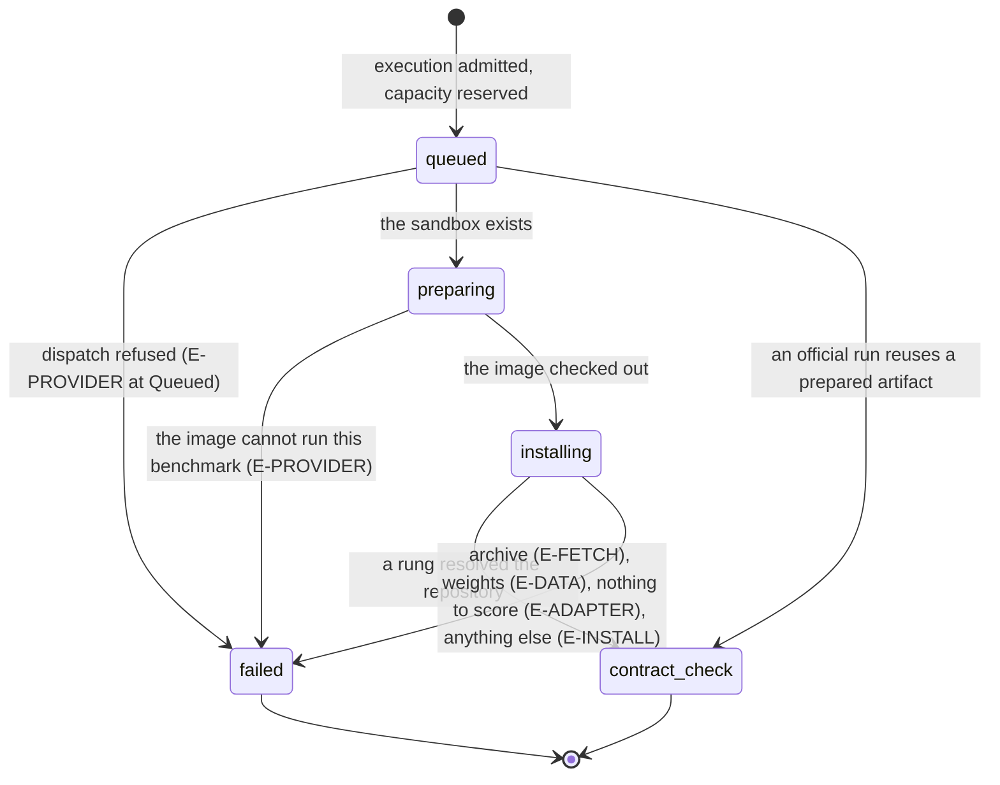

# Prepare

## Summary

Prepare is the part of a hosted practice run between pressing "Start run" and the platform having a
filesystem it can score. It checks that the published sandbox image can run this benchmark at all,
fetches the repository as an archive, unpacks it, pulls down any weight files the team uploaded,
works out how the repository declares what to run, installs what it can, and saves the result as a
filesystem snapshot (the *prepared artifact*) that the evaluate step and any later official attempt
start from. It has no screen of its own. A student meets it as the `Prepare` and `Install` nodes of
the pipeline rail (`apps/portal/src/lib/run-meta.ts:32`), the time under each node, and, when it
fails, a failure card. This document owns everything up to the point where the platform starts
running the team's own functions to find them; the search is [`discovery.md`](discovery.md).

## The simple case

A student presses "Start run". The run row is written as `queued`, the run page opens, and its
Pipeline section says "Still running. This page checks back on its own, and what the run shows will
appear here once it has been scored." (`apps/portal/src/routes/RunDetailPage.tsx:259`) with
"Updates every 2 s." under the rail (`RunDetailPage.tsx:278`). A few seconds later `Prepare` lights,
then `Install`, which stays lit while pip runs and the search runs. Then `Contract check` lights.
Nothing else is shown: no log, no package list, no line naming which way the repository was
resolved.

On the hosted beta, `SamGu-NRX/week2_capstone@29f9cf9` (vision-recognition) spent 2.7 s in Prepare
and 88.0 s in Install on `run_f5fc5babe5`, and 2.0 s and 63.8 s on its Retry `run_f93ba19397`
(beta-qa `hosted-run_*/result.json`). That is the only timing observation; it is beta, one
repository, one benchmark.

## The ask, event by event

```mermaid
stateDiagram-v2
    [*] --> queued : execution admitted, capacity reserved
    queued --> failed : dispatch refused (E-PROVIDER at Queued)
    queued --> preparing : the sandbox exists
    queued --> contract_check : an official run reuses a prepared artifact
    preparing --> failed : the image cannot run this benchmark (E-PROVIDER)
    preparing --> installing : the image checked out
    installing --> contract_check : a rung resolved the repository
    installing --> failed : archive (E-FETCH), weights (E-DATA), nothing to score (E-ADAPTER), anything else (E-INSTALL)
    contract_check --> [*]
    failed --> [*]
```

### Asking

The worker builds a job, records it on the run, and posts it to the Modal controller. The controller
validates it before any container exists (`apps/runner-modal/src/cogworks_runner/protocol.py:24`):
nine required fields plus optional `weights` and `preparedEnvironment`, a forty-character commit, an
archive URL beginning `https://api.github.com/repos/` (`protocol.py:65`), at most eight weight files
of at most 100 MiB each (`protocol.py:77`, `:96`), and, for an official run, a prepared artifact
(`protocol.py:45`). That last rule decides whether prepare happens at all. A job that carries an
artifact skips prepare, reports `contract_check` directly, and checks the saved record of the
artifact against the job instead (`modal_app.py:2209`). Every prepare failure a student sees
therefore comes from a practice run or a practice Retry.

### Answered without work

A job the controller refuses is answered 400 before anything is spawned (`modal_app.py:2372`). The
worker treats a 4xx as a refusal and fails the run at `Queued` with the detail "The run could not be
queued for Modal." (`apps/portal/worker/services/run-actions.ts:218`), and the student who pressed
the button reads "The run could not be queued. Try again." (`run-actions.ts:227`). A dispatch that
times out or gets no clear answer is left `queued`, because the controller may have started it
(`run-actions.ts:185`). If no phase arrives within ten minutes, the maintenance sweep (every five
minutes) fails it; the queued run page says so in advance with "Nothing has reported back yet, which
is usually a short wait for a free machine. If nothing arrives within ten to fifteen minutes we stop
waiting and mark this run failed, so it won't sit here all afternoon." (`run-meta.ts:66`,
`apps/portal/worker/execution/maintenance.ts:32`). None of these uses quota.

### The work begins

`modal.Sandbox.create` returning. `reporter.status("preparing")` follows it (`modal_app.py:1520`),
so `Prepare` lighting is the student's proof that a container exists. The sandbox can reach four
fixed hosts, `api.github.com`, `codeload.github.com`, `pypi.org`, `files.pythonhosted.org`, plus
the portal's own hostname, which is there only so prepare can fetch weight files
(`modal_app.py:1500`).

### While it works

**The image check.** Before any team file exists in the sandbox, the controller runs a probe that
imports the platform's own modules and loads the benchmark plugin in the interpreter student code
will use, and keeps what it saw in controller memory
(`apps/runner-modal/src/cogworks_runner/prepared_environment.py:293`). A probe that fails or reports
the wrong sandbox contract or a non-3.8 interpreter for audio or language is the platform's fault:
`provider`, `infrastructure: true`, "The published environment cannot establish its execution
contract." or "The published environment does not satisfy the current execution contract."
(`modal_app.py:1529`, `:1537`).

Then `installing` is sent once and re-sent every 2.0 seconds while the prepare script runs
(`modal_app.py:1543`, `:1250`). One node covers everything below.

**The archive.** One request with a 30 second socket timeout, capped at 100 MiB, checked against the
declared length and the running total (`modal_app.py:519`). Every download failure, the size cap
included, is rewrapped as "Source archive could not be downloaded safely." (`modal_app.py:536`).
Unpacking refuses "Source archive contains a link or special file.", "Source archive contains an
unsafe path.", and "Source archive must contain one project root." (`modal_app.py:542`, `:545`,
`:549`).

> Technical note: all of these contain "source archive" because `_prepare` routes on that phrase
> (`modal_app.py:1573`). `test_archive_safety.py:442` now asserts the full phrase.

**Weight files.** A team that keeps trained weights out of git uploads them with `cogworks sync`;
the job lists the files synced for this commit, and prepare fetches each into the unpacked
repository. Each is capped at 100 MiB, must land inside the project, must arrive at the declared size,
and must match its SHA-256 (`modal_app.py:555` to `:600`). The refusals name the file: "Weight file
has an unsafe path: {path}", "Weight file is larger than 100 MiB: {path}", "Weight file {path} could
not be downloaded safely.", "Weight file {path} did not match its digest." The weight request has no
socket timeout (`modal_app.py:577`), so a stalled read waits for the sandbox's own budget.

**Rung 0, packaging.** A root `pyproject.toml`, `setup.py`, or `setup.cfg` gets `pip install -e`
with a 420 second timeout (`modal_app.py:626`). One `cogworks.submissions.v2` entry point for this
benchmark resolves the repository; more than one raises "Submission adapter entry point is
ambiguous." (`modal_app.py:677`). A build failure is fatal only when there is no root file to fall
back on (`modal_app.py:641`).

**Rung 1, a declared file.** A root `submission.py` or `benchmark_adapter.py`, imported by path
later in the network-blocked evaluate sandbox rather than installed here (`modal_app.py:616`).

**Between the rungs, `requirements.txt`.** A best-effort `pip install -r` with a 300 second timeout.
A failure writes `COG_NOTE: requirements.txt did not install: …` to stderr and continues
(`modal_app.py:661`); nothing reads that note on a successful prepare.

**Rung 2, discovery.** Runs only when neither rung resolved the repository (`modal_app.py:688`). For
every repository in the 2026 corpus this is the path. See [`discovery.md`](discovery.md).

### How it ends

On success, `contract_check` is sent and the filesystem is snapshotted (`modal_app.py:1585`). Two
files carry state forward: the project directory and the word naming which rung won
(`modal_app.py:752`). The snapshot id and the image observation are bound together into the record a
later official attempt is checked against (`prepared_environment.py:212`).

On failure, `_prepare` takes the exception message from the script's stderr and routes on it, in this
order (`modal_app.py:1572`):

| Detail contains | Category | Rail node | Card the student reads |
| --- | --- | --- | --- |
| "source archive" | `repository_fetch` | Prepare | E-FETCH "Repository could not be fetched" |
| "weight file" | `data_download` | Prepare | E-DATA "Benchmark data is not ready" |
| "no adapter found", "entry point", or "the search for your code could not finish" | `adapter_missing` | Contract check | E-ADAPTER, the refusal card when discovery left one |
| anything else, including an empty stderr | `dependency_install` | Install | E-INSTALL "Dependency installation failed" |
| an exception around the sandbox | `provider`, platform's fault | Prepare | E-PROVIDER "The run couldn't finish" |

Codes and copy are `packages/contracts/src/failures.ts:21` to `:146`. Every row is
`infrastructure: false` except the last; the comment at `modal_app.py:1577` says these messages
"select advice, never refund eligibility", because install and discovery run student code. No
failed execution uses quota whatever its category, and the run page says so in the margin: "A run
that fails doesn't count against your team's practice runs." (`RunDetailPage.tsx:197`).

How much of the card shows depends on the catalog's `retryable` flag, not on who owns the failure
(`apps/portal/src/components/FailureCard.tsx:65`). E-FETCH and E-DATA are retryable, so the card
opens on the explanation and "Open current run", and the detail line naming the file or the archive
problem waits under "Show details". E-INSTALL and E-ADAPTER are not, so the detail is shown open with
the catalog's next step.

## Modifiers

| Modifier | Set before the ask | Changed while it works |
| --- | --- | --- |
| Who you are | No effect. The job carries a team's repository, a commit and a benchmark, never a person. | No effect. |
| Where your team and repository stand | The whole input: one repository at one recorded commit. A repository made private fails the fetch. A repository with no packaging and no root file reaches discovery. | No effect. The archive is one fetch of one commit. |
| Which week's benchmark | Picks the image and interpreter (`modal_app.py:1449`, `prepared_environment.py:192`). `audio-identification` runs prepare under the pinned CPython 3.8.20 venv on the Week 1 image (librosa, soundfile, ffmpeg); `language-search` the same venv on the Week 3 image (GloVe and COCO artifacts baked in); `vision-recognition` and `vision-clustering` share the Week 2 image on 3.11 with FaceNet and the photographs cached. All three images pin `PYTHONHASHSEED=0` (`modal_app.py:329`, `:392`, `:452`). A `requirements.txt` line can install on one track and fail on another. Only weights uploaded for this benchmark are fetched (`apps/portal/worker/services/local-reports.ts:341`). | No effect. |
| Practice or leaderboard | Practice prepares. An official attempt reuses the practice run's artifact and never prepares (`protocol.py:45`). | No effect. |
| Flags, options, and where you are typing | Nothing a student types reaches prepare. The repository controls it through its own files: packaging, a root `submission.py`, `requirements.txt`, and the weights `cogworks sync` uploaded for this exact commit. | No effect. |

## Cancel and interrupt

| Event | Before the work begins | While it works |
| --- | --- | --- |
| You stop it yourself | There is no cancel. Admission already left a `queued` execution. | Closing the page does not stop the sandbox. The run ends or fails on its own. |
| You do something else mid-way | Navigating away has no effect. A second run on the same benchmark is refused with `active_run_exists`. | The same. Leaving the run page stops its 2 second poll and nothing else. |
| A teammate acts at the same time | A teammate who started first holds the benchmark's one active slot, and this start is refused. | A push changes nothing: the archive URL names the recorded commit. |
| The network or the portal fails | A dispatch with no clear answer stays `queued` until a callback or the ten-minute sweep. | Status callbacks retry three times on 429, 500, 502, 503, 504 and connection failures (`modal_app.py:1137`). Losing one heartbeat costs nothing; the next carries the same phase. |
| The page or the process goes away | Nothing to lose. | A sandbox exception becomes E-PROVIDER at Prepare, the platform's fault. A controller that dies mid-prepare leaves the run on its last phase until the hourly sweep fails it with "The execution provider stopped reporting progress." (`maintenance.ts:34`). |
| The thing being measured changes | Before admission, a moved branch changes which commit is recorded. | No effect. A benchmark version change is caught at the contract check (`modal_app.py:1262`), not here. |
| The platform refuses or credit runs out | Admission checks capacity before dispatch. | Prepare changes no quota. A failure frees the reservation. |

After any interrupt, what survives is the run row and the phases already recorded. The prepare
sandbox is always terminated (`modal_app.py:1597`); only a successful snapshot outlives it.

## Interactions with other systems

**Who may do this.** Nobody invokes prepare. It runs because a run was admitted, and the permission
question was settled there.

**The team owns it.** The snapshot becomes the team's prepared artifact for that run. A later
official attempt is scored from it, which is why promotion needs a finished practice run.

**Credit.** None spent by preparing. A failed execution uses no quota in either mode; see
[credit and quota](../cross-cutting/credit-and-quota.md).

**What the portal claims.** Prepare produces no numbers. Its one claim about the repository is the
refusal discovery writes, carried on the `adapter_missing` failure; the vocabulary is in
[`../foundations/what-the-portal-claims.md`](../foundations/what-the-portal-claims.md).

**What the benchmark supplied.** Prepare supplies an environment and the team's own uploaded
weights. When a practice run prepared with weights, the masthead says "{paths} from your local run
at {short sha}" (`RunDetailPage.tsx:177`). See
[`../cross-cutting/what-the-benchmark-supplied.md`](../cross-cutting/what-the-benchmark-supplied.md).

**Live updates and reconnection.** `preparing` once, then `installing` every 2.0 seconds. The rail
records when each phase began and ended, so a returning student sees durations, never the sequence of
steps inside Install.

**Discord.** Prepare posts nothing. See [`../discord/channel-messages.md`](../discord/channel-messages.md).

**Configuration.** None a student can reach. Limits are literals in the prepare script; CPU, memory
and wall clock come from the job; see [`timeouts-and-limits.md`](timeouts-and-limits.md).

## Edge cases

- **One node, two waits.** `Install` covers a `requirements.txt` install (at most 300 seconds, cannot
  fail the run) and the whole discovery search (bounded only by the 900 second sandbox). Both look
  the same on the rail.
- **Two failures nobody is told about.** A broken packaging build is swallowed when a root file
  exists, and a failed `requirements.txt` writes only `COG_NOTE`. The second resurfaces later as a
  skipped module in discovery, with the advice "Add {package} to a requirements.txt at the root of
  your repository …" (`python/cogbench/src/cogbench/resolve.py:3701`), which the team already did.
- **The 100 MiB archive cap reads as a missing repository.** The student is told "The repository may
  have been made private, or the branch may have been deleted." (`failures.ts:25`).
- **A weight-file failure reads as benchmark data.** E-DATA's explanation is about "The fixed
  benchmark data bundle" and staff repairing "the private evaluation volume" (`failures.ts:45`);
  the line naming the team's file is under "Show details".
- **A killed or out-of-memory prepare is never told as one.** `_prepare` has no elapsed-time check.
  If Modal reports the kill as a nonzero return code, an empty stderr becomes "The run failed before
  producing a result." (`modal_app.py:2021`) under E-INSTALL, whose next step is
  `python -m pip install --constraint constraints.txt .` (`failures.ts:38`), a file no 2026
  repository has. If Modal raises instead, it becomes E-PROVIDER, "Preparation provider failed: …"
  (`modal_app.py:1590-1596`). Which path Modal takes is unrecorded
  ([`timeouts-and-limits.md`](timeouts-and-limits.md#open-questions-and-verification)).
- **The rung comment names a file nothing reads.** `modal_app.py:605` says a repository can declare
  its binding through `cogworks.toml`. Prepare never opens one; the only trace is the root reason
  "declared in cogworks.toml" in `discover.py:511`. A team that writes one is told nothing.
- **The evaluate sandbox has no network** (`modal_app.py:1654`), so anything a repository needs has
  to arrive during prepare, from an allowed host.

## Open questions and verification

- Hosted beta (`4984730`) and the candidate share the prepare path byte for byte: `git diff
  4984730 2ff32fa -- apps/runner-modal/src/cogworks_runner/modal_app.py` is empty. The beta timings
  above therefore describe the candidate's code, but were observed on beta.
- Hosted beta (`4984730`) differs: its failure card shows the title, then puts the code, phase,
  explanation, detail and reproduce command all under "Show details", and nests the refusal card
  there too (`apps/portal/src/components/FailureCard.tsx:40` to `:78` at `4984730`). The candidate
  opens on the detail for non-retryable failures and on the refusal itself
  (`FailureCard.tsx:85` to `:127`).
- Week 1's hash seed is pinned now (`modal_app.py:452`, since `0a554ba`), and the guard test selects
  image blocks by `MPLBACKEND` alone and expects three (`apps/runner-modal/tests/test_prepare_rungs.py:216`).
  B-01 is closed in source; no repeated hosted Week 1 run has checked it.
- What Modal reports when the prepare sandbox hits its 900 second budget, a `-1` return code or an
  exception, was not established. The first is E-INSTALL, the second E-PROVIDER.
- Weights are matched to the run's exact commit (`local-reports.ts:340`); a push after `cogworks
  sync` silently drops them (B-08). The run page names the commit only when weights were supplied.
- An official attempt reusing an artifact that holds uploaded weights gets no `weightsSupplied` from
  the runner, which sends it only when the run prepared (`modal_app.py:2295`). By source its page
  still repeats the line, because promotion copied the practice run's weights record
  (`apps/portal/worker/services/run-actions.ts:430`). A Retry of a failed official attempt does not
  copy it (`run-actions.ts:618-642`), so the retried page has no line; integrated `93dfa5e` source
  copies it when the Retry reuses the same artifact (`505ce25`). Not observed.
- Upload, signed fetch, digest check and the weights line have not been observed end to end on any
  build.
- The fixture provider draws Prepare and Install timings on official runs
  (`/tmp/cogshots/matched/pairs/b-run-official-desk.png`); a real official attempt skips both. The
  rail's look on a real official attempt has not been observed.

Read against Cog\*Portal commit `2ff32fa`.
