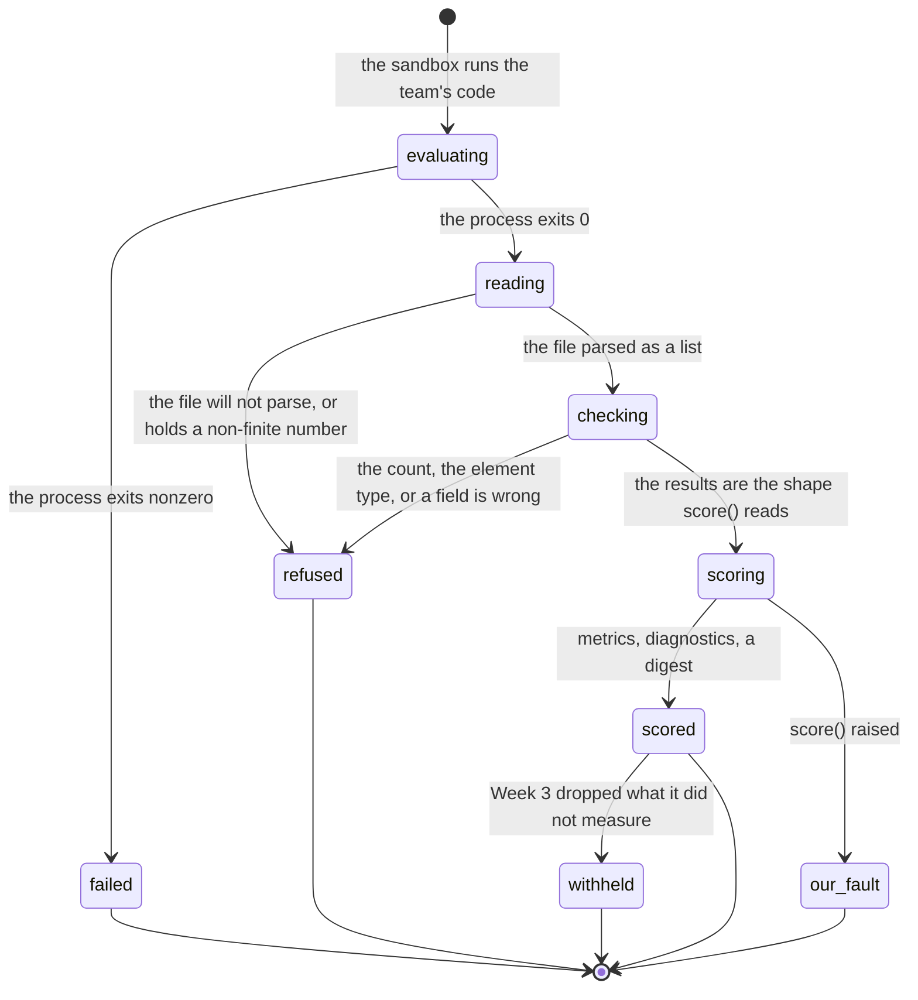

# Scoring and refusals

> **In flight.** The Week 3 refusal sentences about withheld image scores are being edited today, in `benchmarks/week3/language_search_benchmark/plugins.py` and `roles.py`. This document describes what that source says now, mid-edit; a verifier must re-read both files rather than trust the quotes below. One change is already on disk: `weights_diagnostic` used to end "Commit that file and run again." and now tells the team to keep the weights out of git and let `cogworks sync` carry them, which reverses the advice and pushes the sentence past the 240-character cap.

## Summary

This document owns two questions. What has to be true for a number to appear on a run page, and every condition under which the platform declines to give one and the exact sentence it shows instead.

Scoring is the last stage of a hosted run. The evaluate sandbox has already run the team's code and written a results file; the controller reads that file back, checks it against what the benchmark's `score()` can actually read, scores it, and posts one event carrying metrics, diagnostics, an optional difficulty curve, and a digest. There is no screen called "scoring". What a student sees is the RESULTS panel on the run page, the sentence above it, and, when the check refuses, a failure card with the code `E-OUTPUT`.

Every refusal here carries category `output_invalid`, phase `evaluating`, and `infrastructure=False`, which means it spends the official attempt. That is deliberate, and both alternatives to it were measured. See [Why the check exists](#why-the-check-exists).

## The simple case

The team's code finishes. The controller reads `/tmp/cog-predictions.json`, parses it, counts the results against the cases, checks their shape, and hands them to `score()`. Back come named numbers and diagnostics.

The run page leads with the scorer's first diagnostic, set large under the kicker "What this run shows" (`apps/portal/src/components/Finding.tsx:32`), draws the difficulty curve if the benchmark published one, shows the wiring trace if discovery found the team's functions by running them, and only then, in a panel labelled `RESULTS`, prints the primary metric big beside a list of the supporting ones. The number is last on purpose.

## The ask, event by event

### Asking

Nothing is asked. Scoring is not something a student starts; it is what happens to the file their code wrote. What was decided earlier still binds it: the commit, the benchmark id, and whether this run scores the public split or the hidden one (`apps/portal/worker/execution/runner.ts:78`).

### Answered without work

One condition ends scoring before any of the team's results are read. The controller compares five fields of the loaded plugin against the five the job named: benchmark id, version, contract version, plugin version, scorer version. Any mismatch fails at once with category `data_download`, phase `contract_check`, and `infrastructure=True`, carrying the detail "Trusted benchmark plugin version does not match the run job." (`apps/runner-modal/src/cogworks_runner/modal_app.py:926`).

The student reads a card headed "Benchmark data is not ready", code `E-DATA`, explaining that a data bundle "could not be downloaded or did not match its reviewed checksum" (`packages/contracts/src/failures.ts:54`). Nothing was downloaded and no checksum was compared. The attempt is refunded, so the cost is a wrong sentence rather than a lost attempt.

### The work begins

The moment `process.wait()` returns in one of the four evaluate lanes and the controller starts reading the file. Credit was spent much earlier, when the run row was written (see [`../foundations/the-run.md`](../foundations/the-run.md)). What commits here is narrower and matters more: from this point every path either spends the official attempt or refunds it, and which one is decided entirely by the category the controller picks in the next few milliseconds.

### While it works

Nothing streams. The `evaluating` heartbeat posts every 2 seconds until the lane returns (`modal_app.py:901`), then the controller posts one final `evaluating` status at `case_count / case_count` (`modal_app.py:2305`) and only then runs the prediction check.

That ordering is deliberate. Anything raised once the phase is `scoring` and is not already a structured failure becomes category `scorer` with `infrastructure=True`, which tells the team the platform broke and refunds the attempt (`modal_app.py:2306`). Checking before the phase moves is what keeps a bad payload from buying a free retry. What a student sees is a progress bar reading 100 percent while the platform decides whether to refuse.

### How it ends

On success, one `completed` event with the metrics, up to 32 diagnostics of up to 240 characters each, the sweep and the wiring trace when they exist, and a sha256 of the predictions (`modal_app.py:2329`). A practice run gets the sanitized student log back with it; an official run gets null, because the hidden split's contents must not travel (`modal_app.py:2347`).

On a refusal, one `failed` event with the category, the phase, a detail capped at 240 characters, and `infrastructure: false`. No metrics are sent, so the run page shows the failure card and no RESULTS panel at all.

## What produces a metric

A metric is not a number the platform computes. It is a key `score()` returned, wrapped in presentation the plugin declares (`modal_app.py:2156`).

| Field | Where it comes from | What a student sees |
| --- | --- | --- |
| `key` | The key `score()` returned. | Nothing directly. |
| `label` | `metric_labels`, else the key title-cased. | The row name. A metric missing from `metric_labels` arrives as a machine-made title, which is how "Retrieval Mrr Verbatim" once reached a run page (`benchmarks/week3/language_search_benchmark/plugins.py:259`). |
| `value` | `float()` of the score. | The number. |
| `unit` | Always `None` on this path. | Nothing. |
| `higher_is_better` | True unless the key is in `lower_is_better`. | An up or down arrow. |
| `primary` | True for the one key `_primary_for_run` names (`modal_app.py:2143`). | Which number is set large, and what the leaderboard sorts on. |
| `precision` | Fixed at 3. | Three decimals, always. |
| `help` | `metric_help`. | One or two sentences, folded away until the row is clicked. |
| `role` | `metric_roles`: `scored`, `floor`, `reported`, `diagnostic`, `plotted`. | How the row is drawn, or whether it is drawn. |
| `relates_to` | `metric_relations`. | Which row a floor or probe attaches to. |

Absent fields are omitted from the wire rather than sent as null, so a reader can tell "this benchmark has no explanation" from "the explanation is empty" (`python/cogbench/src/cogbench/models.py:50`). `precision` being fixed at 3 is the reason every hosted number reads to three decimals whatever it measures, including `retrieval_median_rank`, which is a rank and has no fractional part to show.

Roles change the drawing and nothing else. A floor renders inline as the scale of the metric it belongs to, as `floor 0.162`, with no arrow, because an arrow on a floor is advice to raise a number the submission does not control (`apps/portal/src/components/MetricBlock.tsx:77`). A `reported` probe renders indented under the score it shadows, marked `not scored`. A `plotted` metric gets no row, because the curve above prints its value beside its point.

A metric declaring no role renders exactly as everything did before roles existed (`MetricBlock.tsx:93`). The whole arrangement reads `role` and `relatesTo` and never a metric's name, so a benchmark that grows a floor gets the right drawing without the page learning anything about that benchmark.

> Technical note: the primary metric is load-bearing. The RESULTS panel renders only when some metric carries `primary: true` (`apps/portal/src/routes/RunDetailPage.tsx:212`), and nothing on either side of the wire checks that exactly one does. A plugin naming a primary key its `score()` did not return would produce a succeeded run whose numbers are on the wire and absent from the page.

## The prediction check

Every evaluate lane converges on one call to `_check_predictions` from `execute_job` (`modal_app.py:1565`). One call site rather than four is the point: a fifth benchmark track added later is covered by construction rather than by remembering.

### Why the check exists

The sandbox counts its own outputs before writing the file, and that count runs inside the student's own process. A module-level `atexit` handler rewrites `/tmp/cog-predictions.json` after the script's last write, so the bytes the controller reads are whatever the handler put there (`modal_app.py:1215`).

Two things go wrong without a second check on the controller's side, and both were measured against the real scoring modules.

A short results list is not a crash. `zip()` truncates, so four Week 1 results covering a submission's two correct queries score `identification_score` 1.0 where the honest twelve score 0.2, and one perfect Week 2 clustering scenario out of four scores `clustering_pairwise_f1` 1.0 against 0.54. A short list inflates the score.

A wrong element type is an uncaught `AttributeError` inside `score()`, and `execute_job` labels anything raised during the scoring phase as `scorer` with `infrastructure=True`. That copy tells the team the platform broke and refunds the attempt, so a wrong type buys unlimited official retries.

The most expensive case is null embeddings. Week 3's `text_first_relevant_ranks` excludes a caption from its own results by writing negative infinity on the score matrix diagonal, then sorts by score descending. With an all-NaN matrix the diagonal is the only non-NaN entry, and numpy sorts NaN after every real value including positive infinity, so each caption ranks itself first and every co-caption lands at rank 1. Against the public-evaluation text block, an honest random submission scores `text_mrr` 0.0101 and an every-value-null one scores 1.0000, with `overall` going 0.0034 to 0.3333 (`modal_app.py:1440`). The exclusion that makes the metric meaningful is what the NaN defeats.

### Every sentence the check shows

All of these carry `output_invalid`, `evaluating`, and `infrastructure=False`, so all of them spend the attempt (`modal_app.py:1487`). The phase is `evaluating` and not `scoring` because what is wrong is the submission's results, and naming the scoring phase would put the platform's name on a step that never ran.

A number that is not finite, caught during the parse rather than by a walk afterwards, because a walk cannot see `1e400` (`modal_app.py:1359`):

> "Your results hold the value {}, which is not a finite number. A NaN or an infinity here usually comes from a division by zero or an average over an empty list. Check the numbers your adapter returns."

A top-level value that is not a list (`modal_app.py:1377`). Each lane calls `list()` on what it returns, and `list()` coerces rather than checks: a top-level object becomes a list of its keys, so `{"a": 1, "b": 2}` reaches the count check looking like two results.

> "Your submission's results came back as {}, and scoring reads a list holding one result per case. Check what your adapter returns."

The wrong number of results (`modal_app.py:1588`), checked for every benchmark including the v1 lane:

> "Your submission returned {} results for {} cases. Scoring pairs them up in order, so it needs exactly one result per case. Look for a case your code skipped, or a filter that dropped some."

An element of the wrong type (`modal_app.py:1611`). Compared with `type()` and not `isinstance()`, because a string passes every sequence check while scoring iterates it one character at a time; measured, a two-character string in Week 2's `known` field clears the length guard and scores as two correct labels.

> "Result {} came back as {}, and this benchmark scores {} for each case. Check what your adapter returns for that case."

A cluster label that is not a string or a number (`modal_app.py:1626`). Cluster labels are dictionary keys twice over inside scoring, so a list or dict label is an uncaught `TypeError`.

> "In result {}, label {} came back as {}. Cluster labels have to be strings or numbers; only which labels match each other matters, never what they are called."

A field that should hold a list and does not (`modal_app.py:1646`). A field that is absent is normal, because a failed case writes `{"ok": False, "error": ...}` with none of these fields and scoring reads that shape on purpose.

> "In result {}, \"{}\" came back as {} where scoring reads a list. Check what your adapter puts in that field."

Four sentences cover the fields handed to numpy, where the check goes to the leaves because a JSON `null` reaches numpy as NaN without raising (`modal_app.py:1505`). A row that is not a list; an empty row, refused because a zero-width matrix scored `text_mrr` 0.6667 on a four-caption case where honest work scored less, since an empty row makes every pair tie; rows of different lengths, refused because numpy raises `ValueError` on a ragged list and an uncaught raise once the phase is `scoring` is the refunded-attempt path; and a leaf that is not a number, where only the first offender is named because a submission that got this wrong usually got it wrong everywhere.

> "In result {}, row {} of \"{}\" came back as {}. Each row holds one list of numbers."
>
> "In result {}, row {} of \"{}\" is empty, and scoring reads one number per position."
>
> "In result {}, \"{}\" has rows of different lengths ({} and {}). Every row needs the same number of values."
>
> "In result {}, \"{}\" holds {} at row {}, position {}, where scoring reads a number. A null here becomes a NaN and cannot be scored."

Two more belong to Week 2 recognition, and they live where the shuffled batches still exist, before the two-batch payload is turned back into the lifecycle shape `score()` reads (`modal_app.py:1799`). The second stops the coercion that turned `{"before_enrollment": "abc", "after_enrollment": "d"}` into a clean dict of lists that cleared every length guard.

> "Each recognition scenario has to return a mapping of labels, and one came back as {}."
>
> "In result {}, \"{}\" came back as {}, and recognize returns one label per image. Check what your adapter returns for that batch."

Only `scores` may be null, because Week 1's driver writes `"scores": None` when the submission returned candidates without them (`modal_app.py:1422`). A boolean cluster label is allowed, because scoring treats `True` as 1 and returns a correct partition for it, and refusing a payload that scores correctly would cost a team an attempt for nothing. Ranking rows may be ragged and empty, because a query that matched nothing legitimately returns none and is scored as a miss. The plain words the sentences use for types come from one table: "a dictionary", "a list", "a string", "a true/false value", "a number", "None" (`modal_app.py:1309`).

### What the failure card says around them

The sentence above is the failure's `detail`. It arrives inside a card whose title, explanation, action, and repro command come from a static catalog keyed on the category, and the `output_invalid` entry was written before this check existed (`packages/contracts/src/failures.ts:137`):

> "Predictions did not match the schema"
>
> "Your adapter returned output that failed schema validation. Extra fields, wrong types, and values outside the allowed range are all rejected."
>
> "Validate your output locally with the schema check, correct the prediction shape, and run practice again before promoting."

Three of those claims do not describe what ran. Extra fields are not rejected; the check reads only the fields the shape table names and ignores the rest. No value range is checked anywhere. And the copyable command, `cogworks test --benchmark {benchmark}`, runs the contract check, which is a different check and does not validate a predictions file. The vision override goes further and says "out-of-range boxes are all rejected" (`failures.ts:208`), which is object-detection vocabulary; Week 2 scores recognition and clustering and has no boxes.

The one line in the card that is right is the last: `defaultConsumesAttempt: true` (`failures.ts:146`), and the run page reads the run's own `consumedAttempt` rather than that flag, so the number a student is told is the real one.

## The difficulty curve

A benchmark with a difficulty knob publishes a `last_sweep` after `score()`, and the controller turns it into the curve the run page draws (`modal_app.py:2207`). Fewer than two points is not a curve, so one point is dropped rather than drawn, which would claim a trend from a single measurement. A plugin that grew a sweep without declaring its `sweep_x_key` and `sweep_y_key` gets no curve instead of a wrong one. Up to 24 points are read, each label capped at 40 characters, and the wire requires between 2 and 24 points with every `y` between 0 and 1 (`packages/contracts/src/protocol.ts:54`).

Week 3's four points are the four query rewrites, from the caption unchanged to the furthest, so its x values are 0 through 3 and mean nothing on their own. Those points carry names, and the page prints the endpoint labels and reads them to a screen reader, which would otherwise say "from 0.95 at 0 to 0.03 at 3". Week 1's x is a real count of songs and reads correctly as itself.

A withheld Week 3 run has no curve. `_rung_curve` reads `search_mrr_{rung}` out of the metrics dictionary after the withheld keys have been popped, finds none, and returns an empty list (`benchmarks/week3/language_search_benchmark/plugins.py:353`). That is the right outcome and it is worth naming, because the curve is the part of the page a team is told to read.

## Week 3 withholds the overall

Week 3 is the only benchmark that withholds. When the image side never bound, the retrieval and search cases never ran; the driver would score those as zero, and an overall averaged over them is a number nobody measured. So the image-side scores and the overall are dropped, their floors stay on the wire, the primary becomes `text_mrr`, and a diagnostic naming the team's own save path is inserted at position 0 (`plugins.py:340`). Being first, it becomes the sentence the run page sets large under "What this run shows".

Two measured reasons this is not a preference. One team's first end-to-end run scored search 0.0 into an overall of 0.4183 with its prepare step bound to the wrong argument order. An independent review found a median rank published at 100.0 from retrieval cases that never ran. Decision record: `docs/design/discovery-v2-brief.md`, "Absent weights", decided 2026-09-02.

There are four sentences, all beginning `overall withheld: `.

**The base case,** no weights and no save call found (`plugins.py:424`, `roles.py:855`). It stands alone only when the discovery root is unknown; otherwise `roles.weights_diagnostic` extends it, and that is the most actionable form the platform produces, because it reads the team's own `save()` call and their own `.gitignore` (`roles.py:847`).

> "overall withheld: the image side has no trained weights to measure."
>
> "overall withheld: the image side has no trained weights to measure. Your {} saves to {} ({}:{}), and it matches .gitignore line {}. Keep that weights file out of git. Then run `cogworks run` locally and `cogworks sync`; the hosted run will fetch the weights the local run used."
>
> "overall withheld: the image side has no trained weights to measure. Nothing under this repository loads as a (512, D) projection and no source file saves one, so there is no image embedding to score. Keep the weights your training run produces out of git. Then run `cogworks run` locally and `cogworks sync`; the hosted run will fetch the weights the local run used."

The last two are the working tree as of today. Before today's edit the first ended ". Commit that file and run again." and the second ended " Commit the weights your training run produces and try again." The advice is now the opposite of what it was, and it depends on `cogworks sync` carrying the weights, which is itself in flight (see [`../terminal/sync.md`](../terminal/sync.md)). This case drops `retrieval_mrr*`, `retrieval_recall_at*`, `retrieval_median_rank*`, `search_mrr*`, and `overall`, and makes `text_mrr` primary (`plugins.py:376`).

**Weights found but nothing used them** (`plugins.py:431`). Saying "no trained weights" here would send the team to commit a file that is already committed.

> "overall withheld: your trained weights were read from {}, but no function in this repository turned descriptors into vectors with them: {}"

**No search function** (`plugins.py:388`). This one drops `search_mrr*` only and leads with `retrieval_mrr`, because the caption and retrieval sides were measured.

> "overall withheld: no function in this repository answered a query with image ids, so the search side is not measured; caption and retrieval scores are. The search found {}: {}"

**Several weight files and no load call to choose between them** (`plugins.py:563`). Refusing the whole repository would throw away a text side that works over a question about the image side.

> "overall withheld: several files in this repository load as a (512, D) projection and no load call in your code says which one to score: {}. Load one of them by name in the script you run, or remove the others, and run again."

Three of the four are longer than the 240 characters `execute_job` truncates a diagnostic to (`modal_app.py:2334`), which is the wire's own limit (`packages/contracts/src/protocol.ts:111`). Measured from the source strings on a representative repository: the save-call form is 311 characters and loses its last 71, cutting inside "Then run `cogworks run` locally and `cogwo"; the no-save-call form is 366 and loses 126. The ambiguous-weights sentence is 222 characters before its file list is interpolated, so any list longer than 18 characters truncates it, and the list is the point of it. Before today's edit the save-call form was 197 characters and fit.

## Modifiers

| Modifier | Set before the ask | Changed while it works |
| --- | --- | --- |
| Who you are | No effect. There is no privileged view: an instructor sees the same metrics, the same refusal sentence, and the same withheld set a student does. | No effect. |
| Where your team and repository stand | Decides what there is to score. A repository whose modules will not import never reaches this stage; one whose image side never bound reaches it and has numbers withheld. | No effect. A push mid-run does not change what is scored. |
| Which week's benchmark | Decides which shape-table entry applies (`modal_app.py:1407`), which sentences are reachable, and whether withholding exists at all. Week 3 is the only benchmark that withholds; Week 2 clustering is the only one whose elements are a flat list rather than a dictionary. A v2 benchmark with no table entry still gets the count check, which is the deliberate failure mode for a week added later. | No effect. |
| Practice or leaderboard | A practice run scores the public split and gets the sanitized log back; an official run scores the hidden split and gets none (`modal_app.py:2347`). A refusal on a practice run costs nothing, because only official runs claim attempts (`apps/portal/worker/routes/runner-events.ts:32`). Every sentence above is identical in both. | No effect. Mode is fixed when the run row is written. |
| Flags, options, and where you are typing | Nothing a student types reaches this stage. The same scoring runs locally through `cogworks run`, capped the same way (`python/cogbench/src/cogbench/models.py:129`). Discord shows the primary metric and up to 300 characters of a refusal headline. | No effect. |

## Cancel and interrupt

| Event | Before the work begins | While it works |
| --- | --- | --- |
| You stop it yourself | No cancel button on this stage. Closing the run page changes nothing; the run outlives every browser watching it. | No effect. Scoring is a few hundred milliseconds of controller work with no cancellation path. |
| You do something else mid-way | Starting a second run for the same benchmark returns `active_run_exists` before anything happens. | The same. The run keeps the lock until it reaches a terminal state. |
| A teammate acts at the same time | A teammate pushing a commit does not change this run, which is about the commit it resolved. | The same. Two teammates watching see the same metrics arrive together. |
| The network or the portal fails | No effect; nothing has been sent. | The `completed` event is retried three times with 0.25 s doubling backoff, honoring `Retry-After`, on 429, 500, 502, 503, and 504 (`modal_app.py:844`). If all three fail the run is scored, the portal never hears, and the stale-run reaper settles it an hour later as a provider failure. |
| The page or the process goes away | No effect. | A killed controller loses the metrics: the predictions file lives in a sandbox terminated in a `finally` block, and nothing re-reads it. The reaper settles the run. |
| The thing being measured changes | The plugin's five version fields are compared against the job before any results are read, and a mismatch fails as `data_download`. | No effect. The plugin object was loaded before the sandbox ran. |
| The platform refuses or credit runs out | Credit was checked and spent when the run row was written, so a refusal here never runs out of it. | Every refusal here spends the attempt, and no refund is available: `output_invalid` is in `CONSUMING_FAILURES` and `infrastructure` is False (`runner-events.ts:25`). |

## Interactions with other systems

**Who may do this.** Nobody does it. Scoring runs on the controller with no actor, and the result belongs to the run.

**The team owns it.** Every metric, diagnostic, and refusal is about the team's repository at one commit. There are no per-person numbers here and no field shaped like one.

**Credit.** The category chosen here decides the money. `output_invalid`, `student_runtime`, `timeout`, and `memory_limit` consume, and only when the mode is official, `infrastructure` is False, and the phase is `evaluating` or `scoring` (`runner-events.ts:32`). Everything else refunds, up to a per-team, per-benchmark cap. See [`../cross-cutting/credit-and-quota.md`](../cross-cutting/credit-and-quota.md).

**What the portal claims.** A withheld number is never rendered as zero, and a refusal is a sentence with a reason rather than a failure. Both words are defined in [`../foundations/what-the-portal-claims.md`](../foundations/what-the-portal-claims.md).

**What the benchmark supplied.** Week 3 hands the team's code a GloVe table and an image descriptor pool; Week 1 hands it an id-to-name table over the enrolled songs. The local report discloses this and the hosted run page does not. See [`../cross-cutting/what-the-benchmark-supplied.md`](../cross-cutting/what-the-benchmark-supplied.md).

**Live updates and reconnection.** No metric is streamed. The run surface carries phase names and a progress pair while the run works; numbers appear only at the terminal event.

**Discord.** The team channel gets a bubble carrying the primary metric and, at terminal, up to 300 characters of a refusal headline. It is the most truncated view of any claim the platform makes.

**Configuration.** Nothing here is configurable. The shape table, the nullable field set, the matrix fields, and the 32-by-240 diagnostic cap are constants.

## Edge cases

- **The floors of withheld metrics disappear from the page.** Week 3 keeps `chance_mrr` and `search_chance` on the wire when their scored partners are dropped, which is what "keeps their floors" means in the glossary. The page renders neither. A floor is filtered out of the row list because it has a `relatesTo`, and it is drawn inline only on the row it points at, which no longer exists (`MetricBlock.tsx:203`). On a base-case withheld run the supporting list is empty, and `text_chance` is invisible too, because its partner `text_mrr` is the primary and `PrimaryMetric` takes no floor (`MetricBlock.tsx:15`). **Unverified** against a rendered page.
- **A withheld run can be promoted, and the leaderboard does not say so.** Nothing in the promote path checks which key is primary (`apps/portal/worker/services/run-actions.ts:335`), and the leaderboard sorts every entry by its own primary value and titles the column from the first entry's label (`apps/portal/worker/services/leaderboard.ts:90`, `apps/portal/src/routes/LeaderboardPage.tsx:202`). A Week 3 team whose image side never bound would publish a `text_mrr` into the same column as other teams' `overall`. **Unverified.**
- **The v1 lane still does what the rest stopped doing.** `_evaluate` slices `stderr[-240:]` and picks its category with `"prediction" in normalized` (`modal_app.py:1690`), which is the pattern `_last_error_line` replaced and the shape `_platform_owned_evaluation_failure` argues against. Reachable only for a benchmark whose contract version is not v2, and all four production ids declare v2, so it is dead weight rather than a live hole today.
- **A NaN that reached a metric used to hang the run.** `json.dumps` re-emits `NaN`, and `JSON.parse` in the Worker rejects the literal token and answers 400. The run was scored, the event was dropped, and the run never reached a terminal state, which reads as a hung run rather than a refusal (`modal_app.py:1327`). The parse hooks and `value: z.number().finite()` on the wire (`protocol.ts:9`) close it from both ends.
- **An empty results list is refused as a count mismatch.** A team whose adapter returned nothing reads "Your submission returned 0 results for 3 cases", which is accurate and does not name the more likely cause.
- **A run with no metrics cannot be reported at all.** The wire requires at least one (`protocol.ts:110`), so an empty score set would 400 the completed event and hang the run in the same shape as the NaN case. No benchmark does this today.
- **The first result is legitimately wider than the rest.** Week 1 and Week 3 attach the adapter's mapping log to `outputs[0]` only, so element 0 carries a `mappings` field the others do not, and the check allows it.
- **The refusal sentences were written to fit.** Every sentence in [Every sentence the check shows](#every-sentence-the-check-shows) is under the 240 characters `execute_job` truncates a detail to, the longest being the count mismatch at about 200. That is not luck: the non-finite sentence carries a comment saying it was kept under the cap, since a refusal cut mid-sentence loses the half that helps (`modal_app.py:1357`). The Week 3 withheld sentences travel as diagnostics rather than as a detail and were not held to the same bar.
- **One refusal passes a library's words through.** When `restore_recognition_outputs` raises, its message becomes the detail verbatim, sliced at 240 (`modal_app.py:1863`). That message was written for a caller and not for a student, and it is the only refusal in this stage whose wording nobody on this side chose.

## Open questions and verification

- A plugin-version mismatch raises `data_download`, so the student reads `E-DATA` "Benchmark data is not ready" and an explanation about a checksum, for what is really version drift between the deployed image and the job (`modal_app.py:926`). `contract_invalid` or `provider` would be truthful. Worth treating as a bug. It also falls through to `run.failed.provider` in the live console, because `data_download` has no entry in the code map (`apps/portal/worker/services/run-surfaces.ts:55`), so the two surfaces disagree about one failure.
- The 240-character diagnostic cap truncates three of the four Week 3 withheld sentences, and today's edit makes the most common one 71 characters too long, cutting the instruction it exists to give. Measured from the source strings, not observed on a page. The cap is a wire limit, so the fix is a shorter sentence rather than a larger cap.
- The static copy around an `output_invalid` refusal describes a check the platform does not run: it claims extra fields and out-of-range values are rejected, and its copyable command runs the contract check rather than anything that reads a predictions file (`failures.ts:137`, `failures.ts:208`). A student who follows the card's advice runs the wrong command. Worth treating as a bug; the detail sentence beside it is already exact.
- Whether an orphaned floor really renders nowhere was traced through `SupportingMetrics` and not observed. **Unverified.**
- The `evaluating` progress counter is decorative. It reports `0/N` for the whole evaluation and then `N/N` (`modal_app.py:2293`, `modal_app.py:2305`), while the wire field carries `unit: "cases"` (`packages/contracts/src/schema.ts:485`), which promises per-case reporting the sandbox never provides. The console draws a bar from it (`apps/portal/src/components/RunConsole.tsx:212`). Carried to triage.
- Nothing validates that exactly one metric is primary, on either side of the wire. The consequence, a succeeded run with no RESULTS panel, was reasoned from `RunDetailPage.tsx:212` and not reproduced. **Unverified.**
- Withholding depends on discovery. `_unmeasured_image_side` reads the binding's own record of what did not bind and treats an unmarked error as evidence that the image side did run (`plugins.py:417`), so a repository that declared its own `submission.py` and never went through discovery would have zeros averaged into an overall rather than withheld. No 2026 repository declares one, so this is a latent path rather than an observed one. **Unverified.**
- Whether a student can tell a `reported` probe from a scored metric at a glance was not observed. The row is indented and marked `not scored`, which reads correctly in the source. **Unverified.**
- The Week 3 sentences are being edited today. Re-read `plugins.py` and `roles.py` before trusting any quote in [Week 3 withholds the overall](#week-3-withholds-the-overall).

Verified against Cog\*Portal commit `f74e087`.
