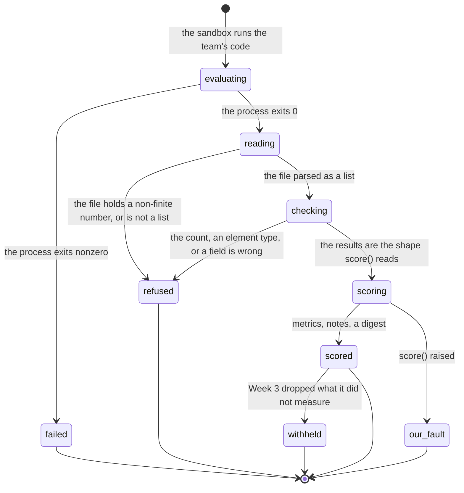

# Scoring and refusals

## Summary

This document owns two questions: what has to be true for a number to appear on a run page, and every condition under which the platform declines to give one, with the exact sentence it shows instead.

Scoring is the last stage of a hosted run. The evaluate sandbox has run the team's code and written a results file; the controller reads that file back, checks it against what the benchmark's `score()` can read, scores it, and posts one `completed` event carrying metrics, diagnostics, an optional sweep, the wiring trace and a digest. There is no screen called "scoring". What a student sees is the finding at the top of the run page, the "Readings" section under it, and, when the check refuses, a failure card with the code `E-OUTPUT`.

A failed execution uses no quota, including an `E-OUTPUT` refusal. A completed evaluation with low or partial results counts. See [credit and quota](../cross-cutting/credit-and-quota.md).

## The simple case

The team's code finishes. The controller reads `/tmp/cog-predictions.json`, parses it, counts the results against the cases, checks their shape, and hands them to `score()`. Back come named numbers, the scorer's notes, and for two benchmarks a sweep.

The run page leads with the scorer's first note, set as the largest type on the page under the label "What this run shows" (`apps/portal/src/components/Finding.tsx:3`), with the rest of the notes as small lines beneath it. The sweep curve comes next when the benchmark published one, then the wiring trace, then a section headed "Readings" with the primary metric on the first row and the supporting metrics in a table below (`apps/portal/src/routes/RunDetailPage.tsx:474`, `:525`). The number is last on purpose.

Observed hosted on beta, run `run_f93ba19397` (Recognition practice, `4984730` lineage): the finding read "2 of 10 queries for the newly enrolled person were called unknown rather than named. That is the cutoff being strict, not a descriptor problem.", the wiring trace named `get_descriptor.file_descriptors` with its shapes, and the primary read `0.9250` above supporting rows at three decimals. The runner, contracts and run-event handler are byte-identical between that build and `2ff32fa`; the page layout around them is not (see the last section).

## The ask, event by event

```mermaid
stateDiagram-v2
    [*] --> evaluating : the sandbox runs the team's code
    evaluating --> failed : the process exits nonzero
    evaluating --> reading : the process exits 0
    reading --> refused : the file holds a non-finite number, or is not a list
    reading --> checking : the file parsed as a list
    checking --> refused : the count, an element type, or a field is wrong
    checking --> scoring : the results are the shape score() reads
    scoring --> scored : metrics, notes, a digest
    scoring --> our_fault : score() raised
    scored --> withheld : Week 3 dropped what it did not measure
    refused --> [*]
    failed --> [*]
    scored --> [*]
    withheld --> [*]
    our_fault --> [*]
```

### Asking

Nothing is asked. Scoring is what happens to the file the team's code wrote. What was decided earlier still binds it: the commit, the benchmark id and version, and whether this run scores the public practice split or the hidden official one.

### Answered without work

One condition ends a run before any of the team's results are read. After preparation the controller loads the trusted plugin and compares five fields against the job: benchmark id, version, contract version, plugin version, scorer version. Any mismatch fails with category `data_download`, phase `contract_check`, `infrastructure=True`, and the detail "Trusted benchmark plugin version does not match the run job." (`apps/runner-modal/src/cogworks_runner/modal_app.py:1273`).

The student reads a card titled "Benchmark data is not ready", code `E-DATA`, whose explanation says a data bundle "either could not be downloaded or did not match its reviewed checksum" (`packages/contracts/src/failures.ts:43`). Nothing was downloaded and no checksum was compared. The live console calls the same failure "The hosted runner could not finish" and Discord calls it "Runner unavailable", because `data_download` has no entry in the event-code map and falls to `run.failed.provider` (`apps/portal/worker/services/run-surfaces.ts:72`, `apps/portal/src/components/RunConsole.tsx:52`, `apps/portal/worker/services/discord-messages.ts:96`). See [B-21](../bug-triage.md).

### The work begins

The controller reads the predictions after evaluation exits. Invalid output fails the execution without using quota. Valid output goes on to scoring, and only a completed evaluation counts.

### While it works

Nothing streams. The evaluating heartbeat repeats `0` of `N` cases while the sandbox runs, the controller then posts `N` of `N` (`modal_app.py:2246`, `:2258`), and only then runs the prediction check. The check runs before the phase moves to `scoring` on purpose: anything raised once the phase is `scoring` becomes category `scorer` with `infrastructure=True`, which tells the team the platform broke (`modal_app.py:2259`, `:2310`).

### How it ends

On success, one `completed` event with the metrics, up to 32 notes of up to 600 characters each, the sweep and the wiring trace when they exist, the paths of any synced weight files the run fetched, and a sha256 of the predictions (`modal_app.py:2283`). A practice run sends the sanitized student log; an official run sends none (`modal_app.py:2354`).

A note longer than 600 characters is split between words into several notes rather than cut (`modal_app.py:156`). The limit was 240 and cut five of the scorers' fixed templates mid-word; the comment records Week 1 notes at 315 characters and Week 2's abstention note at 392 (`modal_app.py:81`). Splitting a long note moves its second half into a small bullet under the finding, which the comment calls worse than one paragraph and better than losing it.

The result is written to the runner's job store before it is sent, and a delivery that fails is retried by the function's own retry policy, up to five more attempts at 10 seconds doubling to 60 (`modal_app.py:2179`). A replay carries the same event id, so the portal applies it once.

On a refusal, one `failed` event with the category, the phase, a detail of at most 240 characters cut at a word with " ..." appended when it had to be cut (`modal_app.py:127`, `:141`), and `infrastructure: false`. No metrics are sent, so the run page shows the failure card and no "Readings" section.

## What produces a metric

A metric is a key `score()` returned, wrapped in presentation the plugin declares (`modal_app.py:2054`).

| Field | Where it comes from | What a student sees |
| --- | --- | --- |
| `key` | The key `score()` returned. | Nothing directly. |
| `label` | `metric_labels`, else the key title-cased. | The row name. |
| `value` | `float()` of the score. | The number. |
| `unit` | Always `None` on this path. | Nothing. |
| `higher_is_better` | True unless the key is in `lower_is_better`. | An arrow, when the row may claim one (below). |
| `primary` | True for the one key `_primary_for_run` names (`modal_app.py:2041`). | The first row of "Readings", and what the leaderboard sorts on. |
| `precision` | 4 for the primary, 3 for the rest (`modal_app.py:2097`). | Four or three decimals. The local runner uses the same rule, so local and hosted print the same digits. |
| `help` | `metric_help`. | Open under the primary; folded under a supporting row until the row is clicked. |
| `role` | `metric_roles`: `scored`, `floor`, `reported`, `diagnostic`, `plotted`. | How the row is drawn, or whether it is drawn. |
| `relates_to` | `metric_relations`. | Which row a floor or probe attaches to. |

Roles change the drawing and nothing else, and the page reads `role` and `relatesTo`, never a metric's name.

- **Floor.** Drawn on the row of the metric it belongs to as `floor 0.010`, at that metric's precision, with no arrow (`apps/portal/src/components/MetricBlock.tsx:257`). A floor of the primary sits under the primary with its own help text open (`MetricBlock.tsx:155`). A floor whose parent is absent keeps a row of its own, still without an arrow (`MetricBlock.tsx:408`).
- **Reported.** Indented under the score it shadows and marked `not scored` (`MetricBlock.tsx:264`). It keeps an arrow only when the benchmark said lower is better.
- **Diagnostic.** Grouped last under "Diagnostics", with the line "These look at one part of the pipeline more closely." (`MetricBlock.tsx:456`).
- **Plotted.** No row, because the sweep prints its value beside its point.

Whether a row may claim a direction at all is decided once per run (`MetricBlock.tsx:53`). A run whose metrics carry no roles gets no arrows anywhere, because a floor and a score would arrive identical and the page will not guess. Week 2 declares no roles, so no Week 2 metric shows an arrow; Week 1 and Week 3 declare them.

When the team has an earlier succeeded run in the same mode on the same benchmark version, every row also carries an uncolored change against it ("+0.024", "same"), and a floor carries none (`MetricBlock.tsx:69`, `RunDetailPage.tsx:402`).

What each benchmark kind sends, at the pinned submodule commits:

| Benchmark | Primary | Floors and probes | Sweep | Notes |
| --- | --- | --- | --- | --- |
| `audio-identification` | `identification_score` | `chance_top1` and `trivial_baseline_top1`, both floors of the primary; `margin_separation` and `median_identify_seconds` reported | songs in the library | always at least one, ending "Outcome split over {n} scored queries: {counts}." |
| `vision-recognition` | `recognition_score` | none declared | none | from `score_recognition` |
| `vision-clustering` | `clustering_pairwise_f1` | none declared; `clustering_seed_spread` says in its help that it is "reported and never scored" and still renders as an ordinary row | none | a seed-spread note only when the spread is at least 0.15 or at most 0.02 |
| `language-search` | `overall`, or a substitute when withheld | three floors, two `reported` verbatim probes, three `plotted` search rungs, seven diagnostics | how far the query is from the caption | the withheld note first when anything is withheld |

Sources: `benchmarks/week1/audio_identification_benchmark/plugins.py:36`, `:82`; `benchmarks/week2/facial_recognition_benchmark/plugins.py:37`, `:220`, `:328`; `benchmarks/week3/language_search_benchmark/plugins.py:367`, `:405`, `:450` (pinned `4e516f3`, `a3dd948`, `94c7e64`).

A clustering run whose spread falls between those bounds has no notes at all, and the finding slot then reads "The scorer didn't write a finding for this run. Its readings are below." (`RunDetailPage.tsx:494`). Observed locally on fixture data at `2ff32fa` for a language-search run with no notes (`final-2ff32fa/result-detail.txt`).

## The prediction check

Every evaluate lane converges on one call, `check_predictions` (`apps/runner-modal/src/cogworks_runner/prediction_validation.py:349`), so a lane added later is covered without anyone remembering to.

### Why the check exists

The sandbox counts its own outputs before writing the file, but that count runs inside the student's own process, and a module-level `atexit` handler can rewrite the file afterwards. Two things go wrong without a second check, both measured against the real scorers (`prediction_validation.py:13`):

- A short list is not a crash. `zip()` truncates, so four Week 1 results covering a submission's two correct queries score `identification_score` 1.0 where the honest twelve score 0.2.
- A wrong element type is an uncaught error inside `score()`, which the controller would file as `scorer` with `infrastructure=True`, telling the team the platform broke.

The most expensive case is a JSON `null` in an embedding. numpy turns it into NaN without raising, and Week 3's caption ranking then puts every caption's partner at rank 1: an honest random submission scores `text_mrr` 0.0101 and an every-value-null one scores 1.0000 (`prediction_validation.py:227`).

### Every sentence the check shows

All carry `output_invalid`, phase `evaluating`, and `infrastructure=False` (`prediction_validation.py:274`). The phase is `evaluating` because what is wrong is the submission's results, and naming the scoring phase would put the platform's name on a step that never ran.

A number that is not finite, caught during the parse because a walk afterwards cannot see `1e400` (`prediction_validation.py:146`):

> "Your results hold the value {}, which is not a finite number. A NaN or an infinity here usually comes from a division by zero or an average over an empty list. Check the numbers your adapter returns."

A top-level value that is not a list, since `list()` would turn an object into its keys (`prediction_validation.py:164`):

> "Your submission's results came back as {}, and scoring reads a list holding one result per case. Check what your adapter returns."

The wrong number of results, checked for every benchmark including the v1 lane (`prediction_validation.py:373`). It no longer assumes the team built the list, because on the v2 lanes the platform's driver builds it:

> "Scoring received {} results for {} cases and needs one per case. If your adapter builds this list, check its length. Otherwise, tell course staff."

An element of the wrong type, compared with `type()` because a string passes every sequence check and is then scored one character at a time (`prediction_validation.py:395`):

> "Result {} came back as {}, and this benchmark scores {} for each case. Check what your adapter returns for that case."

A cluster label that is not a string or a number (`prediction_validation.py:410`):

> "In result {}, label {} came back as {}. Cluster labels have to be strings or numbers; only which labels match each other matters, never what they are called."

A field that should hold a list and does not (`prediction_validation.py:430`). An absent field is normal, because a failed case writes `{"ok": False, "error": ...}` and scoring reads that shape on purpose.

> "In result {}, \"{}\" came back as {} where scoring reads a list. Check what your adapter puts in that field."

Four sentences cover the fields handed to numpy, where the check goes to the leaves (`prediction_validation.py:308`, `:319`, `:329`, `:343`):

> "In result {}, row {} of \"{}\" came back as {}. Each row holds one list of numbers."
>
> "In result {}, row {} of \"{}\" is empty, and scoring reads one number per position."
>
> "In result {}, \"{}\" has rows of different lengths ({} and {}). Every row needs the same number of values."
>
> "In result {}, \"{}\" holds {} at row {}, position {}, where scoring reads a number. A null here becomes a NaN and cannot be scored."

Two more belong to Week 2 recognition and run before the shuffled batches are put back in order (`prediction_validation.py:490`, `:501`):

> "Each recognition scenario has to return a mapping of labels, and one came back as {}."
>
> "In result {}, \"{}\" came back as {}, and recognize returns one label per image. Check what your adapter returns for that batch."

Allowed on purpose: a null `scores` field (Week 1's driver writes it), a boolean cluster label (scoring treats it as 0 or 1 and returns a correct partition), and ragged or empty ranking rows (a query that matched nothing is a miss). The type words come from one table: "a dictionary", "a list", "a string", "a true/false value", "a number", "None" (`prediction_validation.py:96`).

A predictions file that is not valid JSON at all is not dressed up as a shape problem. It raises during the evaluating phase and becomes a `provider` failure with `infrastructure=True`.

### What the failure card says around them

The sentence above is the failure's detail, shown open in the card. The title, the explanation behind "Show details", the next step and the copyable command come from a static catalog keyed on the category (`packages/contracts/src/failures.ts:119`):

> "Predictions did not match the schema"
>
> "Your adapter returned output that failed schema validation. Extra fields, wrong types, and values outside the allowed range are all rejected."
>
> "Validate your output locally with the schema check and correct the prediction shape."

with `cogworks test --benchmark {benchmark}` beneath. Three claims in it are not true of the check: extra fields are ignored, no value range is checked, and `cogworks test` scores the small test cases rather than running a schema check. The vision override says "out-of-range boxes are all rejected" (`failures.ts:187`), and Week 2 has no boxes; the language override says "ids outside the pinned image pool, and more than k results are all rejected" (`failures.ts:210`), and the controller checks neither, since a ranking row may hold any number or numeric string of any length (`prediction_validation.py:258`). The detail sentence beside the card is exact.

Status, `f03ebfa` (2026-10-03): the catalog copy now describes this check (`packages/contracts/src/failures.ts:138-149`):

> "Results came back in a shape scoring can't read"
>
> "Before scoring, the runner checks every result your adapter returned: one per case, each of the type this benchmark scores, with finite numbers where scoring does arithmetic. The line above is the first problem it found."
>
> "The line above says what the runner refused and where to look. This runs your adapter on the small cases locally, but it doesn't repeat the runner's check:"

with the same `cogworks test --benchmark {benchmark}`. The vision and language overrides are deleted, so every module shows this copy. Seen locally on the run page for a fixture `vision-clustering` run; the screenshot retaken at `f03ebfa` shows the committed wording (`~/.long-run/cogportal/evidence/student-recovery/screens/runpage-e-output-raw-tuples-f03ebfa.png`; [B-62](../bug-triage.md#b-62-the-e-output-card-promises-checks-that-do-not-run)).

## The difficulty curve

A benchmark with a difficulty knob publishes `last_sweep` after `score()`, and the controller turns it into the curve (`modal_app.py:2107`). Fewer than two points is not drawn, because one point drawn as a curve would claim a trend. A plugin without `sweep_x_key` and `sweep_y_key` gets no curve rather than a wrong one. Up to 24 points, labels capped at 40 characters, and every `y` between 0 and 1 (`packages/contracts/src/protocol.ts:60`). The curve is labeled with the metric it plots, read from `sweep_metric` when the plugin declares one, so Week 3's search rungs no longer appear under the label "overall".

Week 1's x is a count of songs. Week 3's four points are the query rewrites from the caption unchanged to the furthest; their x values are 0 to 3, and the page prints and reads aloud the rung names instead. The page marks the largest single fall of at least 0.1; the comment says that threshold is a judgment and no study of real curves backs it (`apps/portal/src/components/SweepTrace.tsx:57`). With an earlier comparable run on the same axis, that run's curve is drawn dashed behind this one.

A Week 3 run with the search side withheld has no curve, because `_rung_curve` reads `search_mrr_{rung}` after those keys were dropped (`benchmarks/week3/language_search_benchmark/plugins.py:614`). When the image side is withheld and the search cases still ran, the curve is drawn.

## Week 3 withholds the overall

Week 3 is the only benchmark that withholds. When a surface of the search never bound, its cases never ran; the driver would score them as zero, and an overall averaged over them is a number nobody measured (`plugins.py:497`). Decision record: `docs/design/discovery-v2-brief.md`, "Absent weights".

`_withheld` decides what goes (`plugins.py:574`):

| What did not bind | Dropped | Primary becomes |
| --- | --- | --- |
| The image side | `overall`, `retrieval_mrr*`, `retrieval_recall_at*`, `retrieval_median_rank*`, and `search_mrr*` unless the search cases ran anyway | `text_mrr` |
| The database or the search function, image side bound | `overall`, `search_mrr*` | `retrieval_mrr` |

Floors stay. A floor whose scored partner was dropped (`chance_mrr`, `search_chance`) renders as its own row without an arrow, and `text_chance` sits under the primary.

The leading note is built as "overall withheld: {reason} The {image|search} side is not measured; {what still counts}." (`plugins.py:558`), where the last part reads "your caption score is" or "your caption and search scores are" from the metrics that survived. It is then split into one note per sentence (`plugins.py:139`), so the finding is only the first sentence and the instruction lands in the bullets beneath. For the common case, no weights and a save call found (`roles.py:911`, `:930`):

> Finding: "overall withheld: this run found no file in this repository that loads as a (512, D) projection, so there is no image embedding to score."
>
> Bullets: "Your {} saves to {} ({}:{}), and it matches .gitignore line {}." / "Keep that weights file out of git." / "Then run `cogworks run` locally and `cogworks sync`; the hosted run will fetch the weights the local run used." / "The image side is not measured; your caption score is."

The other image-side reasons, each the `{reason}` slot:

- No weights and no save call: the same lead, then "It found no code that saves one either." and "Keep the weights your training run produces out of git." before the same sync instruction (`roles.py:918`).
- Weights loaded and nothing used them: "your trained weights loaded from {}, but this run found no function it could use to turn image descriptors into vectors. Why: {}" with discovery's own words cut at 180 characters (`plugins.py:942`).
- The image function ran and its answer was refused: "this run could not use what your image function returned. Why: {}" (`plugins.py:928`).
- Several projection files: "several files in this repository load as a (512, D) projection and nothing in your code loads one of them by name, so this run could not tell which one to score. The files are {}. Load one by name in the script you run, or remove the others, and run again.", or, when the code loads more than one, "...your code loads more than one of them... Keep the load for the one you score, drop the rest, and run again." (`plugins.py:73`, `:81`).
- Anything else: "this run found no function it could use to turn image descriptors into vectors. It looks for one that takes the descriptor array and returns one row per image, in the same space as your caption vectors." (`benchmarks/week3/language_search_benchmark/discovered.py:60`, `:83`).

Every other unbound surface is said once more as "Also, {reason}", and when there are any, the last of the withheld notes is "A surface here can fail to bind because an earlier one did, so start with the first." (`plugins.py:550`, `:566`). The sentences are cut by the benchmark, at 180 characters for discovery's words, so they fit the 240-character cap of a saved local report as well as the 600-character hosted one.

## Modifiers

| Modifier | Set before the ask | Changed while it works |
| --- | --- | --- |
| Who you are | No effect. An instructor sees the same metrics, sentences and withheld set as the team. | No effect. |
| Where your team and repository stand | Decides what there is to score. A repository whose modules will not import never reaches this stage; one whose image side never bound reaches it and has numbers withheld. A repository that declared its own `submission.py` has no wiring trace. | No effect. A push mid-run does not change what is scored. |
| Which week's benchmark | Decides the shape-table entry (`prediction_validation.py:194`), which sentences are reachable, which roles exist, whether there is a sweep, and whether withholding exists. A v2 benchmark with no table entry still gets the count check. | No effect. |
| Practice or leaderboard | Practice scores the public split and keeps the log; official scores the hidden split and keeps no log. The "Readings" heading says "Public practice split." or "Hidden official split." (`RunDetailPage.tsx:530`). Invalid output uses no quota in either mode. | Mode is fixed for the execution. |
| Flags, options, and where you are typing | Nothing a student types reaches this stage. The local runner scores the same way and uses the same precision rule. Discord shows the primary and up to four other metrics; the run surface shows every metric. | No effect. |

## Cancel and interrupt

| Event | Before the work begins | While it works |
| --- | --- | --- |
| You stop it yourself | No cancel control exists for a hosted run. Closing the run page changes nothing. | No effect. Scoring is a short piece of controller work with no cancellation path. |
| You do something else mid-way | A second start for the same benchmark returns `active_run_exists`. | The same. The run keeps the lock until it is terminal. |
| A teammate acts at the same time | A push does not change this run. | Two teammates watching see the same numbers arrive. |
| The network or the portal fails | No effect; nothing has been sent. | The `completed` event is retried three times inside one attempt on 429, 500, 502, 503 and 504, honoring `Retry-After` (`modal_app.py:1114`), then redelivered by up to five function retries from the stored outcome. A 400 is not retried. If the portal's stale sweep fails the run first, one hour after it was created (`apps/portal/worker/execution/maintenance.ts:21`), a late result is stored on the failed run and shown inside the failure card under "Recorded before it stopped" (`RunDetailPage.tsx:221`); the run stays failed. |
| The page or the process goes away | No effect. | A controller killed after scoring but before writing its outcome loses the result; one killed after writing it is redelivered on retry. Otherwise the stale sweep settles the run with "The execution provider stopped reporting progress." (`maintenance.ts:34`). |
| The thing being measured changes | A plugin whose five version fields disagree with the job fails as `data_download` before any results are read. | No effect. The plugin was loaded before evaluation. |
| The platform refuses or credit runs out | Admission already reserved capacity. | Invalid output fails the execution and frees the reservation without adding to used quota. |

## Interactions with other systems

**Who may do this.** Nobody does it. Scoring runs on the controller with no actor, and the result belongs to the run.

**The team owns it.** Every metric, note and refusal is about the team's repository at one commit. No field is shaped like a per-person number.

**Credit.** The category explains the problem and does not decide cost. See [credit and quota](../cross-cutting/credit-and-quota.md).

**What the portal claims.** A withheld number is never drawn as zero; with no primary at all the "Readings" section opens with "This run has no overall score. Everything the scorer could measure is below." (`RunDetailPage.tsx:579`). The words are defined in [`../foundations/what-the-portal-claims.md`](../foundations/what-the-portal-claims.md).

**What the benchmark supplied.** Week 3 hands the team's code a GloVe table and the image descriptors; Week 1 hands its query step an id-to-name table. Only `cogworks check --json` shows that. A run that fetched synced weights says so under the run title. See [`../cross-cutting/what-the-benchmark-supplied.md`](../cross-cutting/what-the-benchmark-supplied.md).

**Live updates and reconnection.** No metric streams. The run page polls every 2 seconds and the numbers appear with the terminal event.

**Discord.** The bubble shows the primary in its heading and up to four other metrics, picked by order and not by role, so a floor or a plotted rung can take a line and gets a gauge bar like a score (`apps/portal/worker/services/discord-messages.ts:164`). It shows no notes.

**Configuration.** Nothing here is configurable. The shape table, the nullable field set, the matrix fields, the 32-note and 600-character caps and the 240-character detail cap are constants.

## Edge cases

- **A withheld Week 3 primary is treated as comparable with `overall` elsewhere.** The run page compares only the same key, but the Runs list heads its reading column with the first run's primary label and announces that label for every row (`apps/portal/src/components/RunList.tsx:40`, `:138`), the leaderboard sorts every entry by its own primary value (`apps/portal/worker/services/leaderboard.ts:108`), and Discord's team best takes the highest primary of any key (`apps/portal/worker/services/run-surfaces.ts:198`). A team without trained weights shows its `text_mrr` under "Overall" and ranks it against other teams' overall.
- **The v1 lane still guesses.** `_evaluate` keeps the last 240 characters of stderr and picks `output_invalid` when the text contains "prediction" (`modal_app.py:1668`). Reachable only for a benchmark whose contract is not v2, and all four production ids are v2.
- **An empty results list is a count mismatch.** "Scoring received 0 results for 3 cases" is accurate and does not name the likelier cause.
- **A run with no metrics cannot be reported.** The wire requires at least one (`protocol.ts:162`), and the worker answers 400, which the runner does not retry. No benchmark does this today.
- **The first result is wider than the rest.** Weeks 1 and 3 attach the mapping log to `outputs[0]`, and the check allows it. Week 3 then appends each line to the notes as "adapter: {}" (`plugins.py:501`).
- **One refusal passes a library's words through.** When restoring a recognition scenario raises, its message becomes the detail sliced at 240 characters with no word boundary (`prediction_validation.py:508`).
- **Week 1's provenance line comes last.** Week 1 appends its mapping notes after its own, so a note its driver put first renders as the last bullet (`benchmarks/week1/audio_identification_benchmark/metrics.py:307`). See [`../cross-cutting/what-the-benchmark-supplied.md`](../cross-cutting/what-the-benchmark-supplied.md).

## Open questions and verification

- A plugin-version mismatch is filed as `data_download`, so the run page says "Benchmark data is not ready", the console "The hosted runner could not finish" and Discord "Runner unavailable" for what is version drift (`modal_app.py:1273`). The same category is used when a synced weight file cannot be fetched (`modal_app.py:1575`), where the card's words about a benchmark data bundle are describing the team's own weight file. [B-21](../bug-triage.md).
- The `E-OUTPUT` catalog copy promises checks that do not run and offers `cogworks test` as a schema check (`failures.ts:121`, `:187`, `:210`). Carried to triage. Status, `f03ebfa` (2026-10-03): rewritten to the check that runs, overrides removed; see [What the failure card says around them](#what-the-failure-card-says-around-them).
- A withheld Week 3 primary is listed, ranked and celebrated as if it were the overall (Runs list, leaderboard, Discord team best). Carried to triage. **Unverified** on a rendered page.
- The Week 3 withheld note is split one sentence per note, so the instruction to sync weights is a small bullet rather than the finding. That is the benchmark's stated intent (`plugins.py:536`); whether students read past the first sentence was not observed.
- Week 2 declares no roles, so `clustering_seed_spread`, which its help calls "reported and never scored", renders as an ordinary supporting row, and no Week 2 row carries a direction arrow. Whether that is acceptable is a benchmark-side decision.
- Nothing validates that exactly one metric is primary. A run with none now shows "This run has no overall score." rather than hiding everything; a run with two shows the first.
- **Hosted beta (`4984730`) differs:** the run page sets the primary inside a "RESULTS" panel with no change column and no "Readings" heading (beta `apps/portal/src/routes/RunDetailPage.tsx:288` against `2ff32fa` `RunDetailPage.tsx:525`), and its Runs list has no column heading, so the withheld-primary mislabel above is candidate-only (beta `apps/portal/src/components/RunList.tsx:31` against `2ff32fa` `RunList.tsx:40`). The runner, contracts, run-event handler, leaderboard sort and Discord message builder are identical.
- **Hosted beta (`4984730`) differs:** beta's `pipeline.py` passes a per-item `None` through an element read (beta `468655c`); `2ff32fa` still indexes it (`python/cogbench/src/cogbench/pipeline.py:834`). On beta run `run_f5fc5babe5` that crash failed Evaluate as `E-RUNTIME` "Your code raised an exception" before scoring was reached. Same-commit Retry `run_f93ba19397` succeeded on beta after the fix.
- Every `SCORE-*` item except a fixture observation of floor rendering is `not run`. Week 3 withholding, the prediction-check sentences and the version-mismatch card need hosted runs against prepared repositories.

Read against Cog\*Portal commit `2ff32fa`.
