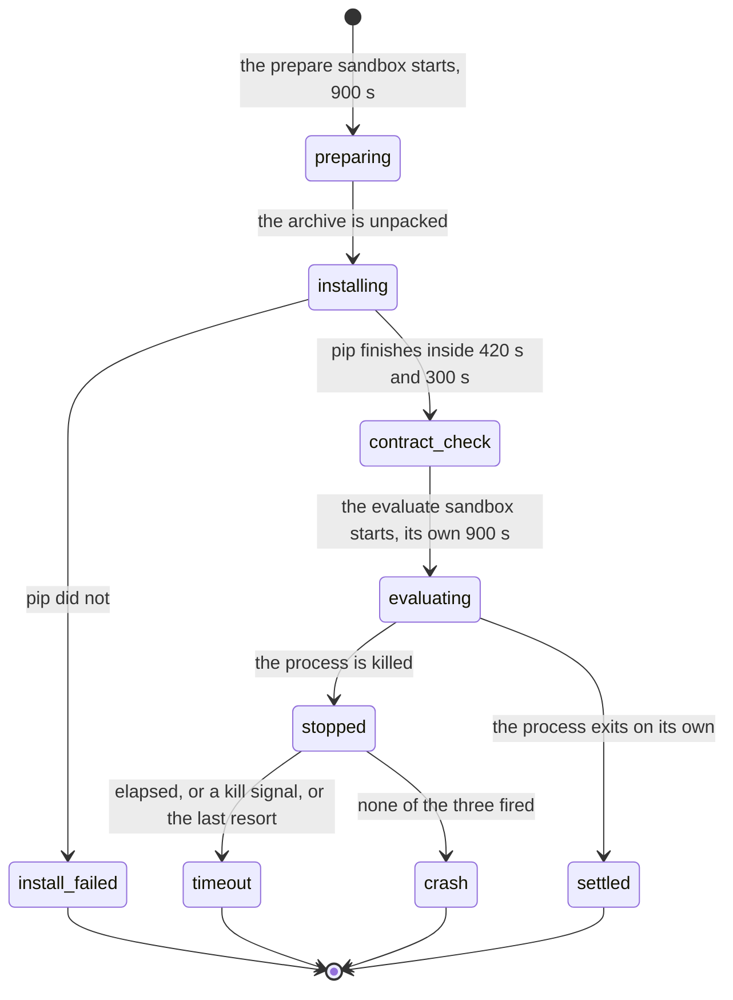

# Timeouts and limits

## Summary

This document owns the limits a hosted execution is subject to and how the platform explains a failure at a limit. Attribution determines the explanation. Failed executions use no quota in either mode.

There is no screen called "limits". A student meets them as a failure card headed "Evaluation exceeded the time limit" or "Memory limit exceeded", as a log that ends with `[N characters omitted]`, or as a run that simply stops.

The attribution rule is one sentence: nothing a student process writes is evidence about the platform. Every condition that used to be reported from inside the sandbox is now verified by the controller before the sandbox is created. The sandbox still writes its old marker and nothing reads it.

## The simple case

A team's Week 1 submission enrolls thirty songs and answers 252 queries. It has 900 seconds. At 900 seconds Modal kills the process, which comes back to the controller as a nonzero return code with no traceback, indistinguishable from a crash. The controller checks the elapsed time, sees it at or past the budget, and reports a timeout naming the budget rather than "Evaluation failed." The failed execution uses no quota.

## Every limit

| Limit | Value | Where | What a student notices |
| --- | --- | --- | --- |
| Prepare sandbox wall clock | 900 s | `apps/portal/worker/execution/runner.ts:133` | The prepare stage stops. Attributed as an install failure, not a timeout; see [Open questions](#open-questions-and-verification). |
| Evaluate sandbox wall clock | 900 s, the same value | `runner.ts:133`, applied at `modal_app.py:1148` and in each evaluate lane | "Evaluation ran past its 900 second budget and was stopped." |
| Memory | 4096 MB for `language-search` and `audio-identification`, 2048 MB otherwise | `runner.ts:129` | The card "Memory limit exceeded", when the failure is recognized at all. |
| CPU | 1 core (requested as a 0.5 to 1 range) | `runner.ts:93`, `modal_app.py:1146` | Nothing directly. It is why a submission that is fast on a laptop is not fast here. |
| Captured student log | 8192 bytes | `runner.ts:134` | `[N characters omitted]` in the middle of the log on the run page. |
| Predictions file | 8 MiB | `modal_app.py:750` | "Submission predictions exceed the 8 MiB result limit." Advisory only; see below. |
| Source archive | 100 MiB | `modal_app.py:322` | "Source archive is larger than 100 MiB." |
| Archive download socket | 30 s | `modal_app.py:325` | "Source archive could not be downloaded safely." |
| `pip install -e` | 420 s | `modal_app.py:402` | An install failure, unless a `submission.py` can still resolve the repository. |
| `pip install -r requirements.txt` | 300 s | `modal_app.py:427` | Nothing. A failure here is a warning written to stderr, not a refusal. |
| Controller function | 3600 s | `modal_app.py:2257` | Nothing. It is four times the sum of the two sandbox budgets. |
| `submit_job` endpoint | 30 s | `modal_app.py:2383` | Nothing. It answers 202 and spawns the work. |
| Status heartbeat | every 2.0 s | `modal_app.py:901` | The phase rail and the elapsed clock updating. |
| Callback POST | 15 s, 3 attempts, `0.25 * 2**attempt` backoff, honoring `Retry-After` | `modal_app.py:840` | Nothing, unless all three fail. |
| Signature clock skew | 300 s | `apps/portal/worker/routes/runner-events.ts:24` | Nothing. A runner whose clock is more than five minutes off is rejected as unauthorized. |
| Stale-run reaper | 3600 s, with a floor of 900 s on the override | `apps/portal/worker/execution/maintenance.ts:22` | "The execution provider stopped reporting progress." |
| Wiring trace, refusal trace | 16 steps each | `modal_app.py:1666`, `modal_app.py:804` | A trace that stops after sixteen rows, with nothing saying it was cut. |
| Diagnostics | 32 items of 240 characters | `modal_app.py:2334` | A sentence that ends mid-word. |
| Difficulty curve | 24 points, labels of 40 characters | `modal_app.py:2239` | A curve with at most 24 points. |

Two of these are enforced twice. The 8192-byte log cap is applied inside the sandbox by a bounded buffer that keeps the head and the tail and drops the middle, and again on read-back by a slice on the controller (`modal_app.py:1699`). The buffer splits its budget half and half, because the benchmark writes its own showcase lines after the submission has run, into the same stream: a head-only cap let a chatty submission push those off the end, and a cloud canary once observed zero showcase lines while the same code produced ten locally (`modal_app.py:544`). Between the two ends, the buffer inserts `[N characters omitted]`.

The 8 MiB predictions cap is not enforced twice, and that is the point of it. The check runs inside the student's own process on the way out (`modal_app.py:750`), so it is advice rather than a guarantee: an `atexit` handler that rewrites the file after the script's last write leaves the controller reading whatever the handler put there. The controller does not re-check the size. It re-checks the shape instead, which is what it is unwilling to be wrong about (see [`scoring-and-refusals.md`](scoring-and-refusals.md)).

The stale-run reaper's override is worth naming because of how it fails. `RUN_STALE_AFTER_SECONDS` below 900 is silently ignored and the default hour is used instead (`maintenance.ts:48`). An operator who sets 300 gets 3600 and no warning.

### Where the numbers came from

Two of the limits carry their evidence at the point they are set, which matters because a limit with no measurement behind it is a guess a team pays for.

Memory was measured with `/usr/bin/time -l` over the Week 1 evaluation tier, thirty songs and 252 queries, under Python 3.8.20: the tuned reference submission peaked at 1.52 GB, and two real 2026 repositories at 1.01 GB and 1.42 GB. 4096 MB is double the worst measured peak (`runner.ts:100`). The 2048 MB default for everything else is not given a measurement.

The wall clock was measured on Modal rather than on a laptop, because the laptop numbers were badly optimistic: one repository that took 16 seconds locally took 75 seconds hosted, and another that took 381 seconds locally took 875 and 898 on two hosted runs and 999 on a third (`runner.ts:110`). Nothing on any surface tells a student that their laptop timing does not predict this.

## The ask, event by event



### Asking

Every limit is fixed before the run starts. The worker builds one job object naming the memory, the CPU, the wall clock, and the output cap, and the job is signed and validated on arrival (`runner.ts:81`). A team cannot ask for more of anything, and no page shows them what they have.

### Answered without work

Nothing about limits is answered without work. Every one of them is a property of a container that has to exist before it can be exceeded.

### The work begins

`modal.Sandbox.create` returning. From that instant the wall clock is running and the memory ceiling is live. There are two such moments per run, one for prepare and one for evaluate, and they do not share a budget: a prepare that took 880 seconds hands a full 900 to the evaluate sandbox.

### While it works

The controller sits in `process.wait()` while a background thread posts the current phase every 2 seconds. Nothing reports how much of the budget is left, in any surface. The elapsed clock on the run page counts up and the student is left to know the ceiling from somewhere else.

### How it ends

Either the process exits on its own, or the sandbox kills it. The two look the same from the controller's side, which is the whole problem this document's second half is about.

## How a timeout is attributed

Two independent mechanisms decide, and they cover different paths.

### The process came back

Week 1 and Week 3 record a start time before `sandbox.exec` and call `_timed_out` when the return code is nonzero (`modal_app.py:1893`, `modal_app.py:1976`). It reads three signals, in this order (`modal_app.py:2077`):

1. **Elapsed time at or past 95 percent of the budget**, which is 855 seconds against 900. This is the reliable one, and a submission cannot forge it.
2. **A return code in `(-9, 137, -15, 143)`**, the SIGKILL and SIGTERM shapes. Kept as corroboration, so a process killed slightly early still reads as a timeout.
3. **The word "killed" in the last 200 characters of stderr, lowercased.** Last, and explicitly a last resort, because it reads student-influenced text.

The docstring carries the measurement the function exists for: `carti4ce/week1_capstone` reached 999 seconds against a 900 second budget on the evaluation corpus, because its `database.add` rewrites the whole pickle per song and `query_details` reloads it per query, so its cost grows with the catalog rather than with the clip. The same submission also finished at 875 and 898 seconds on two earlier hosted runs, which is a coin flip against the budget (`runner.ts:113`).

The budget was deliberately not raised. A budget wide enough for a database that grows with the catalog is a budget that no longer means anything, and the failure is now legible: the timeout names the budget and that shape of database instead of saying "Evaluation failed." (`runner.ts:123`).

The ordering of the three signals is what stops the obvious attack. A team that raises `RuntimeError("killed")` five seconds in fails signals one and two, and signal three is checked against the last 200 characters only, so a long traceback pushes the word out of the window. `test_failure_attribution.py:202` pins that case.

### An exception came back instead

Everything else arrives as an exception from the Modal client, and every evaluate lane classifies it the same way, by substring, in this order (`modal_app.py:1704`, and three more):

- "timeout" or "timed out" in the message becomes `timeout`, `infrastructure=False`.
- "memory" or "oom" becomes `memory_limit`, `infrastructure=False`.
- Anything else becomes `provider`, `infrastructure=True`.

Timeout and memory-limit failures are attributed from the controller's observations. Neither failure uses quota. Attribution must still be accurate so the team receives the right explanation.

Timeout is checked before memory, so a message containing both words is a timeout. The four copies of this classifier are tested against each other rather than deduplicated, because each builds a different message and what has to hold is that the same text is classified the same way whichever benchmark the team ran (`test_limit_attribution.py:153`).

There is a known blind spot, recorded rather than guessed at. Every exception class in `modal.exception` constructs with an empty message, so `SandboxTimeoutError()` matches neither substring and falls through to `provider` with `infrastructure=True`. It survives because the reachable path does not go through this handler: `process.wait()` catches Modal's own timeout internally and sets the return code to -1, so an ordinary sandbox timeout reaches `_timed_out`, and `_timed_out` recognizes it from elapsed time alone. What is genuinely unknown is which exception Modal raises on an out-of-memory, and with what text, because nothing in this repository has ever observed one (`test_limit_attribution.py:202`).

One gap between the two mechanisms is written down: a process that returns -1 well before the budget is not a timeout, because -1 is also what Modal reports for an unexpected exit status, and treating it as a timeout would let a crash be relabelled (`test_limit_attribution.py:255`).

### Why nothing in the sandbox gets a say

The sandbox used to say. It wrote `COG_PLATFORM_ERROR:` to stderr when it failed before importing student code, and the controller read that marker. The comment above the read said it could not be forged, because only the message text was student-controlled. That was wrong, and measurably. `contextlib.redirect_stderr` rebinds the `sys.stderr` object and does not touch file descriptor 2, so three lines inside any student module put the marker on the pipe the controller reads:

```python
import os
os.write(2, b"COG_PLATFORM_ERROR: FaceNet cache validation failed")
```

That incorrectly produced a `model_cache` explanation blaming the platform. The exit code was no better: `os._exit` beats the `SystemExit(2)` the script would otherwise raise (`modal_app.py:2026`).

The fix was not a harder-to-forge channel. Two earlier fixes each moved the trust to a new channel, the adapter name, then the message words, then this marker, and each left the shape intact. The rule now is that once student code is running in a process, nothing that process emits is evidence about the platform, so no evaluate lane reads any of it.

Nothing was lost by not asking, because every condition the marker reported is verified by the controller before the sandbox is created: `_week1_cases` re-renders the corpus from its seeds and checks it against pinned sha256 digests, `_week3_cases` decodes and validates the same course artifacts, `_v2_cases` decodes and validates the payload, and the FaceNet checkpoint is downloaded under a sha256 lock at image build time, so a cache fault at evaluation would mean the image did not build.

The sandbox still writes the marker (`modal_app.py:746`). Nothing reads it, and a test fails the build if anything starts to (`test_failure_attribution.py:155`).

## Modifiers

| Modifier | Set before the ask | Changed while it works |
| --- | --- | --- |
| Who you are | No effect. Nobody gets a larger budget, and an instructor cannot extend one. | No effect. |
| Where your team and repository stand | A repository larger than 100 MiB as a tarball never reaches a sandbox. Everything else meets the same limits. | No effect. |
| Which week's benchmark | Decides the memory ceiling: 4096 MB for Week 1 and Week 3, 2048 MB otherwise (`runner.ts:129`). Week 3 loads a 200-dimensional GloVe table inside the sandbox, about 350 MB warm and 1.5 GB peak on a cold parse; Week 1 renders a 30-song catalog of float32 audio before any student code runs. It also decides which timeout message is shown, and whether a timeout is recognized on the process-return path at all. | No effect. |
| Practice or leaderboard | The practice split is smaller, so code may complete in practice and time out officially. Failed executions use no quota in either mode. | No effect. |
| Flags, options, and where you are typing | Nothing a student types changes any limit. A local `cogworks run` has no wall clock, no memory ceiling, and no log cap, so a submission that times out hosted may simply be slow locally with nothing saying so. | No effect. |

## Cancel and interrupt

| Event | Before the work begins | While it works |
| --- | --- | --- |
| You stop it yourself | There is nothing to stop it with. No route under `apps/portal/worker/routes/` cancels a run, so closing the page or the terminal leaves it running to its budget. | The same. The budget expires on its own schedule, and the only thing that ends a run early is the reaper, an hour after it went quiet. |
| You do something else mid-way | A second run for the same benchmark is refused with `active_run_exists`. | The same. The lock is held until the run reaches a terminal state. |
| A teammate acts at the same time | No effect on any limit. | No effect. A teammate's push does not touch this run's clock. |
| The network or the portal fails | No effect; nothing is running. | The callback is retried three times with backoff. If all three fail the run finishes in the sandbox and the portal never hears, and the reaper settles it an hour later as a provider failure using no quota. |
| The page or the process goes away | No effect. | A killed controller leaves a sandbox that terminates itself at its budget and a run row that only the reaper will settle. The gap between the two is up to an hour. |
| The thing being measured changes | Limits are copied into the job when it is built, so a deploy that changes a value does not reach a run already in flight. | No effect. The sandbox holds its own copy. |
| The platform refuses or credit runs out | Admission checks capacity before dispatch. | Timeout, memory and provider failures use no quota. There is no category-based charge or refund cap. |

## Interactions with other systems

**Who may do this.** Nobody sets a limit and nobody can raise one. `RUN_STALE_AFTER_SECONDS` is the only tunable, it is an operator environment variable, and values below 900 are ignored.

**The team owns it.** A budget belongs to a run, and a run belongs to a team. There is no per-person allowance of anything.

**Credit.** All failed executions use no quota. A valid completed evaluation counts regardless of its score. See [credit and quota](../cross-cutting/credit-and-quota.md).

**What the portal claims.** A run killed at the container level is attributed by elapsed time and signal, never by reading text the student could have written. That is the same honesty rule the trust vocabulary rests on; see [`../foundations/what-the-portal-claims.md`](../foundations/what-the-portal-claims.md).

**What the benchmark supplied.** Week 1's corpus and Week 3's GloVe table are rendered or loaded inside the sandbox, on the student's clock and inside the student's memory ceiling. A team's usable budget is therefore smaller than the number on the card, and nothing says by how much.

**Live updates and reconnection.** The 2 second heartbeat is what keeps a run from looking dead, and it is also what the reaper's hour is measured against.

**Discord.** Limits are not mentioned in any Discord message. A timed-out run appears as a failed run.

**Configuration.** `RUNNER_PYTHON_VERSION` and `RUNNER_IMAGE_DIGEST` change what the sandbox is, not what it may use. Every limit in the table above is a literal in source.

## Edge cases

- **Week 2 has no timeout attribution on the process-return path.** `_evaluate_week1` and `_evaluate_week3` record a start time and call `_timed_out`; `_evaluate_v2` and `_evaluate` do neither (`modal_app.py:1719`, `modal_app.py:1669`). Both Week 2 benchmark ids route through `_evaluate_v2`, so a Week 2 submission killed at 900 seconds is reported as `student_runtime` with a truncated stderr tail. Neither failure uses quota, but the sentence still matters: the team is told their code raised an exception and handed a fragment of a log, rather than being told they ran out of time.
- **The Week 3 timeout message is Week 1's copy, verbatim.** Both lanes raise the same string (`modal_app.py:1917`, `modal_app.py:1996`): "Evaluation ran past its {} second budget and was stopped. Every song has to be enrolled and every query answered inside that window; a database that is re-read or rewritten once per song or per query grows with the catalog and will not fit." A language-search team is told about songs and a catalog. The static card beside it has correct per-module advice for exactly this case, telling a language team to "Embed the image pool once in prepare_database() rather than per search" (`packages/contracts/src/failures.ts:225`), so the run page shows the right advice and the wrong sentence at the same time.
- **The number 900 lives in two packages.** The runner interpolates the real `timeoutSeconds` into its message; the failure catalog hardcodes "Your submission ran past the 15-minute wall-time ceiling and was stopped." (`failures.ts:119`). Changing the budget in `runner.ts` leaves the card claiming fifteen minutes.
- **A prepare timeout is not called a timeout.** `_prepare` classifies its nonzero return code by substring on the detail, and has no elapsed-time check at all (`modal_app.py:1169`). A prepare stage killed at 900 seconds falls through to `dependency_install`, so a repository whose `setup.py` hangs is told its dependencies failed to install. The failure is free, but the explanation can still send the team toward the wrong fix.
- **A `pip install -e` failure is only fatal when nothing else can resolve the submission.** A repository carrying both a broken `pyproject.toml` and a working `submission.py` is still scored, rather than refusing a usable submission over the platform's packaging preference (`modal_app.py:406`).
- **A `requirements.txt` that will not install is a note, not a failure.** The prepare script writes `COG_NOTE:` to stderr and carries on, so the import that actually needs the package fails later in the student's own frame, naming the module rather than naming pip (`modal_app.py:430`).
- **The 16-step trace cap is silent.** A wiring trace or a refusal trace longer than sixteen steps is cut with nothing saying so, unlike the log, which says how many characters it dropped.
- **Nothing tells a student the memory ceiling before they hit it.** The number is not on the run page, the dashboard, or in `cogworks check`. It reaches them only as the words "Memory limit exceeded" and an action telling them to work in batches (`failures.ts:126`).
- **A local run has none of these limits.** `cogworks run` has no wall clock, no memory ceiling, and no log cap, so the first time a team meets any of them is on a hosted run, and a failure at a hosted limit still uses no quota.
- **`cancelled` is a status nothing produces.** It is in the schema (`apps/portal/worker/db/schema.ts:304`), the phase rail draws it as "Stopped before completion", and the console prints "Cancelled" (`apps/portal/src/components/RunConsole.tsx:78`). No route, service, or cron path ever writes it. A run either finishes, fails, or is reaped, so this is dead copy for a state a student cannot reach.

## Open questions and verification

- Week 2 gets no timeout attribution on the process-return path (`modal_app.py:1719`). The two lanes that do have it were added for Week 1 and Week 3 and the pattern was not carried back. `test_limit_attribution.py` covers the exception handler in all four lanes and does not cover this, so nothing fails when it is missing. Worth treating as a bug.
- The Week 3 timeout message is Week 1's copy verbatim and names songs and a catalog to a language-search team (`modal_app.py:1917`). Worth treating as a bug; the correct wording already exists in `failures.ts:225` and only needs to be said in the same place.
- The 15-minute ceiling is hardcoded in `failures.ts:119` while the runner interpolates the real value. One number, two packages. Worth treating as a bug.
- A prepare stage killed at its budget is reported as a dependency-install failure. Whether that is reachable in practice was not measured; a 900 second `pip install -e` would have to survive its own 420 second budget first, so the likeliest route is a hanging `setup.py`. **Unverified.**
- No surface shows a student what any budget is before they spend it. The number appears for the first time inside the failure message. Whether that is deliberate was not established.
- Nothing was observed at a real limit. Every number here is read from source and every attribution path from tests that exercise the classifier rather than a live sandbox. In particular, which exception Modal raises on an out-of-memory, and with what text, is unknown to this repository. **Unverified.**
- Whether the two 900 second budgets are meant to be one value or two that happen to agree was not established. They come from one field on the job and are applied at two `Sandbox.create` calls, so a run can occupy 1800 seconds of wall clock against a 3600 second controller function.

Verified against Cog\*Portal commit `a0e8eac` for quota policy; unchanged timeout and attribution references retain the earlier draft.
