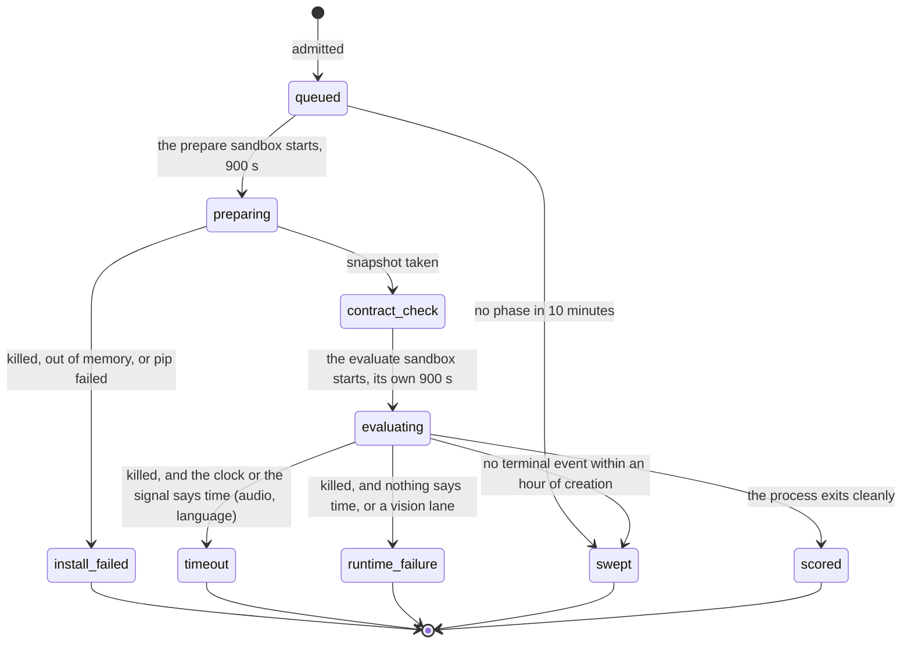

# Timeouts and limits

## Summary

This document owns every limit a hosted execution runs under and how the platform decides whose
failure it was when one is hit. Attribution decides the explanation, not the cost: no failed
execution uses quota in either mode.

There is no screen called "limits". A student meets them as a failure card headed "Evaluation
exceeded the time limit" or "Memory limit exceeded", as a log that contains `[N characters
omitted]`, as a run that stays `queued` or stops reporting until a sweep fails it, or, most often, as
a failure that names the wrong cause.

The attribution rule fits in one sentence: once student code is running in a process, nothing that
process writes is evidence about the platform (`apps/runner-modal/src/cogworks_runner/modal_app.py:1930`).
The controller decides from what it observed outside the process: elapsed time, the return code,
and exceptions from Modal itself.

## The simple case

A Week 1 submission enrolls thirty songs and answers 252 queries inside a 900 second budget. Modal
kills it at 900 seconds; the controller sees a nonzero return code with no traceback, checks the
clock, finds it past 95 percent of the budget, and reports a timeout. The card reads "Evaluation
exceeded the time limit" and, open, "Evaluation ran past its 900 second budget and was stopped.
Every song has to be enrolled and every query answered inside that window; a database that is re-read
or rewritten once per song or per query grows with the catalog and will not fit."
(`modal_app.py:1900`). The margin says "A run that fails doesn't count against your team's practice
runs." (`apps/portal/src/routes/RunDetailPage.tsx:197`).

## Every limit

| Limit | Value | Where set | What a student notices |
| --- | --- | --- | --- |
| Prepare sandbox wall clock | 900 s | `apps/portal/worker/execution/runner.ts:166`, applied `modal_app.py:1514` | Prepare stops. Reported as an install failure, not a timeout. |
| Evaluate sandbox wall clock | 900 s, its own budget | the same field, applied in each evaluate lane (`modal_app.py:1653`, `:1715`, `:1786`, `:1868`) | A timeout card for audio and language; a runtime failure for vision. |
| Memory | 4096 MB for `audio-identification` and `language-search`, 2048 MB for both vision benchmarks; requested as 512 MB to that ceiling | `runner.ts:162`, `modal_app.py:1513` | "Memory limit exceeded" when Modal's message says so; otherwise something else. |
| CPU | up to 1 core, at least 0.5 | `runner.ts:126`, `modal_app.py:1512` | Nothing directly. Why laptop timings do not carry over. |
| Module import during discovery | 30 s per module | `python/cogbench/src/cogbench/discover.py:149` | The module is skipped and named. |
| Discovery pairing attempts | 20,000 per search | `python/cogbench/src/cogbench/resolve.py:105` | A `not_wired` refusal with nothing saying the ceiling was reached. |
| Source archive | 100 MiB, 30 s socket timeout | `modal_app.py:519`, `:522` | "Repository could not be fetched". |
| Weight files | 8 per run, 100 MiB each, no socket timeout | `protocol.py:77`, `modal_app.py:555`, `:577` | "Benchmark data is not ready". |
| `pip install -e` | 420 s | `modal_app.py:634` | An install failure, unless a root `submission.py` can still resolve the repository. |
| `pip install -r requirements.txt` | 300 s | `modal_app.py:658` | Nothing at the time; a skipped module later. |
| Captured student output | 8192 bytes, head and tail kept | `runner.ts:167`, `modal_app.py:771` | `[N characters omitted]` in the middle of a practice log. |
| Predictions | 64 MiB | `modal_app.py:1035` | "Submission predictions exceed the 64 MiB result limit." as a runtime failure. |
| Failure detail | 240 characters, cut at a word with " ..." | `modal_app.py:102`, `:127` | A long exception message ends in " ...". |
| Scorer notes | 32 notes of 600 characters, a longer note split into further notes | `modal_app.py:98`, `:156`, `:2288` | Nothing, unless a note runs past 600 and its second half appears as a bullet. |
| Wiring trace and refusal trace | 16 steps each | `modal_app.py:1630`, `:1070` | A trace that stops at sixteen rows with nothing saying it was cut. |
| Refusal extras | 8 notes, 32 skipped modules, 16 raised errors | `modal_app.py:1078` to `:1097` | Lists that stop with nothing saying so. |
| Difficulty curve | 24 points, labels of 40 characters | `modal_app.py:2139` | At most 24 points. |
| Status heartbeat | every 2.0 s | `modal_app.py:1250` | The rail and its clock updating. |
| Callback POST | 15 s, 3 attempts, `0.25 * 2**attempt` backoff or `Retry-After` | `modal_app.py:1117` | Nothing, unless all three fail. |
| Controller function | 3600 s, 5 retries at 10 s doubling to 60 s | `modal_app.py:2159`, `:2179` | Nothing. Retries only resend a stored outcome. |
| Dispatch POST | 15 s | `runner.ts:412` | A slow dispatch leaves the run `queued`. |
| Queued sweep | 10 min from creation, checked every 5 min | `apps/portal/worker/execution/maintenance.ts:32`, `apps/portal/wrangler.jsonc:92` | The queued note promises it; then "The run couldn't finish". |
| Stale-run sweep | 3600 s from creation; an override below 900 is ignored | `maintenance.ts:21`, `:36` | "The execution provider stopped reporting progress." |
| Callback signature clock skew | 300 s | `apps/portal/worker/routes/runner-events.ts:24` | Nothing. A runner clock off by more than five minutes is refused. |

The 8192-byte output cap keeps the first and last halves and drops the middle, because the benchmark
writes its showcase lines after the submission into the same stream and a head-only cap let a chatty
submission evict them (`modal_app.py:765`). The run page folds the practice log under "Show the log"
with "{n} lines, capped" whether or not anything was dropped
(`apps/portal/src/components/LogView.tsx:33`). The predictions cap runs inside the student's own
process, so it is advice; the controller re-checks shape, not size (see
[`scoring-and-refusals.md`](scoring-and-refusals.md)).

### Where the numbers came from

Memory: `/usr/bin/time -l` over the Week 1 evaluation tier under Python 3.8.20 gave 1.52 GB for the
tuned reference and 1.01 GB and 1.42 GB for two real 2026 repositories; 4096 MB is double the worst
(`runner.ts:131`). Week 3's figure is the GloVe table, about 350 MB warm and 1.5 GB at peak on a cold
parse (`runner.ts:127`). The 2048 MB vision ceiling has no measurement beside it.

Wall clock was measured on Modal because laptop numbers were badly optimistic: one repository took
75 s hosted against 16 s on a laptop, another 875 s and 898 s hosted against 381 s, and the second
timed out at 999 s on a third run (`runner.ts:142`). The budget was deliberately not raised: "A
budget wide enough for an O(N^2) database is a budget that no longer means anything" (`runner.ts:157`).
Nothing on any surface tells a student their laptop timing does not predict the hosted one.

## The ask, event by event

```mermaid
stateDiagram-v2
    [*] --> queued : admitted
    queued --> swept : no phase in 10 minutes
    queued --> preparing : the prepare sandbox starts, 900 s
    preparing --> install_failed : killed, out of memory, or pip failed
    preparing --> contract_check : snapshot taken
    contract_check --> evaluating : the evaluate sandbox starts, its own 900 s
    evaluating --> scored : the process exits cleanly
    evaluating --> timeout : killed, and the clock or the signal says time (audio, language)
    evaluating --> runtime_failure : killed, and nothing says time, or a vision lane
    evaluating --> swept : no terminal event within an hour of creation
    install_failed --> [*]
    timeout --> [*]
    runtime_failure --> [*]
    swept --> [*]
    scored --> [*]
```

### Asking

Every limit is fixed when the worker builds the job, which is signed and recorded on the run
(`runner.ts:114`). A team cannot ask for more of anything, and no page shows what they have.

### Answered without work

Nothing about limits is answered without work; a limit is a property of a container that has to exist
before it can be exceeded. The one exception is the queued sweep, which can fail a run that never got
a container.

### The work begins

`modal.Sandbox.create` returning. There are two such moments for a practice run, prepare and
evaluate, and they do not share a budget: a prepare that took 880 seconds hands a full 900 to the
evaluate sandbox. An official attempt has only the evaluate one.

### While it works

The controller waits on the process while a thread posts the current phase every 2 seconds. During
evaluation the phase carries "0 of N cases" and does not move until the end (B-22). Nothing reports
how much budget is left.

### How it ends

The process exits on its own, or the sandbox kills it. From the controller's side those look the same,
which is what the next section is about.

## How a failure is attributed

### The process came back

`audio-identification` and `language-search` record a start time and, on a nonzero return, call
`_timed_out` (`modal_app.py:1796`, `:1878`, `:1976`). It reads three signals in order:

1. **Elapsed time at or past 95 percent of the budget** (855 s of 900). A submission cannot forge it.
2. **A return code of -9, 137, -15 or 143**, the kill and terminate shapes, so a process killed a
   little early still reads as a timeout.
3. **"killed" in the last 200 characters of stderr.** Last, because the student can write it.

The ordering stops the obvious forgery: a `RuntimeError("killed")` five seconds in fails the first two,
and a traceback pushes the word out of the window.

`vision-recognition` and `vision-clustering` run through `_evaluate_v2`, which records no start time
and never calls `_timed_out` (`modal_app.py:1728` to `:1740`). A vision submission killed at 900
seconds is `student_runtime`: "Your code raised an exception", with whatever line its stderr ended on.
The legacy `_evaluate` lane does the same (`modal_app.py:1667`) and serves no current benchmark.

### An exception came back instead

Anything that arrives as an exception from Modal is classified the same way in all four lanes, by
substring: "timeout" or "timed out" becomes `timeout`; "memory" or "oom" becomes `memory_limit`;
anything else is `provider` and the platform's fault (`modal_app.py:1757`, and three more).
`test_limit_attribution.py:148` checks the four copies agree. Modal's own exception classes carry an
empty message, so `SandboxTimeoutError()` would fall through to `provider`; the reachable path avoids
it because `process.wait()` turns Modal's timeout into a return code of -1, which `_timed_out` sees
by elapsed time. Which exception Modal raises on an out-of-memory, and with what text, has never been
observed (`test_limit_attribution.py:193`).

### Everything after the team's code starts is the team's

The evaluate script marks the step as the student's just before it imports their code
(`modal_app.py:941`, `:972`, `:993`, `:1008`). From there every exception becomes `COG_ERROR` and
`student_runtime`, including the platform's second discovery search and the replay of the bound
pipeline. The hosted beta run `run_f5fc5babe5` failed this way on a defect in the platform's own
pipeline replay and read "Your code raised an exception" (see
[`discovery.md`](discovery.md#the-second-search-and-the-replay)).

That run also shows what a student gets to debug from. A failed hosted run carries the exception
message and nothing else: the script writes one `COG_ERROR:` line (`modal_app.py:1019`), the captured
output is saved only after success (`modal_app.py:1038`), and the failed event carries no log
(`modal_app.py:2318`). No traceback, no file and line, none of their own prints
(beta-qa `hosted-run_f5fc5babe5/failed-dom.txt` has no log). The fixture provider does show a log
on failed runs (`/tmp/cogshots/matched/pairs/b-run-failed-desk.png`), so local development does not
show this.

### Why nothing in the sandbox gets a say

The sandbox used to report its own platform faults with a `COG_PLATFORM_ERROR:` marker on stderr.
`contextlib.redirect_stderr` does not touch file descriptor 2, so `os.write(2, b"COG_PLATFORM_ERROR:
…")` from any student module put the marker where the controller read it, and the run page blamed the
platform. The fix was to stop asking: every condition the marker reported is verified by the
controller before the sandbox starts (`modal_app.py:1955`), and the pre-install image check in
prepare is the only other platform evidence ([`prepare.md`](prepare.md)). The script still writes the
marker for a failure before student code (`modal_app.py:1018`); nothing reads it, and
`test_failure_attribution.py:154` fails if anything starts to.

## Modifiers

| Modifier | Set before the ask | Changed while it works |
| --- | --- | --- |
| Who you are | No effect. Nobody gets a larger budget, and an instructor cannot extend one. | No effect. |
| Where your team and repository stand | An archive over 100 MiB never reaches evaluation. Everything else meets the same limits. | No effect. |
| Which week's benchmark | `audio-identification`: 4096 MB, renders its 30-song catalog inside the student's budget before their code runs, timeout recognized. `language-search`: 4096 MB, loads GloVe inside the budget, timeout recognized but told in Week 1's words about songs (`modal_app.py:1819`). `vision-recognition` and `vision-clustering`: 2048 MB, timeout never recognized on the return-code path. | No effect. |
| Practice or leaderboard | The official split is different data, so code that finishes in practice can still time out officially. An official attempt has no prepare budget to spend. Failed executions use no quota in either mode. | No effect. |
| Flags, options, and where you are typing | Nothing a student types changes a limit. `cogworks run` locally has no wall clock, no memory ceiling and no output cap. | No effect. |

## Cancel and interrupt

| Event | Before the work begins | While it works |
| --- | --- | --- |
| You stop it yourself | There is no cancel. Closing the page leaves the run going. | The same. The budget expires on its own. |
| You do something else mid-way | A second run on the same benchmark is refused with `active_run_exists`. | The slot is held until the run is terminal. |
| A teammate acts at the same time | No effect on any limit. | No effect. |
| The network or the portal fails | A dispatch with no answer stays `queued`; the ten-minute sweep fails it. | Callbacks retry three times. A terminal event that still does not land is stored, and Modal's retries resend it. If the hourly sweep fails the run first, a late result is kept as history under "Recorded before it stopped" and the run stays failed (`runner-events.ts:71`, `RunDetailPage.tsx:219`). |
| The page or the process goes away | No effect. | A dead controller leaves the run on its last phase until the sweep, which counts from creation rather than from the last callback, so a run that reported a minute ago can be failed. |
| The thing being measured changes | Limits are copied into the job, so a deploy does not reach a run already admitted. A Retry refuses if the runtime block changed since (`runner.ts:296`). | No effect. |
| The platform refuses or credit runs out | Admission checks capacity before dispatch. | Timeout, memory, provider and runtime failures use no quota. |

## Interactions with other systems

**Who may do this.** Nobody sets a limit. `RUN_STALE_AFTER_SECONDS` is the only tunable, an operator
variable set to 3600 (`wrangler.jsonc:82`), and values below 900 are ignored.

**The team owns it.** A budget belongs to a run, and a run to a team.

**Credit.** No failed execution uses quota; a valid completed evaluation counts whatever its score.
See [credit and quota](../cross-cutting/credit-and-quota.md).

**What the portal claims.** A killed process is attributed by elapsed time and signal, never by text
the student wrote. The reverse is not held to the same standard: an exception from platform code
inside the student's step is reported as theirs.

**What the benchmark supplied.** Week 1's corpus and Week 3's GloVe table are loaded inside the
sandbox, on the student's clock and inside their memory ceiling, so the usable budget is smaller than
the card's number by an amount nothing states.

**Live updates and reconnection.** The 2 second heartbeat keeps a run from looking dead. The sweeps
do not read it; they count from when the run was created.

**Discord.** No message mentions a limit. A timed-out run is a failed run.

**Configuration.** `RUNNER_PYTHON_VERSION` and `RUNNER_IMAGE_DIGEST` are recorded on the job and change
nothing the sandbox uses; the runner reads only CPU, memory, timeout and output size from `runtime`.
Every limit above is a literal in source.

## Edge cases

- **Vision gets no timeout attribution** (B-11). `test_limit_attribution.py` covers the exception
  classifier in every lane and not the return-code path, so nothing fails.
- **The language timeout talks about songs** (B-25), while the same card's next step, from the
  language override, says "Embed the image pool once in prepare_database() rather than per search"
  (`packages/contracts/src/failures.ts:202`). Right advice and wrong sentence on one card.
- **"15-minute" is written in a second package.** The card's explanation, under "Show details", says
  "Your submission ran past the 15-minute wall-time ceiling and was stopped." (`failures.ts:101`),
  while the runner interpolates the real budget (B-35).
- **A prepare that runs out of time or memory is called an install failure.** `_prepare` has no clock
  check; an empty stderr becomes "The run failed before producing a result." under E-INSTALL
  (`modal_app.py:2021`, `:1584`). Discovery runs inside prepare for every 2026 repository, so a slow
  search or a heavy import is the likely route, not pip.
- **The predictions cap is a runtime failure.** The 64 MiB check raises outside the script's own
  handler (`modal_app.py:1035`), so it surfaces through the traceback as E-RUNTIME "Your code raised
  an exception" on every current benchmark.
- **The 16-step cap is silent**, unlike the log, which says how much it dropped.
- **Nothing states the memory ceiling or the budget before a run hits it.** Neither number is on the
  run page, the dashboard, or in `cogworks check`.
- **`cancelled` is reachable by nothing** (B-37). The run page labels it "Cancelled"
  (`apps/portal/src/lib/run-meta.ts:50`); no route writes it.

## Open questions and verification

- Hosted beta (`4984730`) and the candidate run identical limit and attribution code: `modal_app.py`,
  `runner.ts`, `maintenance.ts` and `failures.ts` have no diff between the two. The one difference
  that changes an outcome is the pipeline replay ([`discovery.md`](discovery.md#open-questions-and-verification)).
- The controller comment at `modal_app.py:2170` says a late replay after the sweep is ignored; the
  worker keeps it as history on the failed run (`runner-events.ts:71`). The comment is stale.
- Nothing was observed at a real limit on any build. Every attribution above is read from source and
  from tests that exercise the classifier, not a live sandbox.
- Whether a prepare killed at its budget reaches the portal as E-INSTALL (return code) or E-PROVIDER
  (exception) depends on Modal behaviour this repository has not recorded.
- Whether the two 900 second budgets are meant to be one value was not established. A practice run
  can occupy 1800 seconds of sandbox time inside a 3600 second controller.

Read against Cog\*Portal commit `2ff32fa`.
