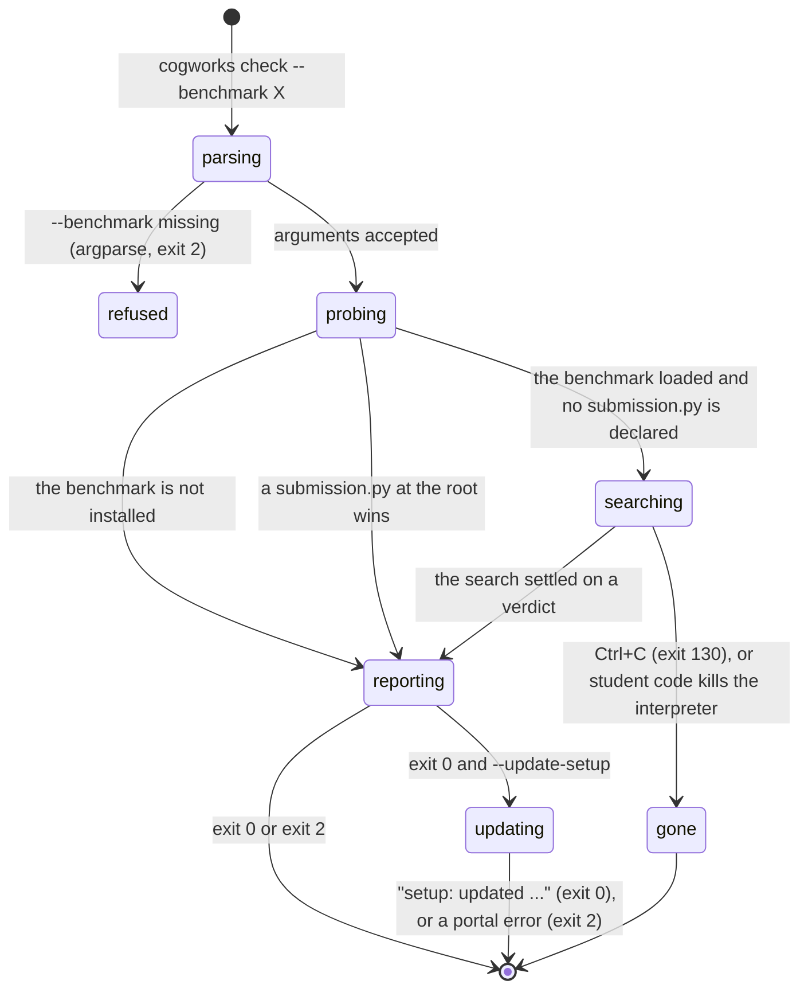

# `cogworks check`

## Summary

`cogworks check` is the command a student runs most and the longest thing the platform prints. It answers two questions at once: is this machine set up to run this week's benchmark, and does this repository hold a pipeline the benchmark can drive. It answers the second by running the team's code, not by reading it. It imports every module it can, then calls their functions with inputs the benchmark supplies until a set of them answers correctly. See [`glossary.md`](../glossary.md) for *discovery*, *bound*, *skipped*, and the five verdicts.

The report is ordered the way a person asks about it, and `report.py`'s own docstring states the order: "Where is your code. Which files did we read, and which could we not. What did we wire up. Then one line: either you are ready, or here is the single next thing." (`python/cogbench/src/cogbench/report.py:8`). The first version of this command printed nine lines of `False` and no next step, which is the failure the whole module was rewritten to avoid.

It is reached by typing `cogworks check --benchmark <id>` inside a team repository. `cogworks --help` describes it as "check the local project and benchmark environment" (`python/cogbench/src/cogbench/cli.py:66`). `--benchmark` is required. The other two flags are `--json` and `--update-setup`, and only the last of them carries a help line, "after local success, update your linked CogPortal setup guide" (`python/cogbench/src/cogbench/cli.py:77`); `--benchmark` and `--json` are described nowhere in `--help` (`python/cogbench/src/cogbench/cli.py:72`). There is no `--portal`, because the loop that builds the subparsers adds that flag only for `run` (`python/cogbench/src/cogbench/cli.py:79`). `cogworks doctor` is a hidden deprecated alias that prints "cogworks: `doctor` is deprecated; use `cogworks check`." to stderr and then does exactly the same work (`python/cogbench/src/cogbench/cli.py:658`).

Nothing is sent anywhere unless `--update-setup` is passed. Nothing is written by the command itself, though the team's own code runs and may write whatever it likes.

## The simple case

A student stands in their team repository with the Week 1 environment installed and types `cogworks check --benchmark audio-identification`. The search runs for a few seconds behind a spinner, the spinner is erased, and this is what is left on screen:

```
benchmark              audio-identification
python                 3.11.9
hosted python          3.8.20 (the hidden evaluation runs on this)
repository             CogWorksBWSI/team-bagel-2026

looked in              Week1  (directory name matches this week)
read                   4 files: spectrogram, fingerprint, database, match
from notebooks         database (definitions only; the cells were not run)
skipped                3 scripts that read files or a microphone this machine does not have

Wired up:
  spectrogram    spectrogram.make_spectrogram
  peaks          fingerprint.find_peaks
  fingerprints   fingerprint.build_fingerprints
  store          database.add
  query          match.query

Your code is wired up and ready to score.

Run `cogworks run --benchmark audio-identification` to score it on your machine.
```

The command exits 0. The last line is the whole point of the closing section: one action, and it is the next command the student will type.

Every label in the top block is padded to 22 characters (`python/cogbench/src/cogbench/report.py:25`). The stage column under `Wired up:` is sized to the widest stage name with a floor of 14, because a function that fills two stages is named for both and a fixed column put the rest of that row out of line (`python/cogbench/src/cogbench/report.py:260`).

`Your code is wired up and ready to score.` is the headline of a placeholder verdict the search writes when a chain binds and there is nothing left to prove locally (`python/cogbench/src/cogbench/resolve.py:1817`). It is not a score. No number appears anywhere in `check`.

### What it looks like when nothing wired up

The same repository on a laptop missing three of Week 1's packages, where the search reaches the peaks step and stalls:

```
benchmark              audio-identification
python                 3.11.9
hosted python          3.8.20 (the hidden evaluation runs on this)
repository             CogWorksBWSI/team-bagel-2026

looked in              Week1  (directory name matches this week)
read                   3 files: spectrogram, peaks, database
could not read         fingerprint_maker: imports librosa, which is not installed here
skipped                4 scripts that read files or a microphone this machine does not have

Wired up:
  spectrogram    spectrogram.make_spectrogram
  peaks          peaks.find_peaks

This check could not read 1 of your files, because this machine is missing packages they import. That is a limit of this check and not a problem with your repository: the graded run installs those packages and will read them.

fingerprint_maker did not import, because librosa is not installed here. librosa is part of the environment the course has you install, and the graded run has it. Install it here and run this again.
```

Exit 2. Three things in that block are worth reading closely.

The verdict is not `not_wired`. The search reached a real dead end, but the module it could not read imports a package the Week 1 image installs, so the skip is *ours* and no verdict about the repository is supported. `not_wired` hands off to `could_not_look` rather than writing a sentence blaming a repository it did not finish reading (`python/cogbench/src/cogbench/verdict.py:344`). The reason is measured and sits in the comment above that line: three Week 2 repositories were reported not wired while the modules holding their clustering were skipped for packages the graded run installs.

The gap note is missing, and that is deliberate. When the verdict is `could_not_look` the paragraph about missing packages is suppressed, because printing both made the reader work out that two paragraphs were one fact, and the verdict wins by being specific about which modules (`python/cogbench/src/cogbench/report.py:207`). The headline names a count and not the module names, for the same reason at a smaller scale: naming them in both made the reader compare two lists to discover they were the same list (`python/cogbench/src/cogbench/verdict.py:379`).

Neither the headline nor the next step is wrapped. Both are appended as single lines (`python/cogbench/src/cogbench/report.py:269`, `:274`) and wrap at whatever the terminal happens to be, breaking mid-package-name. The gap note is the only paragraph put through the 78 column wrapper, and its docstring gives the reason that applies equally to these two (`python/cogbench/src/cogbench/report.py:40`).

### The gap note

When the verdict does not already cover it, one paragraph goes directly under the list of files that were read, because that list is the thing it qualifies. It points the student at the `could not read` lines above it rather than describing a module in the abstract, so the caveat and the evidence for it are on one screen. It has two forms. With one package missing (`python/cogbench/src/cogbench/environment.py:299`):

> "One package the graded run installs is missing here, so this report may have read less of your repository than the graded run will. If a module is listed above under 'could not read' because it needs {names}, this machine skipped it. The hosted run has the package and will read that module. It is part of the environment the course has you set up, so installing it here makes this check match the graded run more closely."

With more than one (`python/cogbench/src/cogbench/environment.py:308`):

> "{count} packages the graded run installs are missing here, so this report may have read less of your repository than the graded run will. If a module is listed above under 'could not read' because it needs one of these packages, this machine skipped it. The hosted run has the packages and will read those modules. They are part of the environment the course has you set up, so installing them here makes this check match the graded run more closely. Missing: {names}."

The list comes from comparing this interpreter against the package list for the benchmark's own track, using `find_spec`, which locates a module without importing it (`python/cogbench/src/cogbench/environment.py:319`). A package that cannot be confirmed present is reported missing rather than assumed present. Measured on a developer machine: cv2, facenet_models, torch, sklearn, matplotlib, datasets, mygrad, mynn, and noggin were absent locally and present in the image (`python/cogbench/src/cogbench/environment.py:257`). An unknown benchmark id yields an empty list rather than a guess, since a package list for the wrong week is worse than no list.

It is not phrased as a fix, because nothing is broken. The repository is fine and the graded run is unaffected.

### What each line of the survey says

The block between the repository line and the wiring is the survey, and it has eight possible lines in a fixed order (`python/cogbench/src/cogbench/report.py:50`).

`looked in` names the directory the search chose and why, in one of five phrases: "declared in cogworks.toml", "directory name matches this week", "code sits at the repository root", "the rest of the code imports from here", or "holds the most importable files" (`python/cogbench/src/cogbench/discover.py:476` to `:493`). Only the last path segment is shown, so two directories named `Week1` in different subtrees print identically.

`could not finish` comes next when the process reading the repository did not survive, and it comes before everything else because it changes how every line under it reads. Under it, `stopped while reading` names the file being read when it died, which is the likeliest cause and the one thing the student can go and look at, and then either `partial` ("what follows is what was read before it stopped, not the whole repository") or, when nothing at all survived, `read  unknown; nothing was reported before it stopped` and the survey ends there. The last case exists because saying "read nothing" would be the exact false statement the branch was written to prevent: an empty `modules` and an empty `skipped` is what a repository holding no Python produces, so a student whose module crashed the reader was told their repository held nothing.

`read` names every module that imported, as "N files: a, b, c", or the single word "nothing". `from notebooks` lists any of them lifted from a `.ipynb`, with "(definitions only; the cells were not run)", because a function lifted from a notebook can fail on a global its cells built.

`could not read` gets one line per skipped module worth naming, carrying the module and the reason. `skipped` collapses the rest into a count: "N scripts that read files or a microphone this machine does not have". A skip is collapsed when its name starts `test` or `run`, or contains `demo`, or its detail starts `FileNotFoundError`, `EOFError`, or `OSError` (`python/cogbench/src/cogbench/report.py:139`). One repository skips fifteen of its own scripts for want of audio files, and naming each buries the one skip that matters.

### When there is no submission to describe

Four different sentences, and each sends the reader somewhere different (`python/cogbench/src/cogbench/report.py:216` to `:245`).

The benchmark is not installed, and the report knows which package that is (`python/cogbench/src/cogbench/report.py:218`):

> "Nothing was searched for, because {benchmark} is not installed here."
> "Install it with `{command}`, then run this again."

The command is built from a table mapping each shipped benchmark id to its distribution name and a git source pinned to the submodule commit (`python/cogbench/src/cogbench/plugins.py:20`, `:44`). For Week 1 the second line reads in full:

> "Install it with `python -m pip install "cogworks-week1-audio-benchmark @ git+https://github.com/SamGu-NRX/cogworks-week1-audio-benchmark.git@b156644aecc810e0b93535e320098f96c39ae04e"`, then run this again."

Four ids are mapped: `audio-identification`, `vision-recognition`, `vision-clustering`, and `language-search`, with the two Week 2 ids sharing one distribution. A benchmark id with no entry falls back to the bare "Install it, then run this again." (`python/cogbench/src/cogbench/report.py:226`), which is what a typo reaches.

A file at the repository root answered for it:

> "Your submission.py at the repository root was used, so nothing was searched for."

Nothing was declared and nothing was searched, because the benchmark does not tell the search what its task is:

> "Nothing was searched for: {benchmark} does not yet describe its task to the search, so a submission must be declared."
> "Add a benchmark_adapter.py at the repository root that defines create_submission(resources), then run this again."

`create_submission` is the name every benchmark accepts; the per-week aliases such as `create_search_adapter` are also recognised (`python/cogbench/src/cogbench/apploader.py:110`), so naming one of them here was only correct for Week 3.

When a package registering this benchmark is installed on the machine, one more line follows, and it is a statement about the machine rather than about the repository (`python/cogbench/src/cogbench/report.py:270`):

> "A package registering {benchmark} is installed here, but it is not this repository, so it is not scored as your work."

That line replaced "Your submission is registered as an installed package, so it was used as is.", which was false: `run` scores a file in this repository or what discovery bound, never an entry point.

The reading of the repository ended before it reported:

> "Reading your repository ended the process before it finished: {detail}."
> "That is an import taking the interpreter down rather than raising, so import your modules one at a time to find which one does it."

Reading happens in a child process (`python/cogbench/src/cogbench/cli.py:412`), so a module that aborts the interpreter costs this report and not the command.

## The ask, event by event



### Asking

Three things happen before the repository is touched.

The process re-executes itself once under a pinned `PYTHONHASHSEED`, because discovery runs student code whose answer can depend on string hashing and an interpreter's seed is fixed before its first line. It is a no-op under an already pinned seed, and it only happens when the command really came from a command line (`python/cogbench/src/cogbench/cli.py:631`).

Arguments are parsed. A missing `--benchmark` is argparse's own error, so it is the one failure on this command that does not carry the `cogworks: ` prefix and does not pass through the handler at `cli.py:846`. It still exits 2.

The working directory is read once, before any benchmark loads, because a benchmark plugin may change it: Week 1 chdirs into a private scratch directory (`python/cogbench/src/cogbench/cli.py:648`). Everything afterwards, including the git state, is resolved against that one value.

### Answered without work

There is almost no such path. `check` is a report, and it prints a report even when every signal is false. A benchmark that is not installed still produces four lines and the two-sentence closing above.

The three ways out with no report at all are an argparse usage error, a benchmark whose plugin raises while loading (`cli.py:371`, `:385`), and a benchmark whose `cache_status` probe raises (`cli.py:378`). The last two escape `_check` entirely and surface as one `cogworks: {message}` line on stderr with exit 2, so a student sees a Python-shaped sentence where they expected the survey.

Nothing is written and nothing is sent on any of the three.

### The work begins

The first student module is imported. From that moment their code has run on their own machine and the platform cannot undo it: constructors open files, module scope trains models, and one 2026 repository keeps a module-global relative `db.pkl`.

Nothing durable belongs to `check` itself. It writes no report, no cache, and no config. What survives an interrupt is whatever the team's own code did before the interrupt landed.

> Technical note: `check` imports that code in its own process. The `survey()` function exists precisely so that a module which aborts the interpreter costs a report rather than the whole run, and its docstring names the real case, an audio helper that loads a second copy of a native backend and dies with a nanobind error no `except` clause can see (`python/cogbench/src/cogbench/discover.py:2230`). No production code calls it. `_discover` goes through `from_spec` to `resolve`, which calls `discover` in-process (`python/cogbench/src/cogbench/resolve.py:554`), so such a module takes `cogworks check` down with it and the student sees nothing at all.

### While it works

The search draws a spinner on stderr, and only when stderr is a terminal. Piped to a file or run in CI it goes silent, because a spinner in a log is thousands of escape codes nobody reads (`python/cogbench/src/cogbench/progress.py:100`). `--json` suppresses it too, by handing the search no watcher at all (`python/cogbench/src/cogbench/cli.py:279`).

Three phase headlines print permanently as the search moves through them: "Reading your repository" (`resolve.py:553`), "Looking for the functions that do the work" (`resolve.py:622`), and "Trying your functions to find which pair stores a song and names it back" (`resolve.py:894`). Between them, a note saying how many files were read and in which directory, and one indented line per stage as it binds. What stays on screen afterwards is a record of what happened rather than the last frame of an animation.

The line that changes is a braille frame, a 24 cell bar, and a count of pairings, rewritten in place at about twelve frames a second and erased when the phase ends. Every number in it is counted by the search itself; nothing is extrapolated from a run on another machine. The last attempt always draws, so the line does not stop on 3,961 of 3,962 and leave a student wondering whether it hung on the final one.

An estimate is appended only after 200 attempts, and only when more than three seconds remain. One repository resolves in 35 attempts and another in 3,962, and the first pairing carries the cost of warming a team's imports and their first call into numba, so a single sample once announced "2m 06s" for a search that took 23 seconds (`python/cogbench/src/cogbench/progress.py:46`). The estimate is phrased "{duration} left at most", because the search stops at the first pairing that works and a countdown that read like a prediction would be wrong most of the time.

### How it ends

The report prints to stdout in a fixed order: benchmark, python, the hosted interpreter when it differs, the repository, a blank line, the survey, the gap note when it is not superseded, the wiring, the verdict with its notes and next step, and the run command when the repository is ready.

The exit code is 0 only when all five of `gitRepository`, `repositoryFullName`, `benchmarkInstalled`, `benchmarkLoadable`, and `submissionLoadable` are true, and 2 otherwise (`python/cogbench/src/cogbench/cli.py:547`). `submissionInstalled` is deliberately not in that list: it reports only entry-point registration, and a repository that resolves by file has none. `submissionLoadable` is now whether `_scoreable` found something to score, which is the same question `cogworks run` asks.

With `--update-setup` and exit 0, one authenticated POST follows, carrying the four step names "clone", "environment", "project", and "wiring" (`python/cogbench/src/cogbench/cli.py:665`), and printing "setup: updated {names}" from the portal's own accepted list. That call deliberately does not retry: the student asked for one visible update, and a failure should hand back control rather than becoming background telemetry. A failure there turns a successful check into exit 2, with the whole report already on stdout.

## Modifiers

| Modifier | Set before the ask | Changed while it works |
| --- | --- | --- |
| Who you are | No effect on the report. `check` reads a repository and an interpreter, and neither has an identity. Only `--update-setup` involves an account, and it uses the device token, so an unlinked machine can run `check` forever with the same output an instructor gets. | No effect. The token is read after the report is already printed. |
| Where your team and repository stand | Decides most of the report. A directory that is not a GitHub worktree prints `repository  not a git repository` and cannot exit 0. A worktree with no commit fails `gitRepository` and exits 2 with nothing on screen saying which of the two was missing. The team, the portal, and any run history are not consulted. | No effect within one invocation. A commit landing mid-search does not change the report; the modules were already read. |
| Which week's benchmark | Decides the package list the gap note compares against, whether the hosted interpreter line prints (3.8.20 for `audio-identification` and `language-search`, 3.11 otherwise), whether a search happens at all, and which cache probes run. `vision-recognition` and `vision-clustering` share Week 2's list and print the same gap note; an unknown id resolves to no track, so its gap note is empty. | No effect. One invocation is one benchmark. |
| Practice or leaderboard | No effect. `check` never contacts a run, spends nothing, and says nothing about quota. It is the only view of a repository that costs nothing to ask for. | No effect. |
| Flags, options, and where you are typing | `--json` replaces the whole report with one JSON object and silences the spinner; it is the only way to see the model and dataset cache probes, which the text report never prints. `--update-setup` acts only after exit 0. There is no `--portal`, so `--update-setup` targets whatever `COGPORTAL_URL` or the saved active portal names. `doctor` adds one deprecation line on stderr. Output is stdout, progress is stderr, so redirecting stdout alone leaves the phase lines on screen with no report under them. | No effect. Every flag is read once at parse time. |

## Cancel and interrupt

| Event | Before the work begins | While it works |
| --- | --- | --- |
| You stop it yourself | Ctrl+C during parsing or the plugin probe prints `cogworks: interrupted` on stderr and exits 130. Nothing was going to be written. | Ctrl+C during the search prints the same line and exits 130. The spinner's live line is not erased first, so the last frame can be left on screen above the message. Whatever the team's own code already wrote to their own disk stays written. |
| You do something else mid-way | No effect. There is no lock and no shared state; two `cogworks check` runs in two terminals are independent. | No effect on this command. The two searches import the same modules in separate processes, so a repository whose module scope writes a shared file has two writers and the platform does not warn about it. |
| A teammate acts at the same time | A push a teammate made is only visible if the student pulled it. `check` reads the working tree in front of it, not the branch, and not the portal's idea of the repository. | No effect. Files are read once at the start of the search. A pull landing mid-search leaves the report describing the previous tree with nothing saying so. |
| The network or the portal fails | No effect. Nothing is sent before the report is printed. A machine with no network produces the identical report. | Only reachable with `--update-setup`, and only after the report. The request is not retried, so one failure prints its message on stderr and exits 2. |
| The page or the process goes away | Closing the terminal kills the command. Nothing of the platform's is left behind. | The same, plus one hazard that is not the platform's: student code that had started writing is killed part way. A module that aborts the interpreter outright produces no report and no message, because the search runs in this process. |
| The thing being measured changes | An edit saved a second before the command starts is included. `check` reads files, not commits, so an uncommitted change is what gets read. | An edit saved mid-search is not picked up. Modules are imported once, and Python will not re-read a file it has already executed. |
| The platform refuses or credit runs out | Not applicable. `check` spends nothing and asks permission for nothing. | The one refusal that can appear is `could_not_look`, which is the platform refusing to judge rather than refusing the ask. It ends the report normally with exit 2. See [`foundations/what-the-portal-claims.md`](../foundations/what-the-portal-claims.md#could-not-look). |

## Interactions with other systems

**Who may do this.** Anyone with the package installed and a directory to stand in. No account, no team, no device link, no network. The only part gated on identity is `--update-setup`.

**The team owns it.** The report is about a repository, and the repository is the team. Nothing in the output names a person, and the four step names sent by `--update-setup` are recorded against the team's setup guide rather than the student who ran the command. See [`foundations/the-team-and-the-repository.md`](../foundations/the-team-and-the-repository.md).

**Credit.** None spent, none reported. `check` is the free view, and its closing line points at `cogworks run`, which is also free because it is local. Neither costs a hosted practice slot.

**What the portal claims.** Nothing here is *verified* in the sense of [`foundations/what-the-portal-claims.md`](../foundations/what-the-portal-claims.md): the portal did not observe any of it. Every line is a claim the student's own machine makes about itself, which is why `could_not_look` matters so much on this command. The report is also careful about the difference between "we could not look" and "there was nothing to find", and says the first one first, because it changes how every line under it reads (`python/cogbench/src/cogbench/report.py:62`).

**What the benchmark supplied.** The search hands the team's functions inputs the benchmark made up, and the acceptance test is the benchmark's. None of that is disclosed in `check`'s output; the "supplied" list appears only on a local report. See [`cross-cutting/what-the-benchmark-supplied.md`](../cross-cutting/what-the-benchmark-supplied.md).

**Live updates and reconnection.** None. There is no session, no stream, and no `--live`. The spinner is the only live thing and it is local.

**Discord.** Nothing is posted. `check` is the one substantial command that is invisible to the rest of the team.

**Configuration.** `COGBENCH_CONFIG` and the saved active portal matter only under `--update-setup`. `TORCH_HOME` changes where the Week 2 checkpoint probe looks (`python/cogbench/src/cogbench/runner.py:132`). Nothing else about the report is configurable.

## Edge cases

- **`repository` shows the GitHub name, not whether it is a repository.** The line prints `repositoryFullName`, which is parsed out of `git remote get-url origin` with a GitHub-specific regex (`python/cogbench/src/cogbench/project.py:30`). A real git worktree with no `origin`, a non-GitHub remote, or a URL with a trailing slash prints "not a git repository", which is false. `gitRepository`, the signal that actually says whether there is a commit, is required for exit 0 and never printed at all.
- **An installed entry point does not stop the search.** Discovery runs unless *this* repository declares a submission by file. An entry point belongs to whatever package was pip-installed, which on a machine that has done more than one week is quite possibly another repository, and the measured consequence is in the comment: an empty repository scored 52% against the reference submission (`python/cogbench/src/cogbench/cli.py:343`).
- **The cache probes run and are never printed.** For a Week 2 benchmark, `check` reads and SHA-256s the entire FaceNet checkpoint, 111,898,327 bytes, on every invocation (`python/cogbench/src/cogbench/runner.py:138`, size from `benchmarks/week2/facial_recognition_benchmark/model-lock.json`). The result reaches `checks["modelCache"]` and the two data cache entries, and `render_check` takes no argument for any of them, so a student who has not downloaded the dataset gets a slower command and no sentence about it.
- **`--json` is a different report, not the same one in another shape.** It carries `localGap`, `modelCache`, `dataTestCache`, `dataEvaluationCache`, `submissionError`, `submissionDetail`, and the whole `discovery` record, serialised with `default=str` so paths become strings (`python/cogbench/src/cogbench/cli.py:521`). None of the prose is in it, and none of the cache fields are in the prose.
- **An unknown benchmark id still gets a hosted interpreter line.** `_hosted_python` falls back to "3.11" for any id it does not know (`python/cogbench/src/cogbench/cli.py:239`), so a typo produces "hosted python 3.11 (the hidden evaluation runs on this)" about a benchmark that does not exist, on the same screen as "not installed here".
- **`contractVersion` in the JSON is an entry-point group name.** It reads `cogworks.submissions.v1` or `cogworks.submissions.v2` (`python/cogbench/src/cogbench/cli.py:357`), not a version number, which is what the key sounds like.
- **`submissionSource` is set to `"discovery"` and never used.** When the search succeeds, `_check` records that value (`cli.py:506`), but `render_check` consults `submission_source` only on the branches where there is no submission object at all, so the string never reaches a reader in text mode.
- **The wiring section can appear with no verdict under it.** `Wired up:` prints whenever there are steps or a store and query pair, and the verdict block prints only if a verdict object exists. Every path through `resolve` produces one, so this is not reachable today, but the two are independent in `render_check`.

## Open questions and verification

- ~~A repository whose module aborts the interpreter takes `cogworks check` down with it, printing nothing.~~ Fixed. The whole of the reading now runs through `run_isolated` (`python/cogbench/src/cogbench/cli.py:412`), and a child that dies produces the "ended the process" report above. Verified against a real `SIGSEGV` in the child, not a description of one (`python/cogbench/tests/test_cli_readiness.py`). `survey()` is still called only from tests, so the `unread` branch of `render_survey` remains unreachable from the CLI.
- ~~`check` can exit 0 while `cogworks run` refuses.~~ Fixed. Both commands now read one decision, `_scoreable` (`python/cogbench/src/cogbench/cli.py:323`); `_submission_for` is a wrapper that raises when it finds nothing to score (`cli.py:376`). An installed entry point is reported and never counted as readiness.
- A `not_wired` verdict on a fully provisioned machine ends with a headline and nothing else. `_next_step_for_stall` returns "" when no skipped module names a missing package (`resolve.py:1928`), so the report's promise of "either you are ready, or here is the single next thing" is not kept in the most ordinary failure. Worth treating as a bug, or the promise should be narrowed.
- The verdict headline and the next step are not wrapped, though the gap note is. The `could_not_look` headline is about 220 characters and breaks mid-word on a narrow terminal. Worth treating as a bug; the fix is one call to the wrapper that is already in the file.
- `--update-setup` is silently ignored when the check does not pass (`cli.py:664`). A student who copies the setup page's command and whose check fails sees no line saying the setup guide was not updated. Whether the setup page's copy block includes the flag was not read in this pass. **Unverified.**
- `check` has no `--portal` while `run` does, so `run --update-setup` can target a portal and `check --update-setup` cannot (`cli.py:79`, `cli.py:691`). Carried to triage as an inconsistency rather than a defect.
- Four test classes in `python/cogbench/tests/test_report.py` sit after `if __name__ == "__main__": unittest.main()` at line 211, so they do not run when the file is executed directly. They do run under `pytest` and `python -m unittest`. `test_verdict.py` and `test_discover.py` have the same shape. Whether the project's test command uses a collector was not confirmed. **Unverified.**
- No timing was measured. Whether the Week 2 checkpoint hash is noticeable on a laptop, and how long a 3,962 pairing search really takes, are both from comments rather than observation. **Unverified.**
- The samples above are assembled from the format strings in `report.py` and the stage names in `benchmarks/week1/audio_identification_benchmark/roles.py:256`, not captured from a terminal. Column positions should be correct; the module names in them are illustrative. **Unverified.**

Verified against Cog\*Portal commit `5a74e74`.
