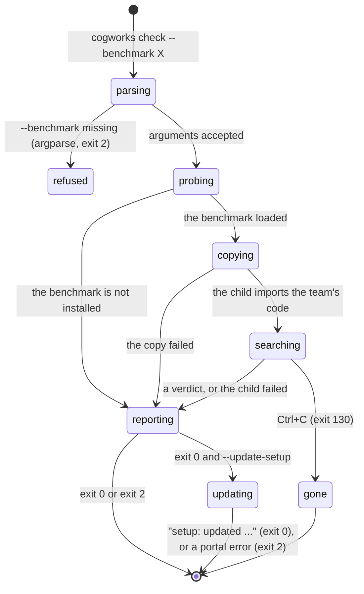

# `cogworks check`

## Summary

`cogworks check` is the command a student runs most and the longest thing the platform prints. It answers two questions at once: is this machine set up to run this benchmark, and does this repository hold a pipeline the benchmark can drive. It answers the second by running the team's code, not by reading it: it imports every module it can, then calls their functions with inputs the benchmark supplies until a set of them answers correctly. See [`glossary.md`](../glossary.md) for *discovery*, *bound*, *skipped*, and the five verdicts.

The report is ordered the way a person asks about it, as `report.py`'s docstring states: "Where is your code. Which files did we read, and which could we not. What did we wire up. Then one line: either you are ready, or here is the single next thing." (`python/cogbench/src/cogbench/report.py:6`). The first version printed nine lines of `False` and no next step.

It is reached by typing `cogworks check --benchmark <id>` inside a team repository. `cogworks --help` lists it as "check the local project and benchmark environment" (`python/cogbench/src/cogbench/cli.py:78`). `--benchmark` is required. The other flags are `--json` and `--update-setup`; only the last carries a help line, "after local success, update your linked CogPortal setup guide" (`cli.py:89`). There is no `--portal`: the loop that builds the subparsers adds it only for `run` (`cli.py:91`). `cogworks doctor` is a hidden deprecated alias that prints "cogworks: `doctor` is deprecated; use `cogworks check`." to stderr and then does the same work (`cli.py:1160`).

The setup page's last step is this command with `--update-setup` (`apps/portal/src/lib/setup-progress.ts:165`); that flag is how the guide's boxes become "seen by the portal". Without it nothing is sent anywhere.

> Technical note: which `check` a student has depends on which CLI the setup page installed. On the candidate the "Install the CogWorks tool" line pins CogPortal commit `40d31a2` (`apps/portal/src/lib/benchmark-packages.ts:40`, seen on screen in `/tmp/cogshots/matched/pairs/a-setup-desk.png`), which lacks seven CLI commits now in this tree. For `check` the visible differences are the adapter-file sentence (below) and two discovery fixes for the private copy (`deb8ef3`, `a08b58f`). The TestPyPI package `cogworks-benchmark` 0.1.0 is not reachable from any page on either build; the setup test asserts the line never names `test.pypi.org` (`apps/portal/test/setup-rail.test.ts:69`).

## The simple case

A student stands in their team repository with the Week 1 environment active and types `cogworks check --benchmark audio-identification`. The search runs behind a spinner, the spinner is erased, and this is left on stdout:

```
benchmark              audio-identification
python                 3.11.9
hosted python          3.8.20 (the hidden evaluation runs on this)
repository             CogWorksBWSI/team-bagel-2026

looked in              Week1  (directory name matches this week)
read                   4 files: spectrogram, fingerprint, database, match

Wired up:
  spectrogram    spectrogram.make_spectrogram
  peaks          fingerprint.find_peaks
  fingerprints   fingerprint.build_fingerprints
  store          database.add
  query          match.query

Your code is wired up and ready to score.

Run `cogworks run --benchmark audio-identification` to score it on your machine.
```

Exit 0. Every label in the top block is padded to 22 characters (`report.py:26`). The stage column under `Wired up:` is as wide as the widest stage name, at least 14, because a function that fills two stages is named for both (`report.py:337`). "Your code is wired up and ready to score." is the headline of a placeholder verdict the search writes when a chain binds (`python/cogbench/src/cogbench/resolve.py:3602`). It is not a score; no number appears anywhere in `check`.

### When the search stalls on a missing package

The same repository on a laptop missing `librosa`. This sample was rendered from `render_check` with hand-made inputs, not captured from a real repository:

```
looked in              Week1  (directory name matches this week)
read                   3 files: spectrogram, peaks, database
could not read         fingerprint_maker: ModuleNotFoundError: No module named 'librosa'
skipped                1 script that read files or a microphone this machine does not have

This check could not read one of your files, so it could not finish looking for the code this task needs.

Could not read:
  fingerprint_maker: ModuleNotFoundError: No module named 'librosa' (ours)
  run_demo: FileNotFoundError: data/song.wav

fingerprint_maker did not import, because librosa is not installed here. librosa is part of the environment the course has you install, and the graded run has it. Install it here and run this again.
```

Exit 2. The verdict is `could_not_look`, not `not_wired`: the unread module needs a package the graded run installs, so the platform refuses to say the repository lacks a pipeline (`python/cogbench/src/cogbench/verdict.py:423`). The reason is in the comment there: three Week 2 repositories were reported not wired while the modules holding their clustering were skipped for packages the graded run installs.

Three things in that block read badly. `fingerprint_maker` is named three times: in the survey, in the verdict's own "Could not read:" block (`verdict.py:318`), and in the next step, although the verdict's docstring says the modules "are listed once, in the next step" (`verdict.py:463`). `run_demo`, counted as routine in the survey, is named in the second block anyway. And the owner tag `(ours)` is internal vocabulary printed to a student. The gap note is missing on purpose: when the verdict is `could_not_look` it already covers the fact (`report.py:247`).

The headline, the two blocks and the next step are not wrapped (`report.py:345` to `:355`); only the gap note and the failure sentences go through the 78-column wrapper (`report.py:37`).

### The gap note

When the verdict does not already cover it, one paragraph sits under the survey, because the survey is what it qualifies. With one package missing (`python/cogbench/src/cogbench/environment.py:299`):

> "One package the graded run installs is missing here, so this report may have read less of your repository than the graded run will. If a module is listed above under 'could not read' because it needs {name}, this machine skipped it. The hosted run has the package, so it will not skip that module for that reason. It is part of the environment the course has you set up, so installing it here makes this check match the graded run more closely."

With more than one, the same paragraph in the plural, ending "Missing: {names}." (`environment.py:309`). The list compares this interpreter against the benchmark's own track using `find_spec`, which locates a module without importing it (`environment.py:342`). An unknown benchmark id yields no list rather than a guess.

### What each line of the survey says

`looked in` names the directory the search chose and why, in one of five phrases: "declared in cogworks.toml", "directory name matches this week", "code sits at the repository root", "the rest of the code imports from here", or "holds the most importable files" (`python/cogbench/src/cogbench/discover.py:511` to `:535`). Only the last path segment shows, so two directories named `Week1` print identically.

`could not finish` comes first when the reader did not survive, with `stopped while reading` naming the file and then either `partial` or `read  unknown; nothing was reported before it stopped` (`report.py:67`). Saying "read nothing" there would be false.

`read` lists every module that imported, or "nothing". `from notebooks` marks the ones lifted from a `.ipynb`, "(definitions only; the cells were not run)".

`could not read` names each skip worth naming with its reason. `skipped` counts the rest: "N scripts that read files or a microphone this machine does not have". A skip is counted only when its reason starts `FileNotFoundError` or `EOFError` (`report.py:157`); the module's name no longer decides, because a `demo_features` failing to load `libsndfile` was being counted as a script that reads a file.

### When there is no search to describe

Each sends the reader somewhere different (`report.py:263` to `:315`):

- Not installed: "Nothing was searched for, because {benchmark} is not installed here." then "Install it with `{command}`, then run this again." The command is built from a table pinned to the benchmark submodule commits (`python/cogbench/src/cogbench/plugins.py:25`). An id with no entry, which is what a typo reaches, gets "Install it, then run this again." The top line then reads `benchmark  {id} (not installed)` (`report.py:217`).
- A declaration at the root: "Your {filename} at the repository root was used, so nothing was searched for.", naming `submission.py` or `benchmark_adapter.py`, whichever resolved (`report.py:280`). The CLI the candidate's setup page installs always says `submission.py` here.
- A declaration that will not load: "Your adapter file could not be loaded: {error}" then "Fix the error in that file, then run the check again." (`report.py:263`).
- The benchmark could not build its search right now: "Nothing was searched for, because {benchmark} could not describe its task just now: {reason}" (`report.py:291`). Week 3 reaches this when its caption file has not been fetched. The same sentence also prints when the search itself raised, with a Python exception name as the reason (`cli.py:346`), which is not the benchmark failing to describe anything.
- No search and no declaration: "Nothing was searched for: {benchmark} does not yet describe its task to the search, so a submission must be declared." then "Add a benchmark_adapter.py at the repository root that defines create_submission(resources), then run this again." When a package registering the benchmark is installed, one line between them says it "is not this repository, so it is not scored as your work." (`report.py:303`). All three shipped benchmarks describe their task, so this needs a benchmark outside the 2026 set.
- The reading process failed: "Could not finish checking your repository: {detail}" (`report.py:254`), where the detail is the child's own words, such as "stopped because the wall-clock time limit expired" or "the Python interpreter {verb} while running this code" (`python/cogbench/src/cogbench/isolate.py:574`, `:583`).

## The ask, event by event


```mermaid
stateDiagram-v2
    [*] --> parsing : cogworks check --benchmark X
    parsing --> refused : --benchmark missing (argparse, exit 2)
    parsing --> probing : arguments accepted
    probing --> reporting : the benchmark is not installed
    probing --> copying : the benchmark loaded
    copying --> reporting : the copy failed
    copying --> searching : the child imports the team's code
    searching --> reporting : a verdict, or the child failed
    searching --> gone : Ctrl+C (exit 130)
    reporting --> updating : exit 0 and --update-setup
    reporting --> [*] : exit 0 or exit 2
    updating --> [*] : "setup: updated ..." (exit 0), or a portal error (exit 2)
    gone --> [*]
```

### Asking

The process re-executes itself once under `PYTHONHASHSEED=0`, because discovery runs student code whose answer can depend on string hashing and a seed is fixed before an interpreter's first line (`cli.py:1141`, `python/cogbench/src/cogbench/isolate.py:209`). It is skipped on Windows, which has no `exec` (`isolate.py:235`), and when the seed is already pinned.

Arguments are parsed. A missing `--benchmark` is argparse's own error without the `cogworks: ` prefix, exit 2.

The working directory is read once, before any benchmark loads, because a plugin may change it (`cli.py:1156`).

### Answered without work

`check` prints a report even when every signal is false, so almost nothing ends it early. The exceptions are an argparse error and, for an installed benchmark, a plugin that raises while loading or while probing its caches in this process (`cli.py:739` to `:755`). A `PluginError`, `OSError` or `ValueError` there is one `cogworks: {message}` line and exit 2; anything else is a traceback. Nothing is written or sent on these paths.

### The work begins

The project is copied to a private temporary directory, leaving out `.git`, `.cogbench`, `__pycache__` and any virtual environment (`python/cogbench/src/cogbench/execution.py:56`, `:93`), and a child process imports the team's modules from the copy. From that moment the team's code is running. Files it writes beside itself or relative to its working directory land in the copy, which is deleted afterwards, so `check` no longer leaves a module-global `db.pkl` in the student's repository. Absolute paths and network calls are not contained.

On macOS the child is a fresh interpreter; on Linux it is a fork; on Windows there is no child and the search runs in this process, so a module that kills the interpreter there takes the command with it (`isolate.py:592`, `cli.py:584`).

A copy that fails ends here with "Could not copy the project for execution: {error}. The original was not run. Check free space and file access, then retry." (`execution.py:120`) inside the "Could not finish checking" sentence.

### While it works

The search draws on stderr, and only when stderr is a terminal (`python/cogbench/src/cogbench/progress.py:104`). Three phase headlines print and stay: "Reading your repository", "Looking for the functions that do the work", and "Trying your functions to find which pair stores a song and names it back" (`resolve.py:1584`, `:1955`, `:2354`), with a line per stage as it binds. `--json` hands the search no watcher, so nothing draws (`cli.py:336`).

The live line is a braille frame, a 24 cell bar, and a count of pairings, redrawn about twelve times a second and erased when the phase ends. An estimate appears only after 200 attempts and only when more than three seconds remain, phrased "{duration} left at most", because one sample once announced "2m 06s" for a search that took 23 seconds and the search stops at the first pairing that works (`progress.py:41`, `:46`).

The child has a 300 second wall clock and a 3 GiB memory limit (`isolate.py:67`, `:104`). A repository the search cannot read inside that is reported through the "Could not finish checking" sentence.

### How it ends

The report prints to stdout in a fixed order: benchmark, python, the hosted interpreter when it differs, the repository, the survey, the gap note when not superseded, the wiring, the verdict with its notes and problem blocks, its next step, and the run command when the repository is ready.

The `repository` line is the GitHub `owner/name` parsed from `origin`, "a git checkout with no GitHub `origin` remote" when there is a commit but no such remote, or "not a git repository" (`report.py:230`).

The exit code is 0 only when `gitRepository`, `repositoryFullName`, `benchmarkInstalled`, `benchmarkLoadable` and `submissionLoadable` are all true (`cli.py:819`). `submissionInstalled` is not required, because a repository that resolves by file has no entry point.

With `--update-setup` and exit 0, one authenticated POST follows carrying the steps `clone`, `environment`, `project` and `wiring` and the benchmark id (`cli.py:1166`, `:187`), and the CLI prints "setup: updated {steps}" from the portal's accepted list (`cli.py:211`). The portal records `clone` and `environment` as machine facts and `project` and `wiring` against that benchmark, and upgrades any step the student ticked by hand to seen by the portal (`apps/portal/worker/routes/setup.ts:232`, `:250`). The call does not retry (`python/cogbench/src/cogbench/client.py:136`). A failure turns a passing check into exit 2 after the whole report is on screen. The failures a student can meet:

- "This CogPortal connection is missing, expired, or revoked. Run `cogworks link --portal {portal}` and retry." (`cli.py:201`)
- "This directory is {yours}, but CogPortal expects {team's}." (`setup.ts:207`)
- "Finish joining a team and connecting its repository first." (`setup.ts:197`)

With `--update-setup` and exit 2, nothing is sent and nothing says so (`cli.py:1166`).

## Modifiers

| Modifier | Set before the ask | Changed while it works |
| --- | --- | --- |
| Who you are | No effect on the report. Only `--update-setup` involves an account, through the device token, so an unlinked machine gets the same report an instructor gets. | No effect. The token is read after the report prints. |
| Where your team and repository stand | Decides most of the report. No `origin` on GitHub prints the checkout line and exits 2. The team, the portal, and run history are not consulted, except that `--update-setup` refuses a repository that is not the team's. | No effect within one invocation; the copy was taken at the start. |
| Which week's benchmark | Decides the gap note's package list, the hosted interpreter line (3.8.20 for `audio-identification` and `language-search`, 3.11 otherwise, `cli.py:285`), and which cache probes run. `vision-recognition` and `vision-clustering` share Week 2's list. | No effect. One invocation is one benchmark. |
| Practice or leaderboard | No effect. `check` contacts no run, spends nothing, and says nothing about quota. | No effect. |
| Flags, options, and where you are typing | `--json` replaces the report with one JSON object, silences the search drawing, and is the only place the model and data cache probes appear. `--update-setup` acts only after exit 0. No `--portal`, so the update goes to `COGPORTAL_URL` or the saved portal. Stdout carries the report and stderr the progress, so redirecting stdout leaves the phase lines on screen with no report under them. | No effect. Flags are read once. |

## Cancel and interrupt

| Event | Before the work begins | While it works |
| --- | --- | --- |
| You stop it yourself | Ctrl+C during parsing or the plugin probe prints `cogworks: interrupted` and exits 130. | The same line and exit 130. The child is reaped and the private copy removed by the parent (`execution.py:124`); a hard kill of the parent can leave the copy in the temp directory. |
| You do something else mid-way | No effect. No lock and no shared state. | Two checks run in two copies, so module-scope writes no longer collide in the repository. |
| A teammate acts at the same time | `check` reads the working tree, so a teammate's push matters only once pulled. | No effect. The copy was taken at the start. |
| The network or the portal fails | No effect. Nothing is sent before the report. | Only `--update-setup`, only after the report, not retried: one line on stderr and exit 2. |
| The page or the process goes away | Closing the terminal kills the command. | The same; the private copy may be left behind. |
| The thing being measured changes | An edit saved before the copy is included, committed or not. | An edit after the copy is not picked up. |
| The platform refuses or credit runs out | Not applicable. | The one refusal is `could_not_look`, which refuses to judge rather than refusing the ask. Exit 2. See [`foundations/what-the-portal-claims.md`](../foundations/what-the-portal-claims.md#could-not-look). |

## Interactions with other systems

**Who may do this.** Anyone with the package installed. Only `--update-setup` needs a linked device whose account is on the team that owns this repository.

**The team owns it.** The report names a repository, never a person. `--update-setup` evidence is stored per user and team, and the setup page reads it for the student who ran it.

**Credit.** None spent, none reported.

**What the portal claims.** Nothing here is *verified* in the sense of [`foundations/what-the-portal-claims.md`](../foundations/what-the-portal-claims.md); every line is the student's machine describing itself. `--update-setup` is how a check becomes a box the portal marks "seen by the portal", which records that a linked device reported it, not that the portal ran anything.

**What the benchmark supplied.** Not in the text report. The discovery record under `discovery` in `--json` carries it. See [`cross-cutting/what-the-benchmark-supplied.md`](../cross-cutting/what-the-benchmark-supplied.md).

**Live updates and reconnection.** None. The setup page polls every 2.5 seconds while unfinished, so an `--update-setup` that succeeds ticks its boxes within a few seconds; see [`portal/setup.md`](../portal/setup.md).

**Discord.** Nothing is posted.

**Configuration.** `COGBENCH_CONFIG` and the saved portal matter only for `--update-setup`. `TORCH_HOME` moves the Week 2 checkpoint probe (`python/cogbench/src/cogbench/runner.py:138`).

## Edge cases

- **The repository line misreads some remotes.** `origin` is parsed with a GitHub-only pattern (`python/cogbench/src/cogbench/project.py:30`), so a non-GitHub remote or a URL with a trailing slash prints "a git checkout with no GitHub `origin` remote" and exits 2.
- **The Week 2 cache probe hashes 111,898,327 bytes on every run.** For Week 2, `check` reads and SHA-256s the whole FaceNet checkpoint in the parent (`runner.py:144`), and the text report never mentions the result.
- **The whole project is copied every time.** A repository holding course data under its root copies that data on every `check` and every `run`. No measurement of the cost exists.
- **An unknown benchmark id still gets a hosted interpreter line.** A typo prints "hosted python  3.11 (the hidden evaluation runs on this)" beside "(not installed)" (`cli.py:289`).
- **`--json` is a different report.** It carries `localGap`, the cache probes, `submissionError`, `submissionDetail`, `isolationDetail` on a child failure, and the `discovery` record, with `default=str` (`cli.py:796`). `contractVersion` holds an entry-point group name such as `cogworks.submissions.v2`, not a number.
- **Student output goes where the report goes.** Anything the team's code prints during import lands on stdout ahead of the report, or on stderr under `--json` so the JSON stays clean (`cli.py:466`).

## Open questions and verification

- The could-not-look report names one unread module three times and prints the owner tag `(ours)` (`verdict.py:318`, `report.py:352`). Read from code and confirmed by rendering `render_check` with synthetic inputs; not seen on a real repository. New triage item.
- A `not_wired` verdict with nothing missing ends with no next step (`resolve.py:3717`). The docstring now says this is deliberate ("which of those it is belongs to the student"), while `report.py:8` still promises "here is the single next thing". Product call (B-18).
- The headline, the problem blocks and the next step are not wrapped (B-17).
- `--update-setup` is dropped without a word when the check fails (`cli.py:1166`), and the setup page's command includes the flag (B-16).
- `check` has no `--portal` while `run` does (`cli.py:91`).
- Hosted beta (`4984730`) differs: its setup page installs CLI `b6bbffb` (beta `apps/portal/src/lib/benchmark-packages.ts:41`), which is this tree's CLI plus #53, where the candidate installs `40d31a2` (`apps/portal/src/lib/benchmark-packages.ts:41`). Students on beta get the adapter-file sentence and the private-copy fixes; students on the candidate do not.
- No timing was taken: not the copy, not the checkpoint hash, not a 3,962-pairing search.

Read against Cog\*Portal commit `2ff32fa`.
