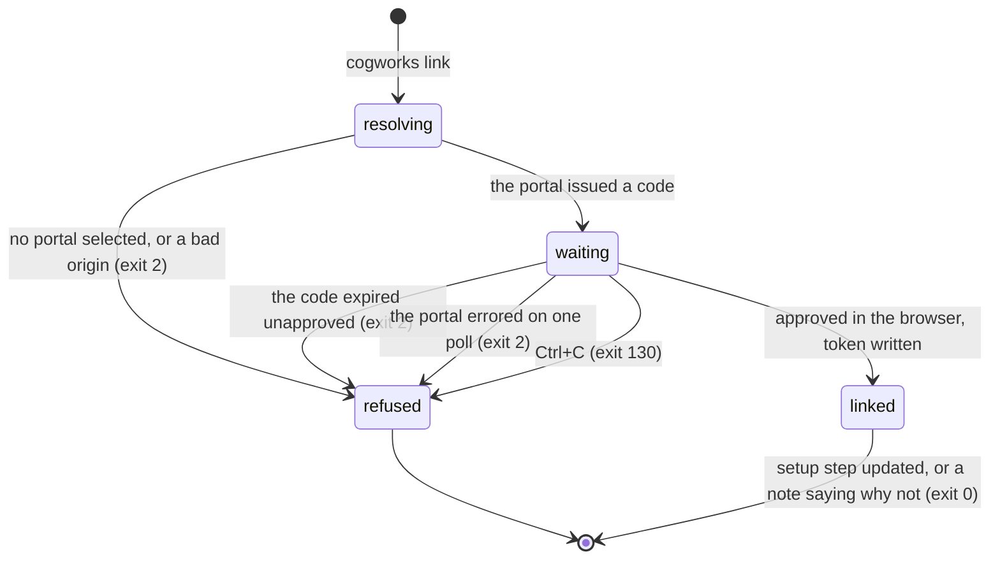

# `cogworks link`

## Summary

`cogworks link` connects one machine to one portal origin. It uses a device-code handshake, so no password and no token is ever typed into a terminal: the CLI asks the portal for a short code, the student approves that code in a browser they are already signed in to, and the CLI polls until the approval lands and then writes a token to disk. Afterwards the machine can sync a local report, update the setup guide, share a live run, and answer `cogworks status`.

It is reached by typing `cogworks link` in any directory, though what it does at the very end depends on whether that directory is a GitHub worktree. It takes two options, `--portal` and `--no-browser`, and has no `--json`. It is the only command that writes `~/.cogbench/config.json`, and therefore the only one that changes which portal every later command talks to.

## The simple case

A student types `cogworks link` and reads three lines before anything is decided:

```
Connecting to https://cogportal.example
CogPortal receives setup check names, package versions, and your GitHub repository; never source, paths, logs, predictions, scores, or environment variables.
Open https://cogportal.example/connections?user_code=A3F9-2C81-D40B&return_to=setup and confirm code A3F9-2C81-D40B.
```

A browser opens on that URL. The connections page shows a panel labelled `COGWORKS DEVICE` with the heading "Approve device A3F9-2C81-D40B", one sentence saying what the approval grants ("This grants one device permission to upload explicitly selected local reports. It does not grant repository access or permission to run or promote benchmarks.", `apps/portal/src/routes/ConnectionsPage.tsx:143`), a text field labelled "Device name" pre-filled with `CogWorks CLI`, and a button reading "Approve device".

The student presses it, and the page says:

```
Device approved. You can return to the terminal; returning to Setup…
```

Just under a second later the page navigates to the setup guide. Back in the terminal, within five seconds:

```
Linked ada-macbook.local. Local commands still work offline.
setup: updated clone
```

Exit 0. The privacy sentence is printed before the code, so it is on screen while the student is deciding whether to approve, which is the only moment it can do any work.

Run from somewhere that is not the team project, the last line is a note instead of a setup update, and it still exits 0:

```
Linked ada-macbook.local. Local commands still work offline.
setup: device linked; change into your team project before running `cogworks check --benchmark audio-identification --update-setup`.
```

And when nobody approves the code, the terminal is silent for ten minutes and then says one thing:

```
Connecting to https://cogportal.example
CogPortal receives setup check names, package versions, and your GitHub repository; never source, paths, logs, predictions, scores, or environment variables.
Open https://cogportal.example/connections?user_code=A3F9-2C81-D40B&return_to=setup and confirm code A3F9-2C81-D40B.
cogworks: The device link expired before it was approved.
```

Exit 2, nothing written on this machine.

## The ask, event by event



### Asking

Only one thing is resolved: which portal. `--portal`, then `COGPORTAL_URL`, then the active portal in the config file, and the value must be a bare HTTPS origin unless the host is `localhost`, `127.0.0.1`, or `::1`. See [`foundations/the-ask.md`](../foundations/the-ask.md#configuration-precedence). On a machine that has never linked anything there is no active portal, so a first `cogworks link` must carry `--portal` or the environment variable, and the failure message says so: "No CogPortal is selected. Copy `cogworks link --portal ...` from the setup page."

No token is read, because this is the command that creates one. Nothing else about the machine is inspected before the request; the repository is looked at only at the very end.

### Answered without work

Two ways out, both before any request: no portal selected, and an origin that is not a valid HTTPS origin. Each prints one line on stderr prefixed `cogworks: ` and exits 2. The config file is not written, no code is issued, and nothing exists on the portal to expire.

### The work begins

There are two moments and they belong to different machines.

**On the portal**, when `/api/v1/cli/device/start` returns. A row now exists holding the hash of the device code, the user code, and an expiry ten minutes out (`apps/portal/worker/routes/connections.ts:38`, `:151`). The code is 48 bits of hex, rendered as three groups of four, which the comment says keeps a ten-minute approval code impractical to enumerate (`:46`). Abandoning here costs nothing except a dead code.

**On this machine**, when the token is written. `save_token` creates `~/.cogbench/`, chmods it to `0700`, writes a temporary file at `0600`, and replaces the config atomically (`python/cogbench/src/cogbench/storage.py:44`). The same write sets `activePortal`. Before it, Ctrl+C leaves the machine exactly as it was. After it, this portal is the one every later `cogworks` command uses by default, whether or not the student meant to change that.

### While it works

The terminal prints nothing at all. `poll_device_link` asks `/api/v1/cli/device/token` and sleeps for `max(pollIntervalSeconds, retryAfterSeconds)`, both of which are 5 (`apps/portal/worker/routes/connections.ts:40`, `:238`), until the answer is `authorized` or the local clock passes the portal's `expiresAt` (`python/cogbench/src/cogbench/client.py:78`). There is no spinner, no countdown, and no line saying the code is still waiting. A student who leaves the browser tab alone sees a terminal that has been silent for ten minutes and then fails.

The browser half is where all the state lives. The page reads `user_code` from the query string and shows the approval form only while it has one and the approval has not yet happened (`apps/portal/src/routes/ConnectionsPage.tsx:139`). The "Device name" field accepts up to 80 characters and the button is disabled while it is blank, so an unnamed device cannot be submitted; the server treats a missing name as still pending anyway (`apps/portal/worker/routes/connections.ts:235`). On success the page clears the saved return, drops `user_code` from the URL so a reload does not re-offer a consumed code, and shows the confirmation. On failure it shows the server's own sentence, falling back to "The device couldn't be approved. Try again." (`apps/portal/src/routes/ConnectionsPage.tsx:185`).

> Technical note: approving the same code twice on purpose succeeds. A reload re-offers the form while the code is still in the URL, so the endpoint checks whether this same user already approved this code and whether the CLI either finished linking or still can, and returns success rather than an error (`apps/portal/worker/routes/connections.ts:189`). An approved code the CLI never consumed before expiry deliberately falls through to the refusal, because telling the student the terminal will finish linking would be false.

### How it ends

On approval the token and its expiry are saved, and one line goes to stdout: "Linked {hostname}. Local commands still work offline." The expiry is sixty days out (`apps/portal/worker/routes/connections.ts:39`), and it is what `cogworks status` prints on its `Expires` line.

Then the command looks at the directory it started in. If it is a GitHub worktree, it marks the `clone` setup step and prints "setup: updated clone". If that request fails, it prints "setup: clone was not updated: {error}" to stderr **and still exits 0** (`python/cogbench/src/cogbench/cli.py:673`), because the link itself succeeded and the setup guide is a convenience. If the directory is not a worktree, it prints a note to stderr instead:

```
setup: device linked; change into your team project before running `cogworks check --benchmark audio-identification --update-setup`.
```

The benchmark in that sentence is the one installed benchmark, when exactly one is installed. With zero or several, the sentence contains the literal string `<benchmark>` (`python/cogbench/src/cogbench/cli.py:206`). The comment explains the choice: `link` takes no `--benchmark`, so naming a track would be a guess, and naming what is installed is not.

## Modifiers

| Modifier | Set before the ask | Changed while it works |
| --- | --- | --- |
| Who you are | The terminal half needs nobody. The browser half needs a signed-in session that has a cohort and a team: `/connections` sits behind `RequireStage stage="team"` (`apps/portal/src/App.tsx:117`) and the approve endpoint behind `requireTeam` (`apps/portal/worker/routes/connections.ts:171`). An instructor approves a device exactly as a student does. | Signing out of the browser mid-poll leaves the code unapproved and the terminal waits it out in silence. Signing back in and reopening the URL still works while the ten minutes hold. |
| Where your team and repository stand | This decides both the browser outcome and the last line. With no team, the browser bounces to `/join` or `/connect` and the code is abandoned. With a team, approval works from any directory; only the trailing setup step cares whether the current directory is a GitHub worktree. | No effect. `project_root` is captured before anything runs, so changing directory in another terminal, or committing, or connecting a repository mid-poll, does not change what the last line says. |
| Which week's benchmark | No benchmark is loaded and none is required. The only appearance of one is the hint in the not-a-worktree note, which reads the installed entry points rather than choosing a track. | No effect. |
| Practice or leaderboard | No effect. Linking creates nothing that can be scored, promoted, or shown to anyone else. The approval sentence says as much: it grants no permission to run or promote. | No effect. |
| Flags, options, and where you are typing | `--portal` selects the origin for this invocation and, unlike every other command, is made permanent by the success path, because `save_token` also writes `activePortal`. `--no-browser` skips opening a browser; the URL was already printed either way. There is no `--json`, no colour, and no terminal detection, so a pipe and a terminal get identical bytes. | No effect. Nothing is reread after the command starts. |

## Cancel and interrupt

| Event | Before the work begins | While it works |
| --- | --- | --- |
| You stop it yourself | Ctrl+C during origin resolution prints `cogworks: interrupted` and exits 130. No code was issued and nothing was written. | Ctrl+C during the poll exits 130 and leaves an authorization row on the portal, possibly already approved. The browser has said "Device approved. You can return to the terminal", which is now false. Nothing on either side corrects it; the row expires within ten minutes. |
| You do something else mid-way | No effect. | A second `cogworks link` in another terminal starts an independent authorization with its own code. Both can be approved and both write tokens, producing two device rows on the connections page, and whichever finishes last decides the active portal. Nothing warns about either. |
| A teammate acts at the same time | No effect. A device belongs to a person, not to a team. | No effect, with one exception: a teammate who removes this account from the team makes the approve endpoint's `requireTeam` fail, and the student reads the server's sentence in the panel. |
| The network or the portal fails | `start_device_link` does not retry. A single 500 or a connection failure ends the command with "Could not reach CogPortal: {reason}" or the portal's own message, exit 2. | `poll_device_link` does not retry either, so one transient failure on one poll ends the link even though the code is live for the rest of its ten minutes. On genuine expiry the student may read either "The device authorization expired. Start again." from the portal (`apps/portal/worker/routes/connections.ts:233`) or "The device link expired before it was approved." from the CLI's own loop guard (`python/cogbench/src/cogbench/client.py:88`), depending on which clock noticed first. |
| The page or the process goes away | Nothing exists to clean up. | Closing the terminal abandons an authorization that may already be approved. Closing the browser tab before pressing "Approve device" leaves the terminal polling to expiry. Reloading the browser is safe: the code is still in the URL and re-approving is deliberately idempotent. |
| The thing being measured changes | The device code and the portal origin are fixed at the start. | Joining a team during the poll makes the approve form reachable, and if the code is still live the recovery is to reopen the printed URL rather than to re-run the command. Nothing tells the student that. |
| The platform refuses or credit runs out | Credit is not consulted and never will be. Linking costs nothing. | Three refusals are reachable, all HTTP 410: "The device code is invalid, expired, or already used." on approval, and "The device authorization expired. Start again." or "The device authorization was already used." on the poll. Each ends the command with exit 2 and leaves the config file untouched. |

## Interactions with other systems

**Who may do this.** Anyone who can sign in to the portal and is already on a team. The team requirement is on the browser half only, and it is the single biggest failure of this flow: see the first open question.

**The team owns it.** It does not. A device belongs to a person, and linking is one of the three asks in the platform that are personal rather than team-owned, alongside signing in and reading `cogworks status`. See [`foundations/the-team-and-the-repository.md`](../foundations/the-team-and-the-repository.md).

**Credit.** None spent, none reported.

**What the portal claims.** The connections page marks GitHub `VERIFIED` and a device merely present, with a name and a date. There is no chip claiming the machine is anything. That is correct under the trust rule: the portal observed an approval, not a machine. See [`foundations/what-the-portal-claims.md`](../foundations/what-the-portal-claims.md).

**What the benchmark supplied.** Nothing. No benchmark is loaded.

**Live updates and reconnection.** The terminal polls every five seconds and the browser polls the connections summary every four seconds while zero devices are linked, and does not stop when the student simply parks there (`apps/portal/src/lib/queries.ts:120`). Neither side notices the other; the browser learns the link finished only on its next poll. See [`cross-cutting/live-updates.md`](../cross-cutting/live-updates.md).

**Discord.** `cogworks link` says nothing about Discord. The page it opens carries the Discord connection flow in a separate panel, so a student arriving to approve a device also sees whether their Discord account is linked, which is the only place the two connections appear together.

**Configuration.** This is the only command that writes `~/.cogbench/config.json` (or wherever `COGBENCH_CONFIG` points). It stores one entry per portal origin, each with a token and an expiry, plus a single `activePortal`. Nothing removes an entry, so a config file accumulates every portal a machine has ever linked to.

## Edge cases

- **The device has two names.** The terminal prints `platform.node()`, the machine's hostname (`python/cogbench/src/cogbench/cli.py:668`). The portal stores whatever was typed in the browser, defaulting to `CogWorks CLI` (`apps/portal/src/routes/ConnectionsPage.tsx:33`), and that is what the connections page lists and what `cogworks status` prints on its `Device` line. So `link` says "Linked ada-macbook.local" and `status` says "Device   CogWorks CLI", about the same device, on the same machine.
- **Every link redirects to the setup guide.** `return_to=setup` is baked into the verification URL unconditionally (`apps/portal/worker/routes/connections.ts:164`), so a student re-linking a machine months into the course is still sent to the day-zero setup page after approving.
- **The panel and the product disagree about the name.** The approval panel is labelled `COGWORKS DEVICE` and the list below it is labelled `COGBENCH DEVICES` (`apps/portal/src/routes/ConnectionsPage.tsx:241`), while every student-facing string elsewhere says CogWorks CLI or `cogworks link`.
- **A code that dies between the claim and the device row is recoverable.** Issuing the token is two writes, and if the second fails the endpoint releases the claim so the CLI's next poll can try again, rather than leaving a code marked consumed with no device behind it (`apps/portal/worker/routes/connections.ts:269`). The comment is explicit that a batch would have been worse.
- **Expiry is judged against this machine's clock.** The poll loop compares the local time to the portal's `expiresAt`. A laptop whose clock is far ahead gives up early with the CLI's own sentence; one far behind keeps polling and reads the portal's. Neither says anything about a clock.
- **`--no-browser` is the only way to link on a machine with no browser, and nothing detects that.** `webbrowser.open` returns a value the CLI ignores, so on a headless machine without the flag the command silently fails to open anything and then waits. The URL was printed first, so the student can still copy it.
- **The config file is written even when the setup update then fails.** The token is saved before the repository is looked at, so a link that ends in "setup: clone was not updated" is a complete, working link.
- **Re-linking the same machine leaves the old device behind.** Every successful handshake inserts a new `cliDevices` row (`apps/portal/worker/routes/connections.ts:259`), and nothing revokes the previous one. On this machine the config entry for that origin is overwritten, so the old token stops being used; on the portal it stays live for its full sixty days. A student who links three times, which is what happens when the first two attempts are dropped by the team gate, ends up with three rows on the connections page, all called `CogWorks CLI`, all showing a "Linked" date and no way to tell which one the terminal is actually holding. Revoking the wrong one is silent until the next command fails.
- **Nothing on the page identifies the machine.** The device name is whatever was typed, and the hostname never leaves the terminal, so two links from the same laptop and one link each from two laptops look identical.
- **A revoked device fails at the next command, not here.** `token_for` only checks the stored expiry (`python/cogbench/src/cogbench/storage.py:66`), so revoking in the browser leaves the CLI believing it is linked until the portal rejects the token. The sentence the student then reads is the portal's, not "run `cogworks link` again".

## Open questions and verification

- **A student who runs `cogworks link` before joining a team loses ten minutes.** The stage guard sends them from `/connections` to `/join` or `/connect`, records the loss, and the destination page tells them what happened ("A device was waiting for approval, but you need a team first. Finish this step, then run `cogworks link` again.", `apps/portal/src/components/DroppedLinkNotice.tsx:23`). The terminal is told nothing and polls in silence until the code expires. The browser fix landed; the terminal half did not. Since `cogworks link` is the first command in the CLI's own workflow, this is the failure a first-time student is most likely to meet. **Unverified** against a running portal.
- The 900 ms redirect timer at `apps/portal/src/routes/ConnectionsPage.tsx:159` is never cleared, so it fires after unmount if the student navigates away in that window. Worth treating as a bug.
- `COGBENCH DEVICES` at `apps/portal/src/routes/ConnectionsPage.tsx:241` contradicts the product's own vocabulary. Worth treating as a bug.
- The connections query polls every four seconds forever while no device is linked (`apps/portal/src/lib/queries.ts:120`). Already carried to triage from [`foundations/the-ask.md`](../foundations/the-ask.md); it is most visible here, because this is the page a student sits on with zero devices.
- Neither `start_device_link` nor `poll_device_link` passes `retry=True`, so a single transient 503 ends a handshake whose code is still valid. Every other portal call the CLI makes on a shared path does retry. Whether this is deliberate was not established: no comment explains it, unlike `update_setup_checks`, which documents why it does not retry.
- The two expiry sentences say different things about the same event. Which one a student sees depends on clock skew, which is not a distinction a reader can act on.
- Whether a student ever notices the hostname-versus-device-name split was not observed. The two strings appear in different commands, minutes apart. **Unverified.**
- Whether the literal `<benchmark>` placeholder is reachable in practice depends on how many benchmark packages a 2026 machine has installed at the moment of linking. If students install all three at setup, the placeholder is the normal case rather than the fallback. Not established.
- Re-linking accumulates live device rows on the portal with no way for a student to tell them apart. Whether the intent is that a student prunes them by hand, or that an older device should be revoked automatically, is a product decision this pass could not read from the code. Carried to triage either way.
- The ten minute silence in the terminal was not sat through. Whether a student waits it out or kills the command first, and therefore which of the two expiry sentences is the one people actually see, is unknown. **Unverified.**

Verified against Cog\*Portal commit `f74e087`.
