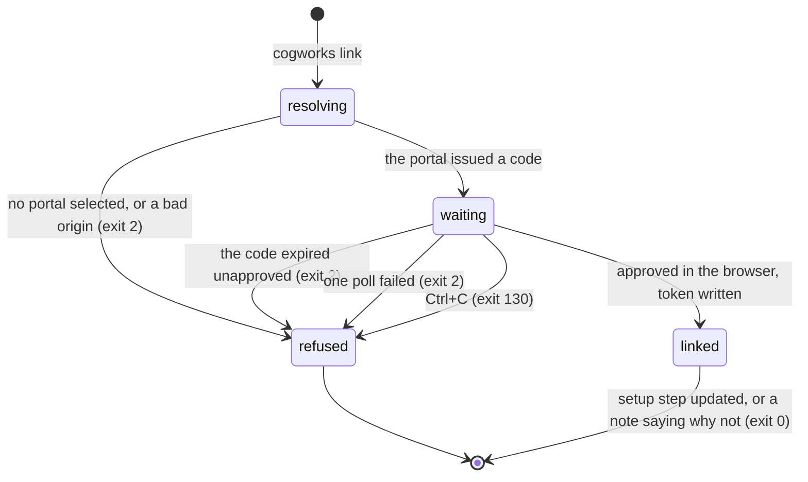

# `cogworks link`

## Summary

`cogworks link` connects one machine to one portal origin. It uses a device-code handshake, so no password or token is ever typed into a terminal: the CLI asks the portal for a short code, the student approves that code in a browser where they are signed in and on a team, and the CLI polls until the approval lands and then writes a token to disk. Afterwards the machine can report setup checks, sync a local report, share a live run, and answer `cogworks status`.

It is reached by typing `cogworks link` in any directory; `cogworks --help` lists it as "link this device to CogPortal" (`python/cogbench/src/cogbench/cli.py:107`). What it does at the end depends on whether that directory is a GitHub worktree. It takes `--portal` and `--no-browser` ("print the approval link without opening your browser", `cli.py:115`) and has no `--json`. It is the only command that writes `~/.cogbench/config.json`, and so the only one that changes which portal later commands use.

## The simple case

The first run needs `--portal`: a machine that has never linked has no saved portal, and a bare `cogworks link` ends at "No CogPortal is selected. Copy `cogworks link --portal ...` from the setup page." (`cli.py:139`). Two pages hand over the whole line, both from `deviceLinkCommand` (`apps/portal/src/lib/setup-progress.ts:82`): step 4 of the setup page, and the Connections page's "CogWorks tool" section while no device is linked (`apps/portal/src/routes/ConnectionsPage.tsx:302`).

The student pastes `cogworks link --portal https://cogportal.example` and reads four lines before anything is decided:

```
Connecting to https://cogportal.example
CogPortal receives setup check names, package versions, and your GitHub repository.
A report's scores and notes go up when you run `cogworks sync` or `cogworks run --live`, and weights only with `cogworks sync`. Source, logs, predictions, and environment variables stay on this machine.
Open https://cogportal.example/connections?user_code=A3F9-2C81-D40B&return_to=setup and confirm code A3F9-2C81-D40B.
```

That is this tree's CLI (`cli.py:1250` to `:1261`). The CLI the candidate's setup page installs, `40d31a2` (`apps/portal/src/lib/benchmark-packages.ts:40`), prints one consent line instead: "CogPortal receives setup check names, package versions, and your GitHub repository; never source, paths, logs, predictions, scores, or environment variables." That sentence is false: `cogworks sync` and the end of `cogworks run --live` both send a report's scores. Commit `b30a93e` corrected it after the pin was taken.

A browser opens on the URL. The Connections page leads with a panel labelled "Approve this device": "It can upload the local reports you choose to sync. It gets no access to your repository and can't run or promote a benchmark." Under it, "Check that your terminal shows the same code before you approve it.", the code in large type inside the detection-box corners, a "Device name" field pre-filled with `CogWorks CLI` and the hint "So you can tell your machines apart in the list below.", and an "Approve device" button (`ConnectionsPage.tsx:153` to `:216`).

The student presses it, and the page says "Device approved. You can return to the terminal; returning to Setup…" (`ConnectionsPage.tsx:225`). 900 ms later it moves to the setup page. Within five seconds the terminal prints:

```
Linked ada-macbook.local. Local commands still work offline.
setup: updated clone
```

Exit 0. The consent lines print before the code, so they are on screen while the student decides.

Run from somewhere that is not a GitHub worktree, the last line is a note on stderr instead, still exit 0:

```
setup: device linked; change into your team project before running `cogworks check --benchmark audio-identification --update-setup`.
```

When nobody approves the code, the terminal is silent for ten minutes and then prints `cogworks: The device link expired before it was approved.` Exit 2, nothing written on this machine.

## The ask, event by event


```mermaid
stateDiagram-v2
    [*] --> resolving : cogworks link
    resolving --> refused : no portal selected, or a bad origin (exit 2)
    resolving --> waiting : the portal issued a code
    waiting --> refused : the code expired unapproved (exit 2)
    waiting --> refused : one poll failed (exit 2)
    waiting --> refused : Ctrl+C (exit 130)
    waiting --> linked : approved in the browser, token written
    linked --> [*] : setup step updated, or a note saying why not (exit 0)
    refused --> [*]
```

### Asking

Only the portal is resolved: `--portal`, then `COGPORTAL_URL`, then the saved portal, as a bare HTTPS origin unless the host is loopback. See [`foundations/the-ask.md`](../foundations/the-ask.md#configuration-precedence). No token is read and nothing else about the machine is inspected until the end.

### Answered without work

No portal selected, or an origin that is not a valid HTTPS origin. Each is one `cogworks:` line on stderr and exit 2. No code is issued and the config file is not written.

### The work begins

Two moments, on two machines.

**On the portal**, when `/api/v1/cli/device/start` returns. A row now holds the hash of the device code, the user code, and an expiry ten minutes out (`apps/portal/worker/routes/connections.ts:38`, `:146`). The code is 48 bits, shown as three groups of four, which the comment says keeps a ten-minute code impractical to enumerate (`connections.ts:47`). Abandoning here leaves a dead code.

**On this machine**, when the token is written. `save_token` creates the config directory, sets it to `0700`, writes a temporary file, sets it to `0600`, and replaces the config (`python/cogbench/src/cogbench/storage.py:129`). The same write sets `activePortal`, so from here every later command uses this portal by default.

### While it works

The terminal prints nothing. `poll_device_link` asks `/api/v1/cli/device/token` every five seconds until it hears `authorized` or the local clock passes the code's expiry (`python/cogbench/src/cogbench/client.py:80`). There is no spinner and no countdown.

The browser holds the state. The approval form shows while the URL has a `user_code` and the approval has not happened. The button is disabled while the name is blank, and the field takes up to 80 characters. On success the page clears the saved return, drops `user_code` from the URL so a reload does not re-offer a consumed code, and shows the confirmation. On failure it shows the server's sentence, or "The device couldn't be approved. Try again." (`ConnectionsPage.tsx:211`).

> Technical note: approving the same code twice succeeds. A reload while the code is still in the URL re-offers the form, so the endpoint checks whether this user already approved this code and whether the CLI finished or still can, and returns success (`connections.ts:189`). An approved code the CLI never consumed before expiry falls through to the refusal, because saying the terminal will finish linking would be false.

### How it ends

On approval the token and its sixty-day expiry are saved (`connections.ts:39`), and stdout gets "Linked {hostname}. Local commands still work offline." (`cli.py:1271`).

Then the command looks at the directory it started in. In a GitHub worktree it reports the `clone` setup step and prints "setup: updated clone". If that request fails, stderr gets "setup: clone was not updated: {error}" and the command still exits 0 (`cli.py:1276`), because the link succeeded. The likeliest error is the portal's "This directory is {yours}, but CogPortal expects {team's}." (`apps/portal/worker/routes/setup.ts:207`). Outside a worktree the note above prints instead. Its benchmark is the one installed benchmark when exactly one is installed, and the literal `<benchmark>` otherwise (`cli.py:293`), because `link` takes no `--benchmark` and naming a track would be a guess.

## Modifiers

| Modifier | Set before the ask | Changed while it works |
| --- | --- | --- |
| Who you are | The terminal half needs nobody. The browser half needs a signed-in session with a cohort and a team: `/connections` is behind `RequireStage stage="team"` (`apps/portal/src/App.tsx:130`) and the approve endpoint behind `requireTeam` (`connections.ts:171`). An instructor approves exactly as a student does. | Signing out mid-poll leaves the code unapproved; signing back in and reopening the URL still works within the ten minutes. |
| Where your team and repository stand | Decides the browser outcome and the last line. With no team, the browser goes to `/join` or `/connect`, and that page shows "Your device link is on hold" with "It needs a team first. Finish getting started, then run `cogworks link --portal {origin}` again." (`apps/portal/src/components/DroppedLinkNotice.tsx:27`). The code itself survives; reopening the printed URL after joining completes the waiting CLI. | No effect on this machine. The directory was captured at the start. |
| Which week's benchmark | None loaded or required, except the hint in the not-a-worktree note. | No effect. |
| Practice or leaderboard | No effect. The approval panel says the device cannot run or promote a benchmark. | No effect. |
| Flags, options, and where you are typing | `--portal` selects the origin and, unlike on any other command, is made permanent on success because `save_token` writes `activePortal`. `--no-browser` skips opening a tab; the URL prints either way. No `--json`, no colour. | No effect. |

## Cancel and interrupt

| Event | Before the work begins | While it works |
| --- | --- | --- |
| You stop it yourself | Ctrl+C prints `cogworks: interrupted` and exits 130. Nothing issued, nothing written. | Ctrl+C during the poll exits 130 and leaves an authorization row, possibly already approved. The browser may already have said "Device approved. You can return to the terminal", which is now false. The row expires within ten minutes. |
| You do something else mid-way | No effect. | A second `cogworks link` starts its own code. Both can be approved and both write tokens, giving two device rows, and whichever finishes last sets the active portal. |
| A teammate acts at the same time | No effect. A device belongs to a person. | A teammate who removes this account from the team makes approval fail with the server's sentence in the panel. |
| The network or the portal fails | `start_device_link` does not retry. One 5xx or connection failure ends the command with "Could not reach CogPortal: {reason}" or the portal's message, exit 2. | `poll_device_link` does not retry either (`client.py:82`), so one transient failure ends a link whose code is still live. At expiry the student reads either the portal's "The device authorization expired. Start again." (`connections.ts:231`) or the CLI's "The device link expired before it was approved." (`client.py:90`), depending on which clock noticed first. |
| The page or the process goes away | Nothing to clean up. | Closing the terminal abandons an authorization that may be approved. Closing the tab before approving leaves the terminal polling to expiry. Reloading is safe. |
| The thing being measured changes | The code and the origin are fixed at the start. | Joining a team mid-poll makes the form reachable; the recovery is to reopen the printed URL. The on-hold notice instead says to run `cogworks link` again, which starts a second code while the first terminal keeps waiting. |
| The platform refuses or credit runs out | Credit is never consulted. | Three refusals, all HTTP 410: "The device code is invalid, expired, or already used." on approval, and "The device authorization expired. Start again." or "The device authorization was already used." on the poll (`connections.ts:210`, `:231`, `:251`). Each ends the command with exit 2 and leaves the config untouched. |

## Interactions with other systems

**Who may do this.** Anyone who can sign in and is on a team. The team requirement sits on the browser half only.

**The team owns it.** It does not. A device belongs to a person; linking is one of the three personal asks, with signing in and `cogworks status`.

**Credit.** None.

**What the portal claims.** The Connections page says "Verified by GitHub sign-in" beside the GitHub login and, for a device, only its name and "Last used {date}" or "Linked {date}, not used yet" (`ConnectionsPage.tsx:239`, `:317`). It claims nothing about the machine. The setup page counts the link step as seen by the portal once any device exists for the account (`setup-progress.ts:217`), not this machine in particular.

**What the benchmark supplied.** Nothing.

**Live updates and reconnection.** The terminal polls every five seconds. The Connections page refetches every four seconds while the account has no device, and never stops if none arrives (`apps/portal/src/lib/queries.ts:134`). Neither side tells the other anything. See [`cross-cutting/live-updates.md`](../cross-cutting/live-updates.md).

**Discord.** The CLI says nothing about Discord. The page it opens has a Discord section, the one place both connections appear together.

**Configuration.** The config file stores one entry per origin with a token and an expiry, plus `activePortal`. Nothing removes an entry.

## Edge cases

- **The device has two names.** The terminal prints the hostname (`cli.py:1271`); the portal stores what was typed, default `CogWorks CLI` (`ConnectionsPage.tsx:46`), and that is what Connections and `cogworks status` show.
- **Every link returns to the setup guide.** `return_to=setup` is in every verification URL (`connections.ts:164`), so re-linking months later still lands on Setup.
- **Re-linking leaves the old device live.** Each handshake inserts a new device row (`connections.ts:257`) and nothing revokes the previous one, which stays valid for sixty days. The list now shows "Last used" for each, updated on every authenticated request (`apps/portal/worker/auth/device.ts:41`), so the one the terminal holds is the one most recently used. Revoke asks first: "Confirm, it stops reporting" (`ConnectionsPage.tsx:325`).
- **A revoked device fails at its next command.** The CLI checks only the stored expiry (`storage.py:151`); the portal then answers "This CogWorks connection expired or was revoked. Run `cogworks link` to connect this machine again." (`device.ts:38`).
- **A failed claim is recoverable.** Issuing a token is two writes; if the second fails the claim is released so the next poll can try again (`connections.ts:267`).
- **Expiry is judged against this machine's clock.** A clock far ahead gives up early with the CLI's sentence; one far behind keeps polling and gets the portal's.
- **`--no-browser` is the only signal for a headless machine.** `webbrowser.open`'s result is ignored, so without the flag nothing opens and the command waits; the URL was printed first.
- **The token is written before the setup update.** A link that ends in "setup: clone was not updated" is a complete, working link.
- **The redirect timer is never cleared.** The 900 ms `setTimeout` (`ConnectionsPage.tsx:182`) can navigate to `/setup` after the student has already clicked elsewhere.

## Open questions and verification

- The candidate's setup page installs a CLI whose consent line says scores are never sent. New triage item, with the rest of that pin's gaps.
- A student who links before joining a team waits ten silent minutes in the terminal (B-02). The browser names the hold; the terminal is told nothing.
- One transient failure on any poll ends the handshake. No comment says whether that is deliberate, unlike `update_setup_checks`, which documents why it does not retry.
- The two expiry sentences say different things about one event.
- Whether the `<benchmark>` placeholder is the common case depends on how many benchmark packages a student has installed when linking. Not established.
- Hosted beta (`4984730`) differs: its setup page installs `b6bbffb` (beta `apps/portal/src/lib/benchmark-packages.ts:41`), which prints the two corrected consent lines. Its approval panel is labelled `COGWORKS DEVICE` with the heading "Approve device {code}" and "This grants one device permission to upload explicitly selected local reports. It does not grant repository access or permission to run or promote benchmarks." (beta `apps/portal/src/routes/ConnectionsPage.tsx:143`), its device list is labelled `COGWORKS CLI DEVICES` (beta `:244`), and Revoke acts on one click (beta `:278`) where the candidate asks to confirm (`ConnectionsPage.tsx:323`).
- The Connections page with no device was seen locally on fixture data in `/tmp/cogshots/matched/pairs/a-connections-desk.png` (right half, close to `2ff32fa`). The approval panel, the redirect, and the terminal half were not observed.

Read against Cog\*Portal commit `2ff32fa`.
