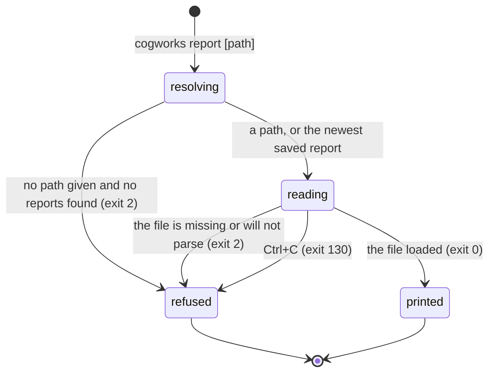

# `cogworks report`

## Summary

`cogworks report` prints a local report that already exists. It takes one optional path; with none, it reads the most recently modified `local_*.json` under `.cogbench/reports/` in the directory the command was run in. It is the only way to read a run's numbers again after the terminal that produced them has gone.

It is the smallest command on the platform. It loads no benchmark, resolves no portal, sends nothing, and writes nothing. It works offline, and it works on a machine where the benchmark package was never installed. Everything it prints comes out of one JSON file.

It is also the only command that reads a file the student can point at, which is where most of its edge cases come from. See [`glossary.md`](../glossary.md) for *report id* and *self-reported*, and [`foundations/what-the-portal-claims.md`](../foundations/what-the-portal-claims.md#self-reported) for what those words commit the platform to.

## The simple case

A student who ran `cogworks run --benchmark audio-identification` an hour ago types `cogworks report`:

```
audio-identification v1 · LOCAL · SELF-REPORTED
Identification score: 0.6562
Clean top-1: 0.8125
Noisy top-1: 0.5000
Short clip top-1: 0.4375
Chance: 0.0208
Trivial baseline: 0.0625
commit: 4f2a19c (dirty)
note: 3 of 48 queries returned no candidate.
```

Exit 0. The first line is fixed: `"{} v{} · LOCAL · SELF-REPORTED"` with the benchmark id and the benchmark version (`python/cogbench/src/cogbench/cli.py:165`). The two words after the middle dots are the platform's promise about the whole rest of the output, and they are there so that a number a student's own machine produced is never mistaken for one the portal observed.

Each metric prints as its label, its value at the precision the plugin declared, and its unit when it has one. The commit line prints only when the report carries a SHA, showing the first seven characters with `(dirty)` after it when the working tree had uncommitted changes. Diagnostics follow, one per line, each prefixed `note: `.

Running it twice prints the same thing twice. Nothing is recorded, and the file is not touched.

## The ask, event by event



### Asking

The working directory is read once, before anything else, for the same reason every command reads it once: a benchmark plugin may change it (`python/cogbench/src/cogbench/cli.py:602`). `report` loads no plugin, so it is only inheriting the rule.

With a path argument, that path is expanded and resolved and nothing else is consulted. With none, `.cogbench/reports/` under the working directory is globbed for `local_*.json` and the results are sorted by modification time, newest last (`python/cogbench/src/cogbench/storage.py:28`).

### Answered without work

One way out before the file is opened: no path given, and no reports directory or no matching files in it. That raises a `ContractError` carrying "No local reports found. Run `cogworks run` first." which reaches the student on stderr with the usual `cogworks: ` prefix, exit 2 (`python/cogbench/src/cogbench/cli.py:180`).

Nothing is written and nothing is sent on that path, or on any other path through this command.

### The work begins

There is no such moment. `report` reads one file and prints. Abandoning it at any instant leaves the machine exactly as it was, which is true of only this command and [`cogworks status`](status.md). Unlike `status`, it does not even make a request.

### While it works

Nothing is displayed. There is no spinner, because there is no search: the whole command is one `read_text` and a loop over metrics. On a report of any realistic size it is over before a frame could be drawn.

### How it ends

The lines above to stdout, then exit 0. A failure prints one `cogworks: {message}` line to stderr and exits 2. There is no summary line, no path, and no report id, so a student looking at the output cannot tell which of their saved reports they are reading. `cogworks run` prints "saved: {path}" when it finishes (`python/cogbench/src/cogbench/cli.py:635`); `cogworks report` prints no such line.

## Modifiers

| Modifier | Set before the ask | Changed while it works |
| --- | --- | --- |
| Who you are | No effect. No account, no device token, no portal. A signed-out student, a team member, and an instructor all get identical output from the same file. | No effect. |
| Where your team and repository stand | Only through the directory. `.cogbench/reports/` is resolved against the working directory, so running this one level down from where `cogworks run` ran finds nothing and prints the "No local reports found" sentence, which sends the student to re-run rather than to change directory. The team, the repository, and the portal are never consulted. | No effect. |
| Which week's benchmark | No effect on the ask, and no way to express it. `report` takes no `--benchmark` and does not filter by one, so a student with Week 1 and Week 3 reports in one directory gets whichever file was modified last. The benchmark id appears in the output, at the start of the first line, only after the choice has already been made. | No effect. |
| Practice or leaderboard | No effect. A local report is self-reported and can never reach the leaderboard, whatever it says. Promotion is about a hosted run. See [`foundations/the-run.md`](../foundations/the-run.md). | No effect. |
| Flags, options, and where you are typing | One positional path, and nothing else. There is no `--json`, even though `_print_report` takes an `as_json` argument and `cogworks run --json` uses it (`python/cogbench/src/cogbench/cli.py:161`, `:644`), so a saved report can only be printed as text by this command. Output is stdout with no colour and no width detection, so a pipe and a terminal get identical bytes. | No effect. |

## Cancel and interrupt

| Event | Before the work begins | While it works |
| --- | --- | --- |
| You stop it yourself | Ctrl+C prints `cogworks: interrupted` on stderr and exits 130. Nothing was going to be written. | The same. The file is opened read-only and the process leaves nothing behind. |
| You do something else mid-way | No effect. There is no lock and no shared state; two `cogworks report` runs are independent. | No effect. |
| A teammate acts at the same time | A teammate's run happens on their own machine and writes to their own `.cogbench/reports/`. Nothing a teammate does changes what this command finds. | No effect. |
| The network or the portal fails | No effect. Nothing is sent. This command is identical with the network unplugged. | No effect. |
| The page or the process goes away | Closing the terminal kills the command with nothing half-written. | The same. |
| The thing being measured changes | A `cogworks run` finishing a moment earlier changes which file is newest, so two invocations a second apart can print two different reports with nothing saying the answer moved. Editing the repository changes nothing: the report is a record of a run that already happened, and it carries its own commit. | A `cogworks run` in another terminal writing a report mid-read cannot affect this one; the newest file was already chosen. |
| The platform refuses or credit runs out | Not applicable. `report` spends nothing and asks permission for nothing. | No effect. |

## Interactions with other systems

**Who may do this.** Anyone with the file. There is no gate of any kind, and a report handed to another student prints the same way on their machine.

**The team owns it.** The report names a repository and a commit, never a person. The GitHub login only enters the picture when a report is uploaded by `cogworks sync`, and that is the syncing student's, not the report's.

**Credit.** None spent, none reported, and no quota is visible from here.

**What the portal claims.** Nothing. Every line is the student's own machine reporting on itself, which is exactly what `LOCAL · SELF-REPORTED` on the first line says. See [`foundations/what-the-portal-claims.md`](../foundations/what-the-portal-claims.md).

**What the benchmark supplied.** Not shown. The "supplied" disclosure is built during discovery and does not travel in a saved report's wire shape, so this command cannot show it even though the run that produced the numbers knew it. See [`cross-cutting/what-the-benchmark-supplied.md`](../cross-cutting/what-the-benchmark-supplied.md).

**Live updates and reconnection.** None. There is no session and no stream.

**Discord.** Nothing is posted, and nothing about the team's Discord channel is read.

**Configuration.** None applies. `COGPORTAL_URL`, `COGBENCH_CONFIG`, and the saved active portal are all ignored, because no portal is resolved.

## Edge cases

- **The newest report wins by modification time, not by run time.** `latest_report` sorts on `st_mtime` (`python/cogbench/src/cogbench/storage.py:28`), so anything that rewrites or copies an older file makes it the answer. The report also carries `startedAt` and `finishedAt`, and neither is consulted.
- **A missing file gives a Python message.** An explicit path that does not exist raises `FileNotFoundError`, which is an `OSError` and therefore caught, so the student reads `cogworks: [Errno 2] No such file or directory: '/...'` and exits 2. That is a Python sentence, not one written for a reader, and it is the most likely way to reach this command wrongly.
- **A file that is valid JSON but not a local report gives a traceback.** `LocalReport.from_json` reads its required fields by subscript, and `KeyError` is not in the caught tuple at `cli.py:720`, so a hosted run's JSON or a hand-written file produces a stack trace. Malformed JSON is different: `JSONDecodeError` is a `ValueError`, which is caught, so that case exits 2 with a Python message instead. Two shapes of the same mistake, two different failures.
- **Floors print exactly like scores.** `Metric.from_wire` reads `key`, `label`, `value`, `unit`, `higherIsBetter`, `primary`, `precision`, and `help`, and drops `role` and `relatesTo` (`python/cogbench/src/cogbench/models.py:62`). `_print_report` then prints every metric as one identical line. A student reading a Week 3 report cannot tell "Chance MRR", which is a property of the dataset, from "Text MRR", which is their score, and nothing marks the primary metric either. The run page makes both distinctions; the terminal makes neither.
- **A report from outside a worktree loses its provenance silently.** The commit line prints only when the report carries a SHA (`python/cogbench/src/cogbench/cli.py:169`). A run in a directory where `git rev-parse HEAD` failed saves a report with no SHA, so nothing on screen says which code produced the numbers, and the `dirty` flag it does carry is never reached.
- **Diagnostics are already truncated on disk.** A saved report holds at most 32 diagnostics of 240 characters each, cut when the report was created (`python/cogbench/src/cogbench/models.py:128`). `report` prints what is there; a run that produced more has already lost them.
- **The benchmark version is printed and never checked.** A report from an older benchmark version prints normally, with the version in the first line and nothing saying it no longer matches what is installed.

## Open questions and verification

- No `--json` flag, confirmed at `python/cogbench/src/cogbench/cli.py:84` where the subparser is given only a positional `path`, and at `:644` where `_print_report` is called without the `as_json` argument. `cogworks run --json` can emit JSON for a report it just made; nothing can emit JSON for a report already on disk. Worth treating as a gap rather than a decision, since the support is present and unreachable.
- A valid-JSON file that is not a local report produces a traceback rather than a sentence. Same cause as the `KeyError` gap noted in [`status.md`](status.md#open-questions-and-verification), and the same one-line fix. Worth treating as a bug.
- **In flight.** `LocalReport` has gained a `weights_used` field that neither `to_wire` nor `from_json` carries (`python/cogbench/src/cogbench/models.py:99`), so it cannot survive a save and cannot appear here. This is the `cogworks sync` weights work named in [`goal.md`](../goal.md); re-read the source rather than trusting this paragraph.
- There is no way to ask for the newest report of a particular benchmark. Whether students keep more than one benchmark's reports in one directory was not established.
- Whether anything scripts against this output was not established, which matters for both the missing `--json` and the unmarked primary metric.
- Nothing here was run. The sample above is assembled from `_print_report`'s format strings and Week 1's metric labels (`benchmarks/week1/audio_identification_benchmark/plugins.py:38`), not from a real file. **Unverified.**

Verified against Cog\*Portal commit `f74e087`.
