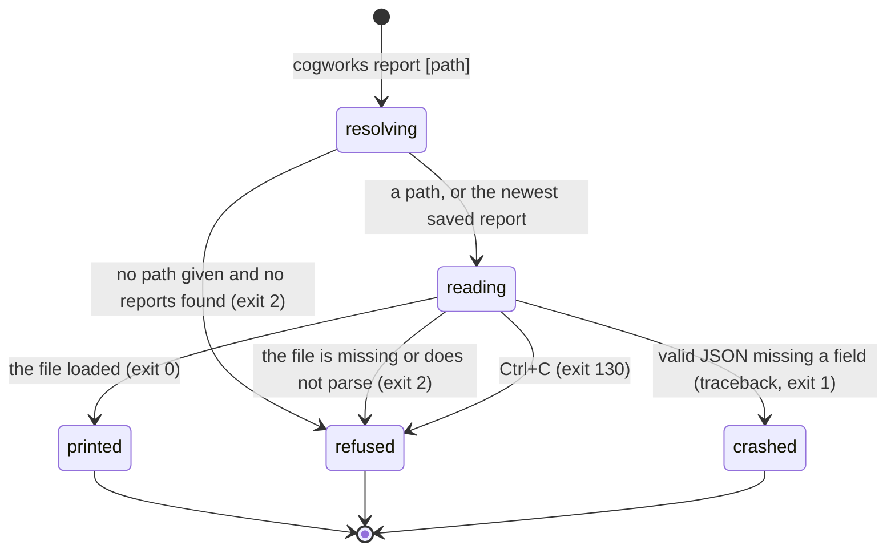

# `cogworks report`

## Summary

`cogworks report` prints a local report that already exists. It takes one optional path; with none, it reads the most recently modified `local_*.json` under `.cogbench/reports/` in the directory the command was run in. It is the only way to read a run's numbers again after the terminal that produced them has gone.

It is the smallest command on the platform. It loads no benchmark, resolves no portal, sends nothing, and writes nothing. It works offline and on a machine where the benchmark package was never installed. Everything it prints comes out of one JSON file. `cogworks --help` lists it as "show a saved local report" (`python/cogbench/src/cogbench/cli.py:101`).

See [`glossary.md`](../glossary.md) for *report id* and *self-reported*, and [`foundations/what-the-portal-claims.md`](../foundations/what-the-portal-claims.md#self-reported) for what those words commit the platform to.

## The simple case

A student who ran `cogworks test --benchmark language-search` earlier types `cogworks report`. This output was printed by the candidate tree from a hand-written report file:

```
language-search v2 · LOCAL TEST · SELF-REPORTED
This smoke test scored only the small test cases. `cogworks run --benchmark language-search` scores the full practice set.
Text MRR: 0.6123
Chance MRR: 0.010
Median query time: 0.042 s
commit: 0123456 (dirty)
note: one note.
```

Exit 0. The first line is `"{} v{} · {} · SELF-REPORTED"` with the benchmark id, its version, and which command made the report: `LOCAL RUN`, `LOCAL TEST`, or plain `LOCAL` for a report that predates the field (`python/cogbench/src/cogbench/cli.py:214`, `:230`). The smoke-test sentence appears only for a `test` report (`cli.py:233`), so a small-case number is not read as a full run.

The primary metric prints at four decimals or its own precision, whichever is more; the others keep their recorded precision (`cli.py:240`). A metric with no unit whose key ends in `_seconds` gets an `s`, because a local run records no unit and the key is the only evidence the value is a duration (`cli.py:245`). The commit line appears only when the report carries a SHA, with `(dirty)` when the tree had uncommitted changes. Each diagnostic line follows as `note: `.

`Chance MRR` above is a floor, a property of the dataset. The report file records that (`"role": "floor"`), and the terminal prints it exactly like the score above it (`cli.py:239`).

Running it twice prints the same thing twice. Nothing is recorded, and the file is not touched.

## The ask, event by event


```mermaid
stateDiagram-v2
    [*] --> resolving : cogworks report [path]
    resolving --> refused : no path given and no reports found (exit 2)
    resolving --> reading : a path, or the newest saved report
    reading --> refused : the file is missing or does not parse (exit 2)
    reading --> crashed : valid JSON missing a field (traceback, exit 1)
    reading --> refused : Ctrl+C (exit 130)
    reading --> printed : the file loaded (exit 0)
    printed --> [*]
    refused --> [*]
    crashed --> [*]
```

### Asking

The working directory is read once, before anything else (`cli.py:1156`); `report` loads no plugin, so it only inherits the rule.

With a path argument, that path is expanded and resolved and nothing else is consulted. With none, `.cogbench/reports/` is globbed for `local_*.json`, symlinks and non-files are ignored, and the newest by modification time wins (`python/cogbench/src/cogbench/storage.py:101`).

### Answered without work

One way out before a file is opened: no path given and no matching report. That is "No local reports found. Run `cogworks run` first." on stderr with the `cogworks: ` prefix, exit 2 (`cli.py:259`). Nothing is written or sent on this path or any other.

### The work begins

There is no such moment. `report` reads one file and prints. Abandoning it leaves the machine as it was. The same holds for [`cogworks status`](status.md), but `report` does not even make a request.

### While it works

Nothing is displayed. The command is one file read and a loop over metrics.

### How it ends

The lines above go to stdout, then exit 0. A handled failure is one `cogworks: {message}` line on stderr and exit 2. There is no path, no report id and no count in the output, so a student cannot tell which of several saved reports they are reading. `cogworks run` prints "saved: {path}"; `cogworks report` prints nothing like it.

## Modifiers

| Modifier | Set before the ask | Changed while it works |
| --- | --- | --- |
| Who you are | No effect. No account, token or portal. Everyone gets identical output from the same file. | No effect. |
| Where your team and repository stand | Only through the directory. Running one level below where `cogworks run` ran finds nothing and prints "No local reports found", which sends the student to run again rather than to change directory. | No effect. |
| Which week's benchmark | No way to choose one. There is no `--benchmark`, so with Week 1 and Week 3 reports in one directory the newest file wins and the benchmark id shows only after the choice. | No effect. |
| Practice or leaderboard | No effect. A local report is self-reported and never reaches the leaderboard. See [`foundations/the-run.md`](../foundations/the-run.md). | No effect. |
| Flags, options, and where you are typing | One positional path, "saved report file to show (uses the latest report when omitted)" (`cli.py:105`), and nothing else. No `--json`, although the printer supports it and `run --json` uses it (`cli.py:226`). Output has no colour and no width detection. | No effect. |

## Cancel and interrupt

| Event | Before the work begins | While it works |
| --- | --- | --- |
| You stop it yourself | Ctrl+C prints `cogworks: interrupted` and exits 130. | The same. |
| You do something else mid-way | No effect. No lock and no shared state. | No effect. |
| A teammate acts at the same time | A teammate's runs write to their own machine. | No effect. |
| The network or the portal fails | No effect. Nothing is sent. | No effect. |
| The page or the process goes away | Closing the terminal leaves nothing half-written. | The same. |
| The thing being measured changes | A `cogworks run` finishing a moment earlier changes which file is newest, so two invocations a second apart can print two different reports with nothing saying the answer moved. | A report written mid-read cannot affect this one; the file was already chosen. |
| The platform refuses or credit runs out | Not applicable. | No effect. |

## Interactions with other systems

**Who may do this.** Anyone with the file. A report handed to another student prints the same way on their machine.

**The team owns it.** The report names a repository and a commit, never a person. A login enters only when `cogworks sync` uploads it, and that is the syncing student's.

**Credit.** None spent, none reported.

**What the portal claims.** Nothing. `SELF-REPORTED` on the first line says the student's machine produced every number. See [`foundations/what-the-portal-claims.md`](../foundations/what-the-portal-claims.md).

**What the benchmark supplied.** Not shown. The disclosure is built during discovery and is not part of a saved report. See [`cross-cutting/what-the-benchmark-supplied.md`](../cross-cutting/what-the-benchmark-supplied.md).

**Live updates and reconnection.** None.

**Discord.** Nothing is posted or read.

**Configuration.** None applies. No portal is resolved.

## Edge cases

- **Newest by modification time, not by run time.** Copying or touching an older file makes it the answer; `startedAt` and `finishedAt` in the file are not consulted (`storage.py:113`).
- **A missing file gives a Python message.** `cogworks: [Errno 2] No such file or directory: '/...'`, exit 2. Seen locally from the candidate tree.
- **Bad JSON and incomplete JSON fail differently.** A file that is not JSON gives `cogworks: Expecting value: line 1 column 1 (char 0)`, exit 2. A file that is valid JSON but lacks a required field, such as a hosted run's JSON or `{}`, raises `KeyError` outside the caught tuple (`python/cogbench/src/cogbench/models.py:303`, `cli.py:1361`) and prints a traceback with exit 1, an exit code the CLI is not supposed to have. Both seen locally from the candidate tree.
- **Weight receipts are validated even though they are not printed.** A report whose `weightsUploaded` names a path it did not score, or lacks a digest, is refused with that reason (`models.py:242`), so a hand-edited weight list makes the scores unreadable here too.
- **A `command` value other than `test` or `run` is refused** with "command must be one of 'test', 'run', not {value}" rather than guessed (`models.py:340`).
- **Notes are already trimmed on disk.** Each note is split at sentence boundaries to fit the 240 character wire limit, and the 32-line cap reserves one line per note before spending spare lines on continuations (`models.py:180`). `report` prints one `note:` line per stored line, so a split note reads as two.
- **The weight files a run used are in the file and never shown.** `weightsUsed` and `weightsUploaded` survive in the JSON; the printer has no line for them (`cli.py:226`). What happens to them is [`sync.md`](sync.md).
- **The benchmark version is printed and never checked** against what is installed.
- **On the candidate's setup-page CLI** (`40d31a2`, `apps/portal/src/lib/benchmark-packages.ts:40`) the first line is always plain `LOCAL` and there is no smoke-test sentence, because that CLI neither writes nor prints the command.

## Open questions and verification

- The `KeyError` traceback and exit 1 were reproduced locally from the candidate tree with a `{}` file (B-34).
- Floors still print as scores although the role now survives in the file (B-26).
- No `--json` and no way to ask for the newest report of one benchmark. Whether students keep several benchmarks' reports in one directory is not established.
- Hosted beta (`4984730`) differs only in which CLI its setup page installs (`b6bbffb`, beta `apps/portal/src/lib/benchmark-packages.ts:41`), which prints `LOCAL RUN` and `LOCAL TEST` like this tree.

Read against Cog\*Portal commit `2ff32fa`.
