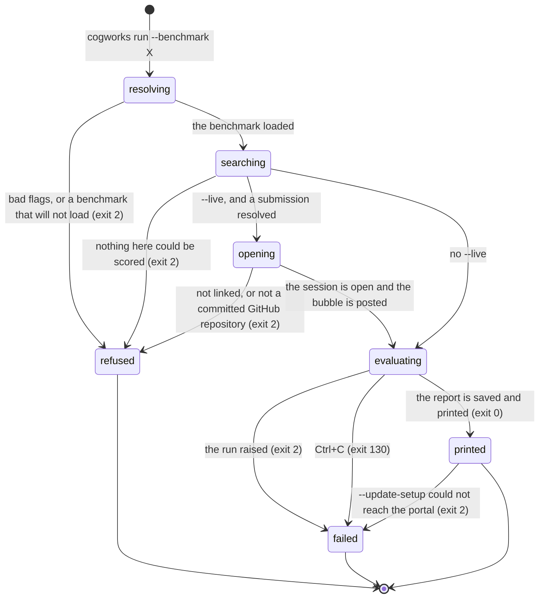

# `cogworks run`

## Summary

`cogworks run` scores a team's repository on the student's own machine and writes a report to disk. It is the only command that runs a benchmark end to end locally: it loads the week's plugin, works out which of the team's functions to score, calls them on the practice cases, scores the answers, and prints the numbers with `LOCAL · SELF-REPORTED` on the first line. With `--live` it also opens a session on the portal so the rest of the team can watch a progress bubble in Discord while it works.

It is reached by typing `cogworks run --benchmark <id>` inside the team's project directory. `--benchmark` is required. The other options are `--json`, `--update-setup`, `--live`, and `--portal`. A sibling subcommand, `cogworks test`, takes the same options minus `--live` and `--portal` and runs a single case instead of the whole set, which is the fast way to find out whether the pipeline holds together at all.

> Technical note: `test` is listed in help alongside `check` and `run` (`python/cogbench/src/cogbench/cli.py:61`, `:66`). The hidden subcommand is `doctor`, a deprecated alias for `check`. Nothing about `test` is secret; it is simply `run` with `smoke=True`, which slices the case list down to one (`python/cogbench/src/cogbench/runner.py:79`).

## The simple case

A student in their team project types `cogworks run --benchmark audio-identification`. The search for their code starts talking almost at once, on stderr:

```
Reading your repository
  read 14 files in team-bagel-2026
Looking for the functions that do the work
Trying your functions to find which pair stores a song and names it back
  ⠹ [#########...............] 1,204/3,962 pairings   58s left at most
  fingerprint    songs.fingerprint
  identify       matcher.best_match
```

Then the run itself, silently, and then the report on stdout:

```
audio-identification v1 · LOCAL · SELF-REPORTED
Identification score: 0.812
Clean top-1: 0.940
Noisy top-1: 0.771
Chance: 0.021
Trivial baseline: 0.183
commit: a3f91c2 (dirty)
saved: /Users/ada/team-bagel-2026/.cogbench/reports/local_4f0c9d2b8e714a55b1c3ad6f27e90814.json
```

Exit 0. The whole thing happened on their laptop: no portal, no sign-in, no credit spent, and nothing uploaded. The `saved:` path is the one `cogworks report` and `cogworks sync` will read next.

Every metric prints the same way. `Chance` and `Trivial baseline` are floors, properties of the dataset rather than of the submission, and the terminal draws them as ordinary rows with no marker (`python/cogbench/src/cogbench/cli.py:166`). The run page distinguishes them; this does not. See [`foundations/what-the-portal-claims.md`](../foundations/what-the-portal-claims.md#floor).

The common unhappy case looks like this. The search runs to the end, finds nothing it can score, and the command stops:

```
Reading your repository
  read 3 files in team-bagel-2026
Looking for the functions that do the work
cogworks: Nothing in this repository could be scored yet. Run `cogworks check --benchmark audio-identification` to see what was found.
```

Exit 2, nothing written. The sentence deliberately does not repeat what the search found, because the report already said it in full and printing it twice made the reader compare two paragraphs to discover they were one fact (`python/cogbench/src/cogbench/cli.py:278`). The cost is that the student is sent back to a command that will do the same search again.

## The ask, event by event



### Asking

Three things are settled before any of the team's code runs.

**The process is replaced once, under a pinned hash seed.** Before argument parsing does anything that reads a repository, the CLI re-executes itself with `PYTHONHASHSEED=0` (`python/cogbench/src/cogbench/isolate.py:141`). Discovery runs student code whose answer can depend on string hashing, and an interpreter's seed is fixed before its first line, so this is the last moment a run can be made reproducible. One 2026 repository builds its inverse-document-frequency table by iterating a set, and its text retrieval score moved between 0.8188 and 0.8335 across three seeds. The re-execution happens only when `argv` is `None`, which is to say only when the command really came from a command line; `main(["run", ...])` in a test would otherwise restart the test runner.

**The working directory is captured before the benchmark loads.** `Path.cwd()` is read at `python/cogbench/src/cogbench/cli.py:602`, before `load_benchmark`, because a plugin may change it. Week 1 does exactly that, chdir-ing into a private scratch directory because one audited repository keeps a module-global relative `db.pkl`. Reading the directory afterwards wrote the report into a scratch directory that is then deleted, and `cogworks report` after a successful run said "No local reports found."

**What gets scored is decided in one place.** A `submission.py` or `benchmark_adapter.py` at the repository root always wins (`python/cogbench/src/cogbench/apploader.py:41`). Only when there is none does discovery run, which for every repository in the 2026 corpus is always. An installed entry point is deliberately not consulted: it belongs to whatever package was pip-installed, and scoring that while standing in a student's repository produces a number for somebody else's code that looks exactly like a number for theirs. Measured: an empty repository scored 52% against the reference submission (`python/cogbench/src/cogbench/cli.py:261`, `python/cogbench/tests/test_cli_submission.py:48`).

### Answered without work

This set is smaller than it looks, and the reason matters. Only three outcomes end the ask before the team's code has run:

- `--benchmark` missing. argparse prints its own usage and error to stderr and exits 2 without reaching `main`'s handlers.
- A benchmark id that is not installed, or a plugin that raises on load. `PluginError`, one line on stderr prefixed `cogworks: `, exit 2.
- Ctrl+C in that window.

Everything else, including every refusal below, happens after discovery has imported and called the team's modules. Discovery is not static analysis; it runs the code. So the moment described in [`foundations/the-ask.md`](../foundations/the-ask.md#the-work-begins) as "the work begins" for a local run has already passed by the time the student is told "Nothing in this repository could be scored yet. Run `cogworks check --benchmark {name}` to see what was found." (`python/cogbench/src/cogbench/cli.py:281`). That sentence is exit 2, and it points at a command that will repeat the same expensive search.

### The work begins

Two moments, in this order.

**The first student module is imported.** Inside `_submission_for`, discovery imports their modules and calls their functions with inputs the benchmark supplies. Their code has now had side effects on their own machine that the platform cannot undo. Nothing is written by the CLI yet, and nothing has left the machine.

**With `--live`, the session opens and the bubble is posted.** `_start_live_run` resolves the portal, reads the token, reads git state, and POSTs to `/api/v1/local-runs` (`python/cogbench/src/cogbench/cli.py:536`). The portal writes a session row and a run surface, and tries to post a Discord message, all before returning. From here the team can see that a run is happening.

The ordering is worth saying plainly: **`--live` is validated after the search, not before.** A student who runs `cogworks run --live` in a directory that is not a committed GitHub worktree waits through the whole discovery search, which is ninety seconds for the slowest repository in the corpus, and is then told "Live sharing requires a committed GitHub repository." (`python/cogbench/src/cogbench/cli.py:545`) with exit 2 and no report saved. The same is true of "This portal is not linked. Run `cogworks link` first." (`:542`). Neither precondition depends on anything the search learns.

### While it works

**The search talks; the run does not.** `TerminalProgress` draws a headline, a permanent line per stage it binds, and one live line it rewrites in place, at about twelve frames a second (`python/cogbench/src/cogbench/progress.py:40`). The estimate reads "left at most" because the search stops at the first pairing that works, so a countdown phrased as a prediction would be wrong most of the time, and it appears only after 200 attempts, because one sample said "2m 06s" for a search that took 23 seconds (`:51`). None of it renders unless stderr is a terminal: piped to a file the spinner would be thousands of escape codes nobody reads. Once the search ends and `execute` begins, the terminal goes quiet until the report prints.

**With `--live`, four phases reach the portal.** `preparing` is sent explicitly at `python/cogbench/src/cogbench/cli.py:622`; the runner then emits `contract_check`, `evaluating`, and `scoring` and nothing else (`python/cogbench/tests/test_runner_progress.py:81`). Each maps to a wire code: `preparing` to `repository.ready`, `contract_check` to `contract.checking`, `evaluating` to `evaluation.started`, `scoring` to `scoring.started`, and anything unrecognised to `evaluation.progress` (`python/cogbench/src/cogbench/cli.py:485`). Moving from `contract_check` to `evaluating` emits an extra `contract.passed` first, so the bubble can say the fast case held before the long part starts.

**A heartbeat every two seconds carries the current phase** (`python/cogbench/src/cogbench/cli.py:482`), which is what keeps the bubble from looking frozen during a long evaluation.

> Technical note: the case counter only ever takes two values. `execute` reports `0` of N before calling the adapter and `N` of N after (`python/cogbench/src/cogbench/runner.py:84`, `:87`), because the adapter is handed the whole input list in one call. Every heartbeat in between repeats `0` of N, and `_live_progress_payload` keeps the code at `evaluation.started` rather than `evaluation.progress` while `current` is zero, which is honest but means the bubble shows no movement for the entire evaluation and then jumps to complete.

**Events are queued, and non-terminal events are dropped when the queue is full.** The send queue holds 32 items and progress events use `put_nowait`, so a portal slow enough to back the queue up loses heartbeats silently (`python/cogbench/src/cogbench/cli.py:456`). A separate 32-entry history is kept for the replay batch, and when it overflows it drops progress events first, oldest first, so the phase transitions survive and the heartbeats between them do not (`:444`). If a send fails, one line goes to stderr and is never repeated: "cogworks: live updates paused: {error}". The run itself is unaffected and still saves its report.

### How it ends

On success, in this order: the report is written to `.cogbench/reports/local_<hex>.json` under the captured directory; the live session is told `completed` with the whole report on the wire; the report is printed; the `saved:` line is printed; and if `--update-setup` was given, the portal's setup guide is updated and "setup: updated run" is printed. Exit 0.

On failure, one line on stderr prefixed `cogworks: ` and exit 2, and with `--live` a terminal `failed` event whose code is chosen by exception type: `ContractError` to `run.failed.contract`, `TimeoutError` to `run.failed.timeout`, `MemoryError` to `run.failed.memory`, everything else to `run.failed.runtime` (`python/cogbench/src/cogbench/cli.py:524`). **The failure event carries a code and no text.** The exception's message stays in the student's terminal and never reaches the shared surface; a test asserts the absence (`python/cogbench/tests/test_runner_progress.py:101`). Teammates watching the bubble learn that the run failed and roughly where, and nothing about why.

Finishing a live run sends two things: the terminal event through the queue, and a replay of the whole 32-entry history through `/events/batch` with a five second deadline and no retry (`python/cogbench/src/cogbench/client.py:114`). Whichever arrives first settles the session; the portal treats every event after a terminal one as a duplicate (`apps/portal/worker/routes/local-runs.ts:86`). If the batch itself fails, one line: "cogworks: final live update was delayed: {error}", and the command still exits 0.

> Technical note: the portal also drops a progress event whose phase is earlier than the one it already recorded (`apps/portal/worker/routes/local-runs.ts:100`). Phases only advance, so a heartbeat that overtakes a transition cannot walk the bubble backwards. The replay batch is the one place events can arrive out of order relative to the single-event stream, which is exactly the case that guard exists for.

### The failure surface

Almost every way a run fails is a `ContractError`, and every one of them prints as `cogworks: ` plus a sentence written for the student. They divide by who the sentence is about.

The team's adapter did something the contract does not allow:

| Sentence | Where |
| --- | --- |
| "Submission adapter must be callable or expose predict(inputs)." | `python/cogbench/src/cogbench/runner.py:50` |
| "Submission returned {n} predictions for {m} inputs." | `:56` |
| "Predictions must be JSON-serializable." | `:61` |
| "Submission returned {n} scenario outputs for {m} cases." | `:221` |
| "Student adapter execution failed: {error}" | `:218` |

The last one is the catch-all: any exception the team's code raises inside the v2 driver is wrapped and reported with its own text. That text is the only diagnosis the platform offers, and it deliberately does not guess at a cause.

The benchmark or the machine is not ready:

| Sentence | Where |
| --- | --- |
| "The benchmark plugin has no public practice cases." | `python/cogbench/src/cogbench/runner.py:78` |
| "The benchmark plugin has no {tier} cases." | `:209` |
| "Benchmark data could not be prepared: {error}" | `:207` |
| "The Week 2 model lock is missing or invalid. Reinstall the benchmark package." | `:126` |
| "FaceNet is not installed. Install the Week 2 model dependencies from the course setup guide." | `:152` |

And the benchmark itself misbehaved, which is the platform's fault and says so by naming the scorer rather than the student:

| Sentence | Where |
| --- | --- |
| "Benchmark scorer returned an invalid metric." | `python/cogbench/src/cogbench/runner.py:92` |
| "Benchmark scorer returned invalid v2 metrics." | `:234` |
| "Benchmark scorer omitted its primary metric." | `:244` |

All of them are exit 2, and with `--live` all of them reach the bubble as `run.failed.contract`, undifferentiated. A teammate cannot tell "FaceNet is not installed on Ada's laptop" from "your adapter returned the wrong number of predictions" from "the benchmark package is broken."

## Modifiers

| Modifier | Set before the ask | Changed while it works |
| --- | --- | --- |
| Who you are | Without `--live` and `--update-setup`, nobody. The command never asks who is running it and works with no portal, no token, and no network. With either flag, the device token carries the account, and the portal refuses a device whose account has no team with "Finish joining a team and connecting its repository first." (`apps/portal/worker/routes/local-runs.ts:217`). | No effect. The token is read once, at `_start_live_run`, and a revocation mid-run surfaces only as a failed event send and the "live updates paused" line. |
| Where your team and repository stand | Without `--live`, none of it is required: a directory that is not a git worktree still runs, and the report records a null commit and `dirty` true, because a `git status` that fails is treated as dirty (`python/cogbench/src/cogbench/project.py:46`). With `--live`, a committed GitHub worktree is required, and the portal rejects a repository that is not the team's: "This device is running {yours}, but your team is connected to {theirs}." (`apps/portal/worker/routes/local-runs.ts:227`). | Committing during the run changes what the second git read sees. `_start_live_run` reads the commit at the start and `execute` reads it again at the end, and the portal compares them; a mismatch rejects the completed event with "The completed report does not match this live run." (`apps/portal/worker/routes/local-runs.ts:114`). |
| Which week's benchmark | `--benchmark` names it and an unknown id is a `PluginError` before anything runs. Week 1 chdirs into a scratch directory during discovery. Week 2 builds a FaceNet model before the first case, which is the slowest legitimate import in the corpus. Week 3 can withhold its overall. All three ship both a discovery description and a way to score what discovery found. | No effect. The plugin object is loaded once at `python/cogbench/src/cogbench/cli.py:616` and held for the rest of the command. Upgrading the package in another terminal does not reach a run in flight. |
| Practice or leaderboard | Neither. `cogworks run` produces a local report, which is self-reported, is never leaderboard-eligible, and cannot be promoted. It spends no credit and consumes no quota. `--live` opens a run surface, which is a place to watch, not a run. | No effect. |
| Flags, options, and where you are typing | `--json` prints the report as JSON and suppresses both the search animation and the `saved:` line, so a pipe gets clean JSON on stdout. `--update-setup` marks the `run` step afterwards. `--live` and `--portal` exist on `run` only, not on `test` (`python/cogbench/src/cogbench/cli.py:77`). The animation is drawn only when stderr is a terminal, so CI and a redirected log get the report and nothing else. | No effect. Nothing rereads a flag, an environment variable, or the config file after the command starts. |

## Cancel and interrupt

| Event | Before the work begins | While it works |
| --- | --- | --- |
| You stop it yourself | Ctrl+C during parsing or plugin loading prints `cogworks: interrupted` and exits 130. Nothing was going to be written. | Ctrl+C during discovery or evaluation exits 130 with no report saved: `save_report` is never reached, so the work is simply lost. With `--live`, `live.failed(KeyboardInterrupt())` fires first, and because `KeyboardInterrupt` is none of the three named types the bubble reads `run.failed.runtime`, which is the same code an ordinary crash produces. A teammate watching cannot tell a deliberate stop from a bug. If the interrupt lands during discovery, the session does not exist yet and nobody is told anything. |
| You do something else mid-way | No effect. | No effect, and no lock. A second `cogworks run` in another terminal runs independently, writes its own report file, and with `--live` opens its own session and its own Discord bubble. The one-at-a-time rule belongs to hosted runs and does not apply here. `cogworks report` afterwards reads whichever file was modified most recently. |
| A teammate acts at the same time | A teammate pushing changes nothing: this run scores the files on this disk, not the branch. | The same. A teammate's own `--live` run adds a second bubble in the same channel with no relationship drawn between them. Removing this account from the team mid-run does not stop the event stream, because event acceptance checks the device and user rather than membership (`apps/portal/worker/routes/local-runs.ts:73`). |
| The network or the portal fails | Without `--live`, unreachable and unconfigured are the same as fine: no request is made. With `--live`, `start_local_run` retries three times with 0.25 s doubling backoff and then raises; the whole command exits 2 having already paid for the search. | The run continues and the report is still saved. The sender thread prints "cogworks: live updates paused: {error}" once, at most, and stops warning. At the end, a failed replay batch prints "cogworks: final live update was delayed: {error}" and the command still exits 0. Live sharing is best effort; the local result never depends on it. |
| The page or the process goes away | Nothing exists to clean up. | Closing the terminal kills the process. The sender and heartbeat threads are daemons, so nothing is flushed. With `--live`, the portal keeps the session at `running` forever: nothing in the worker moves a local run session out of that state, and the scheduled sweep at `apps/portal/worker/execution/maintenance.ts:53` covers only hosted `runs`. The Discord bubble stays at the last phase it heard about, permanently. |
| The thing being measured changes | The benchmark version must be active when the session opens, or the portal answers "That benchmark version is not active." (`apps/portal/worker/routes/local-runs.ts:221`) and the command exits 2. | Editing a file mid-run does not change what is being scored: discovery already imported the modules. Committing does change the recorded commit, which is what breaks the completed event described in the Modifiers table. A week rolling over affects nothing in flight. |
| The platform refuses or credit runs out | Credit is never consulted. A team with zero hosted practice runs left can run this as often as they like, forever, offline. | Not reachable. The only refusals on this path are the four the portal can return when the session opens, all of them before the evaluation starts. |

## Interactions with other systems

**Who may do this.** Anyone standing in the repository. The offline path has no actor at all: no session, no token, no role. `--live` and `--update-setup` add a device token, and the portal then requires that the token's account be on a team and that the directory be that team's repository.

**The team owns it.** The report identifies the repository and the commit, never a person. The live session records which device and user opened it, but the run surface belongs to the team, and the Discord bubble carries no name. See [`foundations/the-team-and-the-repository.md`](../foundations/the-team-and-the-repository.md).

**Credit.** None spent, none refunded, none reported. This is the escape hatch from the ten-practice-run limit: the same code, scored on the same cases, for free, as often as the student wants. What it does not give is a number anyone else will trust. See [`cross-cutting/credit-and-quota.md`](../cross-cutting/credit-and-quota.md).

**What the portal claims.** Nothing, until the student explicitly syncs. `LOCAL · SELF-REPORTED` is the first thing printed, and the digest of the predictions stays on the machine even when a report is later synced. The terminal report prints metrics, the commit, and diagnostics as `note:` lines, and nothing else: no verdict paragraphs, no coverage, no `supplied` disclosure. Those live in `cogworks check`. See [`foundations/what-the-portal-claims.md`](../foundations/what-the-portal-claims.md).

**What the benchmark supplied.** Discovery records what the platform handed the team's code, but `cogworks run` never prints it. A student who wants to know which parts of their score depended on a supplied GloVe table or an id-to-name map has to run `cogworks check`. See [`cross-cutting/what-the-benchmark-supplied.md`](../cross-cutting/what-the-benchmark-supplied.md).

**Live updates and reconnection.** There is no reconnection. The CLI has one session, opened once, and a failed send is dropped rather than retried past the client's three attempts. The replay batch at the end is the whole recovery story, and it is capped at 32 events by both sides (`python/cogbench/src/cogbench/cli.py:445`, `packages/contracts/src/schema.ts:647`). See [`cross-cutting/live-updates.md`](../cross-cutting/live-updates.md).

**Discord.** `--live` prints exactly one line to stderr saying what the portal did with the bubble, chosen from three (`python/cogbench/src/cogbench/cli.py:561`):

```
live: one progress bubble opened in your team channel
live: synced to CogPortal; a team maintainer can choose the Discord channel with /cog
live: synced to CogPortal; Discord delivery is temporarily unavailable
```

The middle one is the only place in the terminal that names the command that binds a channel. `cogworks status`, which reports the same absence, does not. See [`discord/channel-messages.md`](../discord/channel-messages.md).

**Configuration.** `--portal`, then `COGPORTAL_URL`, then the active portal in `~/.cogbench/config.json`, consulted only when `--live` or `--update-setup` is given. `--portal` applies to one invocation. The config file is read and never written by this command.

## Edge cases

- **A repository that breaks discovery says two different things.** When `from_spec` raises, `_discover` prints "Could not read your repository: {error}" to stderr and returns nothing (`python/cogbench/src/cogbench/cli.py:243`), and `_submission_for` then raises "Nothing in this repository could be scored yet." The student reads two sentences about one condition, the second of which tells them to run a command that will repeat the same search.
- **`--update-setup` can turn a successful run into exit 2.** The report is saved and printed, then the setup update runs, and a portal failure there is a `PortalError` caught by the same handler as everything else (`python/cogbench/tests/test_cli.py:31` asserts this for `check`). The student sees their numbers and a non-zero exit.
- **With `--live`, that path sends a second terminal event.** `live.completed` has already fired by then, so the failure handler calls `_finish` a second time and the replay history now holds two terminal events. The batch schema requires the terminal event to be last (`packages/contracts/src/schema.ts:658`), so the portal rejects the whole batch, and the CLI waits up to five seconds on an acknowledgement that can never arrive because the sender thread has already stopped (`python/cogbench/src/cogbench/cli.py:514`). The visible result is a five second pause and a "final live update was delayed" line before the real error.
- **`--json --update-setup` does not produce JSON.** The report is printed as JSON to stdout, and then `_update_setup` prints "setup: updated run" to stdout as well (`python/cogbench/src/cogbench/cli.py:158`). Anything piping that into a parser gets a trailing line of prose after a complete JSON document. Every other line the command can emit, including the search animation, the live delivery note, and "Could not read your repository", goes to stderr and leaves the pipe clean; this is the one that does not.
- **Reports accumulate.** The report id is a fresh `uuid4` hex every time, so nothing is ever overwritten and nothing prunes `.cogbench/reports/`. A student iterating on a fix leaves one file per attempt, and `cogworks report` shows the most recently modified one with no indication of how many there are.
- **A `test` run and a `run` run write indistinguishable reports.** Both go to `.cogbench/reports/local_<hex>.json` and both print `LOCAL · SELF-REPORTED`. Nothing in the report says it was one case rather than the whole set, so `cogworks report` and `cogworks sync` will happily surface a smoke result as a score.
- **Units are dropped.** The v2 metric builder always sets `unit=None` (`python/cogbench/src/cogbench/runner.py:170`), so Week 1's "Median identify time" prints as a bare number with no seconds.
- **Roles are dropped too.** `Metric` carries `role` and `relates_to` so a floor can be drawn as a scale rather than as something to raise, and the local runner never sets either. Every metric a local run produces is a plain scored row.
- **`git` is invoked eight times or more.** `repository_state` shells out four times with a five second timeout each (`python/cogbench/src/cogbench/project.py:34`), and `--live` calls it twice, once when the session opens and once when the report is built. On a very large repository this is visible.
- **The report directory is created eagerly.** `save_report` makes `.cogbench/reports/` with `parents=True` before writing, so a first run leaves a directory behind even in a repository the student did not intend to keep results in.

## Open questions and verification

- `--live` checks its own preconditions after discovery rather than before. A student in the wrong directory pays the full search cost and gets nothing. Worth treating as a bug; the fix is ordering, not logic. **Unverified**: the ninety-second figure is the corpus measurement recorded in `python/cogbench/src/cogbench/progress.py:4`, not a timing taken during this pass.
- A killed `cogworks run --live` leaves its portal session at `running` forever, and the team's Discord bubble with it. No sweep covers `local_run_sessions`. Worth treating as a bug. **Unverified** against a running portal.
- The double terminal event after a failed `--update-setup` is read from the code path, not observed. The five second pause and the rejected batch both follow from it, but neither was timed. **Unverified.**
- Ctrl+C reporting as `run.failed.runtime` may be deliberate: the alternative is a distinct code that tells the team a human stopped it. No comment in the source says which was intended.
- The evaluation counter never moves between `0` of N and N of N, so the progress bar in the bubble is decorative for the longest phase of the run. Whether the surface renders that as a stalled bar was not observed. **Unverified.**
- Whether a student can tell a floor from a score in the terminal output was not tested on a reader. The code makes them identical.
- `--json --update-setup` writing prose to stdout after the JSON document is a bug, and it affects `cogworks check` identically. Whether anything downstream parses this output was not established, so the severity depends on a question this pass could not answer.
- Whether `TimeoutError` and `MemoryError` are actually reachable from a local run was not confirmed. `run_isolated` bounds the discovery child, but `execute` runs the adapter in the parent with no limits, so the codes `run.failed.timeout` and `run.failed.memory` may only be reachable when the team's own code raises those exception types by hand.
- The comment at `python/cogbench/tests/test_cli_submission.py:81` says "Weeks 2 and 3 have no discovery yet". Both now ship `discovery` and `submission_from_discovery` (`benchmarks/week2/facial_recognition_benchmark/plugins.py:256`, `benchmarks/week3/language_search_benchmark/plugins.py:472`). The test still passes because it uses a stub, but the comment is stale and misleads anyone reading it as a statement about the product.

Verified against Cog\*Portal commit `f74e087`.
