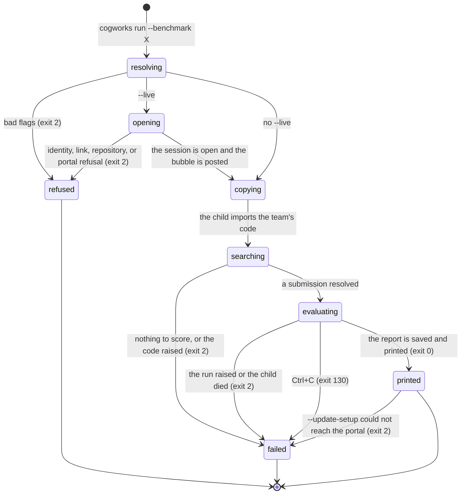

# `cogworks run`

## Summary

`cogworks run` scores a team's repository on the student's own machine and writes a report to disk. It is the only command that runs a benchmark end to end locally: it finds the team's functions the same way `check` does, calls them on the benchmark's practice cases, scores the answers, and prints the numbers under a first line ending `LOCAL RUN · SELF-REPORTED`. With `--live` it also opens a session on the portal so the team can watch a progress bubble in Discord, and the finished report reaches the portal at the end.

It is reached by typing `cogworks run --benchmark <id>` inside the team's project. `--benchmark` is required; the other options are `--json`, `--update-setup`, `--live` and `--portal`. `cogworks test` takes the same options minus `--live` and `--portal` (`python/cogbench/src/cogbench/cli.py:91`) and scores the benchmark's small test cases instead of the full practice set: one case for a v1 plugin, the `test` tier for a v2 plugin (`python/cogbench/src/cogbench/runner.py:83`, `:206`). Help lists it as "check your code against one small benchmark case" (`cli.py:80`).

Both commands answer from the same readiness decision as `check` (`cli.py:389`), so a repository `check` calls ready is one `run` will score.

> Technical note: the setup page on the candidate installs CLI `40d31a2` (`apps/portal/src/lib/benchmark-packages.ts:40`). That CLI does not stamp the producing command on a report, so its reports print plain `LOCAL` and a `test` result carries no smoke-test line. Everything else in this document is the same in that pin.

## The simple case

A student in their team project types `cogworks run --benchmark audio-identification`. On a terminal, the search reports on stderr as it goes:

```
Reading your repository
  read 14 files in team-bagel-2026
Looking for the functions that do the work
Trying your functions to find which pair stores a song and names it back
  ⠹ [#########...............] 1,204/3,962 pairings   58s left at most
  fingerprint    songs.fingerprint
  identify       matcher.best_match
```

Then the scoring, silently, and the report on stdout:

```
audio-identification v1 · LOCAL RUN · SELF-REPORTED
Identification score: 0.8120
Clean top-1: 0.940
Noisy top-1: 0.771
Chance: 0.021
Trivial baseline: 0.183
commit: a3f91c2 (dirty)
saved: /Users/ada/team-bagel-2026/.cogbench/reports/local_4f0c9d2b8e714a55b1c3ad6f27e90814.json
```

Exit 0. Nothing left the laptop and no credit was spent. The `saved:` path is what `cogworks report` and `cogworks sync` read next. The primary metric prints at four decimals or more, the rest at their own precision (`cli.py:240`). `Chance` and `Trivial baseline` are floors, and the terminal prints them exactly like scores (`cli.py:239`); the run page draws them differently. See [`foundations/what-the-portal-claims.md`](../foundations/what-the-portal-claims.md#floor).

The common unhappy case is a search that finds nothing to score:

```
audio-identification · LOCAL · NO RESULT
The run did not finish: PluginError: Nothing in this repository could be scored yet. Run `cogworks check --benchmark audio-identification` to see what was found..
No score was produced.
```

Exit 2, nothing saved, all on stdout (`cli.py:1201`, `:458`). The line carries a Python class name and ends in two full stops, because the format string adds one to a message that already has one. The same three-line shape was produced locally from the candidate tree by `cogworks run --benchmark not-a-benchmark` in an empty repository: "The run did not finish: PluginError: not-a-benchmark is not installed here, so there is nothing to run. Install the benchmark package for this week and run this again.." (`python/cogbench/src/cogbench/plugins.py:112`).

## The ask, event by event


```mermaid
stateDiagram-v2
    [*] --> resolving : cogworks run --benchmark X
    resolving --> refused : bad flags (exit 2)
    resolving --> opening : --live
    resolving --> copying : no --live
    opening --> refused : identity, link, repository, or portal refusal (exit 2)
    opening --> copying : the session is open and the bubble is posted
    copying --> searching : the child imports the team's code
    searching --> failed : nothing to score, or the code raised (exit 2)
    searching --> evaluating : a submission resolved
    evaluating --> failed : the run raised or the child died (exit 2)
    evaluating --> failed : Ctrl+C (exit 130)
    evaluating --> printed : the report is saved and printed (exit 0)
    printed --> failed : --update-setup could not reach the portal (exit 2)
    printed --> [*]
    refused --> [*]
    failed --> [*]
```

### Asking

**The process is replaced once under a pinned hash seed** (`cli.py:1141`). One 2026 repository builds its inverse-document-frequency table by iterating a set, and its text retrieval score moved between 0.8188 and 0.8335 across three seeds. Windows skips this, because it has no `exec` (`python/cogbench/src/cogbench/isolate.py:235`).

**The working directory is captured before anything loads** (`cli.py:1156`). Week 1 chdirs into a private scratch directory; reading the directory afterwards once wrote the report into a directory that was then deleted.

**With `--live`, the preconditions are checked before the search.** The installed benchmark's id and version are read in a child with the repository's own paths removed, so a local module cannot shadow the plugin (`cli.py:1002`, `:1027`). Then the portal, the token, and the git state: "This portal is not linked. Run `cogworks link` first." and "Live sharing requires a committed GitHub repository." (`cli.py:1057`, `:1060`). A student in the wrong directory now hears this in seconds, not after the search.

### Answered without work

An argparse error, and with `--live` the four refusals above plus the portal's own: "Finish joining a team and connecting its repository first.", "That benchmark version is not active.", and "This device is running {yours}, but your team is connected to {theirs}." (`apps/portal/worker/routes/local-runs.ts:230`, `:234`, `:240`). A plugin that will not load under `--live` is "Cannot load live benchmark identity: {detail}" (`cli.py:1041`). Each is one `cogworks:` line on stderr and exit 2, with nothing written.

Without `--live`, even an uninstalled benchmark is not answered without work: the project is copied and a child started before the plugin fails to load, and the student gets the NO RESULT block above.

### The work begins

Two moments, in this order when both apply.

**With `--live`, the session opens.** `POST /api/v1/local-runs` writes a session and a run surface and tries to post the Discord bubble before returning (`local-runs.ts:203`). The team can now see that a run is happening.

**The team's code runs.** The project is copied to a private temporary directory without `.git`, `.cogbench`, `__pycache__` or virtual environments (`python/cogbench/src/cogbench/execution.py:56`, `:93`), and a child imports and scores from the copy. Files the code writes relative to itself land in the copy and are discarded. Scoring has no wall clock or memory limit, because one measured local evaluation took 381 seconds (`cli.py:592`).

### While it works

**The search talks; scoring does not.** The search draws only when stderr is a terminal, rewrites one live line about twelve times a second, and gives an estimate phrased "left at most" only after 200 attempts (`python/cogbench/src/cogbench/progress.py:41`, `:46`). Once scoring starts the terminal is quiet until the report. Anything the team's code prints goes to stdout ahead of the report, or to stderr under `--json` (`cli.py:466`).

**With `--live`, progress crosses from the child as datagrams** and the parent forwards it (`cli.py:512`, `:523`). Four phases reach the portal: `preparing`, sent when the child starts (`cli.py:1094`), then `contract_check`, `evaluating` and `scoring` from the runner. Each maps to a wire code (`cli.py:944`), and moving from `contract_check` to `evaluating` adds a `contract.passed` first (`cli.py:957`).

**A heartbeat every two seconds repeats the current phase** (`cli.py:936`).

> Technical note: the case counter takes two values. The runner reports `0` of N before handing the whole case list to the team's code and `N` of N after (`runner.py:231`, `:245`), so the bubble shows no movement for the entire evaluation and then jumps to complete.

**Events are queued and some are dropped.** The send queue holds 32 events and a heartbeat that finds it full is dropped; a terminal event evicts one to make room (`cli.py:887`). A separate 32-entry history keeps phase transitions over heartbeats for the replay batch. A failed send prints "cogworks: live updates paused: {error}" once and never again (`cli.py:928`). The run itself is unaffected.

### How it ends

On success, in this order: the report is saved to `.cogbench/reports/local_<hex>.json` under the captured directory (`cli.py:1228`), with a `.cogbench/.gitignore` holding `*` written the first time so the run does not make the tree dirty (`python/cogbench/src/cogbench/storage.py:65`); the live session is told `completed` with the whole report; the report prints; the `saved:` line prints; and with `--update-setup` the portal records the `run` or `test` step and the CLI prints "setup: updated {step}" (`cli.py:1234`). Exit 0.

With `--live`, the completed event stores the report on the portal as a synced local report under this device's account (`local-runs.ts:116`). That is a sync without weights; see [`sync.md`](sync.md).

On failure the NO RESULT block prints and the command exits 2. The detail is the child's own: for an exception, its class name and up to 300 characters of its message (`isolate.py:386`); for a child that died, a sentence such as "the Python interpreter {verb} while running this code" (`isolate.py:583`). With `--live` a terminal `failed` event goes up carrying a code and the current phase, no text: `run.failed.contract` when the detail starts `ContractError: `, `run.failed.memory` or `run.failed.timeout` for those exception names, and `run.failed.runtime` for everything else (`cli.py:1184`, `:990`). Teammates watching learn that it failed and in which phase, not why.

Finishing a live run sends the terminal event through the queue and, separately, the 32-entry history through `/events/batch` with a five second deadline and no retry (`python/cogbench/src/cogbench/client.py:116`). Whichever lands first settles the session; the portal treats later events as duplicates (`local-runs.ts:86`) and drops a progress event whose phase is earlier than the one recorded (`local-runs.ts:100`). A failed batch prints "cogworks: final live update was delayed: {error}" and the command keeps its exit code. A second terminal event is now a no-op (`cli.py:966`), so a failing `--update-setup` after a live success no longer stalls on a rejected batch.

### What a failure says

The NO RESULT line wraps the runner's sentences. The team's code broke the contract:

| Sentence | Where |
| --- | --- |
| "Submission adapter must be callable or expose predict(inputs)." | `runner.py:50` |
| "Submission returned {n} predictions for {m} inputs." | `:56` |
| "Predictions must be JSON-serializable." | `:61` |
| "Submission returned {n} scenario outputs for {m} cases." | `:240` |
| "Student adapter execution failed: {error}" | `:237` |

The last is the catch-all for any exception inside a v2 benchmark's run, including one raised by the platform's own pipeline code rather than the team's (see the Week 2 row under Modifiers).

The benchmark or the machine is not ready: "The benchmark plugin has no public practice cases." (`:82`), "The benchmark plugin has no {tier} cases." (`:228`), "Benchmark data could not be prepared: {error}" (`:226`), "The Week 2 model lock is missing or invalid. Reinstall the benchmark package." (`:132`), "FaceNet is not installed. Install the Week 2 model dependencies from the course setup guide." (`:159`).

The benchmark misbehaved: "Benchmark scorer returned an invalid metric." (`:96`), "Benchmark scorer returned invalid v2 metrics." (`:253`), "Benchmark scorer omitted its primary metric." (`:272`).

With `--live` all of these reach the bubble as `run.failed.contract`, so a teammate cannot tell a missing FaceNet on one laptop from a wrong-length answer from a broken benchmark.

## Modifiers

| Modifier | Set before the ask | Changed while it works |
| --- | --- | --- |
| Who you are | Without `--live` and `--update-setup`, nobody: no portal, no token, no network. With either, the device token carries the account, and the portal refuses an account with no team. | No effect. The token is read once; a revocation mid-run surfaces as "live updates paused". |
| Where your team and repository stand | Without `--live`, none of it is required: outside a worktree the report records no commit and `dirty` true, because a failed `git status` counts as dirty (`python/cogbench/src/cogbench/project.py:46`). With `--live`, a committed GitHub worktree named like the team's repository is required (case-insensitive). | Committing mid-run changes the commit `execute` records at the end, the portal compares it with the session's, and the completed event is refused with "The completed report does not match this live run." (`local-runs.ts:114`). The report is still saved locally, the CLI prints "final live update was delayed", and the session stays `running`, because the CLI sends no second terminal event. |
| Which week's benchmark | `--benchmark` names it. Week 1 chdirs into a scratch directory inside the child. Week 2 builds a FaceNet model first and, on the candidate, raises on a photo with no face: the pipeline subscripts a per-item `None` (`python/cogbench/src/cogbench/pipeline.py:834`), and the student reads "Student adapter execution failed: 'NoneType' object is not subscriptable". Week 3 can withhold its overall and is the only week that records weights. | No effect. The plugin is loaded once per child. |
| Practice or leaderboard | Neither. A local report is self-reported, never leaderboard-eligible, and cannot be promoted. `--live` opens a run surface to watch, not a run. | No effect. |
| Flags, options, and where you are typing | `--json` prints the report as JSON, or a JSON object with `benchmarkId`, `status` and `detail` on failure, and drops the `saved:` line (`cli.py:1194`). `--update-setup` marks `run` or `test`. `--live` and `--portal` exist on `run` only. | No effect. Nothing is reread after the start. |

## Cancel and interrupt

| Event | Before the work begins | While it works |
| --- | --- | --- |
| You stop it yourself | Ctrl+C prints `cogworks: interrupted` and exits 130. | The same, and no report is saved. With `--live` the session already exists, so a `failed` event with `run.failed.runtime` goes up (`cli.py:1358`), the same code an ordinary crash produces. |
| You do something else mid-way | No effect. | No lock. A second `cogworks run` works in its own copy, writes its own report, and with `--live` opens its own bubble. The one-at-a-time rule belongs to hosted runs. |
| A teammate acts at the same time | A teammate's push changes nothing; this scores the files on this disk. | A teammate's own `--live` run adds a second bubble with no relation drawn. At `2ff32fa`, removing this account from the team mid-run did not stop the event stream, because events were checked against the device and user only (`local-runs.ts:73` there). Since `b0e0c55` (2026-10-03, not deployed) leaving or being removed does stop it: the next event is refused before anything is saved, with "You're no longer on this run's team, so the portal stopped recording it. The run still finishes here and saves its report on this machine." (`apps/portal/worker/routes/local-runs.ts:145`, checked at `:171` and again inside the guarded write at `:243`). The CLI prints that once as "live updates paused" and keeps going (`cli.py:972`, read from code). |
| The network or the portal fails | Without `--live`, nothing is asked. With `--live`, opening the session retries three times and then exits 2, now before the search. | The run continues and saves its report. "live updates paused" prints once; a failed final batch prints "final live update was delayed". The local result never depends on the portal. |
| The page or the process goes away | Nothing to clean up. | Closing the terminal kills the process. With `--live` the session stays `running` and the bubble stays on its last phase: nothing sweeps local sessions (`apps/portal/worker/execution/maintenance.ts:43` covers hosted runs only). An exception the CLI does not catch still sends a `failed` event from its `finally` (`cli.py:1366`). |
| The thing being measured changes | The benchmark version must be active when the session opens. | Edits after the copy are not scored. A commit breaks the completed event as above. |
| The platform refuses or credit runs out | Credit is never consulted. | Not reachable. |

## Interactions with other systems

**Who may do this.** Anyone standing in the repository. `--live` and `--update-setup` add a device token whose account must be on the team that owns this repository.

**The team owns it.** The report names a repository and a commit, never a person. A live session records the device and user, but the run surface belongs to the team and the bubble carries no name.

**Credit.** None spent. This is the free path past the ten-practice-run limit: the same code on the same practice cases, as often as the student likes. What it does not give is a number anyone else has to trust. See [`cross-cutting/credit-and-quota.md`](../cross-cutting/credit-and-quota.md).

**What the portal claims.** Nothing, until the student syncs or uses `--live`. Then the report is shown as self-reported. The digest of the predictions stays on the machine. The terminal report prints metrics, the commit and `note:` lines only; verdicts, coverage and the supplied disclosure live in `check`.

**What the benchmark supplied.** Not printed. See [`cross-cutting/what-the-benchmark-supplied.md`](../cross-cutting/what-the-benchmark-supplied.md).

**Live updates and reconnection.** One session, opened once, no reconnection. The replay batch is the whole recovery, capped at 32 events on both sides. See [`cross-cutting/live-updates.md`](../cross-cutting/live-updates.md).

**Discord.** `--live` prints one line on stderr saying what happened to the bubble (`cli.py:1076`):

```
live: one progress bubble opened in your team channel
live: synced to CogPortal; a team maintainer can choose the Discord channel with /cog
live: synced to CogPortal; Discord delivery is temporarily unavailable
```

The middle one is the only terminal line that names the command that binds a channel. See [`discord/channel-messages.md`](../discord/channel-messages.md).

**Configuration.** `--portal`, then `COGPORTAL_URL`, then the saved portal, consulted only for `--live` or `--update-setup`. The config file is never written here.

## Edge cases

- **The NO RESULT line reads like a log.** It shows the exception's class name and, for every message ending in a full stop, two full stops (`cli.py:1202`). Seen locally from the candidate tree.
- **`--json --update-setup` does not produce clean JSON.** "setup: updated run" prints to stdout after the JSON document (`cli.py:211`).
- **A live report names weights it never uploads.** The completed event stores the report with its weight receipts (`local-runs.ts:116`), but only `cogworks sync` uploads bytes. A hosted run at that commit then picks this report as the newest and fails before it starts with "Required weight {path} has not been uploaded; sync the report again." (`apps/portal/worker/services/weights.ts:369`, chosen at `apps/portal/worker/services/local-reports.ts:319`). Week 3 only; read from code.
- **Reports accumulate.** Each run writes a new `local_<uuid>.json`; nothing prunes them, and `cogworks report` shows the newest by modification time.
- **Units are dropped.** The local runner sets no unit (`runner.py:179`); the printer adds `s` only to a key ending `_seconds` (`cli.py:245`).
- **Floors are stored and not shown.** The runner now records each metric's role (`runner.py:191`), so a floor survives into the report and the portal, but the terminal prints it as a plain row.
- **`git` runs four times per repository read** with a five second timeout each (`project.py:11`), and `--live` reads twice.
- **Windows runs student code in the CLI's own process**, so a module that kills the interpreter takes the command with it, and the hash seed is not pinned (`isolate.py:592`).

## Open questions and verification

- Ctrl+C reporting as `run.failed.runtime` may be deliberate; no comment says so.
- Whether `run.failed.timeout` and `run.failed.memory` are reachable: scoring has no limits, so only code that raises those exception types itself produces them.
- Whether the live bubble renders the stuck counter as a stalled bar was not observed (B-22).
- A killed `--live` run leaves the session `running` for good (B-13). Not observed.
- Hosted beta (`4984730`) differs: its pipeline passes a per-item `None` forward (beta `python/cogbench/src/cogbench/pipeline.py:834` to `:841`, #53), and its setup page installs that CLI (`b6bbffb`, beta `apps/portal/src/lib/benchmark-packages.ts:41`). On beta a Week 2 photo with no face scores; on the candidate (`pipeline.py:834`) the local run fails and blames the adapter.
- Leaving mid-run (since `b0e0c55`) is covered by `apps/portal/test/team-leave.test.ts`: a single or batched event racing a leave is refused rather than reported as a duplicate, a completed event racing a leave saves no report, and a completed event reusing a report id frozen by a left team finishes nothing. No real CLI run was driven through a leave.
- None of this was run against a portal. The two NO RESULT samples were produced locally from the candidate tree with no benchmark installed; every other sample is assembled from format strings.

Read against Cog\*Portal commit `2ff32fa`.
