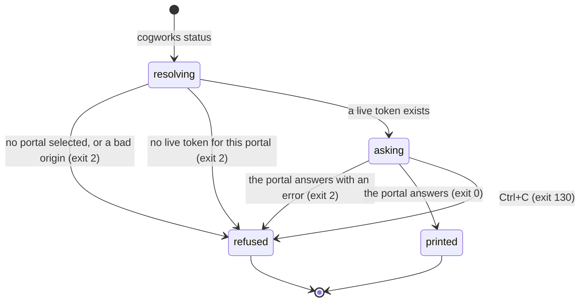

# `cogworks status`

## Summary

`cogworks status` answers one question: what does the portal think this machine is? It prints seven lines naming the GitHub account behind the link, the team, the repository, the team's Discord channel, this device's name, when the link expires, and which portal origin all of that came from. It is the only command that shows the device expiry, and the only place a student can see the team's Discord channel from a terminal.

It is reached by typing `cogworks status` in any directory. Unlike `check`, `run`, and `test`, it does not take `--benchmark`, does not read the repository it is standing in, and does not care whether that directory is a git worktree at all. It takes one option, `--portal`, and has no `--json` mode. Nothing is written to disk and nothing is sent except one authenticated GET.

## The simple case

A student who has already run `cogworks link` types `cogworks status` and gets seven aligned lines:

```
GitHub   @octocat
Team     Team Bagel
Repo     CogWorksBWSI/team-bagel-2026
Discord  #1234567890123456789
Device   MacBook Pro
Expires  2026-10-01T14:22:05Z
Portal   https://cogportal.example
```

The command exits 0. Nothing changed anywhere; running it twice prints the same thing twice.

The `Discord` line shows a raw channel snowflake, not a channel name. A student reading it cannot tell which channel that is without pasting the number into Discord. When no channel has been chosen, the line reads `Discord  team channel not chosen` instead, which is the only cell on this screen written in words rather than in an identifier (`python/cogbench/src/cogbench/cli.py:687`).

The `Expires` line is an ISO 8601 UTC timestamp ending in `Z`, converted from the millisecond value the portal stores. Every other timestamp a student sees is rendered in their own locale; this one is not.

## The ask, event by event



### Asking

Everything is decided before a byte leaves the machine.

First the portal origin is resolved, in this order: `--portal`, then `COGPORTAL_URL`, then the active portal saved in the config file. With none of the three set, the command stops with "No CogPortal is selected. Copy `cogworks link --portal ...` from the setup page." An origin that carries a path, a query, a fragment, or credentials is rejected, as is any non-HTTPS origin that is not `localhost`, `127.0.0.1`, or `::1`: "CogPortal must use HTTPS (HTTP is allowed only for local development)." Both are exit 2. See [`foundations/the-ask.md`](../foundations/the-ask.md#configuration-precedence) for the precedence rule, which every command shares.

Then the saved token for that exact origin is read. A token is only returned when its stored expiry is in the future, so an expired link and a link that never existed are the same condition here and produce the same sentence: "This portal is not linked. Run `cogworks link` first."

> Technical note: expiry is judged against this machine's clock, not the portal's. A laptop whose clock is far ahead treats a live token as expired and sends the student to re-link; a laptop far behind sends a dead token and gets the portal's rejection instead. Neither case says anything about a clock.

### Answered without work

Three ways out before any request:

- No portal selected.
- An origin that is not a valid HTTPS origin.
- No live token for that origin.

All three print one line to stderr prefixed `cogworks: ` and exit 2. Nothing is written, no request is made, and the config file is not touched, not even to clear a token the command just decided was expired.

### The work begins

There is no such moment. `status` never becomes extended in the sense the other commands do: the single GET to `/api/v1/cli/device/status` is the whole of the work, it writes nothing anywhere, and abandoning it at any instant leaves the machine and the portal exactly as they were. This is the one command in the platform where an interrupt can cost nothing.

### While it works

One GET with a 15 second timeout, marked retryable. A 429, 500, 502, 503, 504, or a connection failure is retried up to three attempts with 0.25 s doubling backoff (`python/cogbench/src/cogbench/client.py:16`). Nothing is printed while this happens. On a slow or flaky connection the command can sit silent for the better part of a minute with no spinner and no line saying it is retrying, which is the same silence a hung command produces.

### How it ends

On success, seven lines to stdout in a fixed order, then exit 0. Each label is padded to a fixed width so the values line up.

On any portal error, one line to stderr and exit 2. The message is the portal's own sentence when the portal sent one. The failure a student is most likely to hit is a device linked to an account that is not yet on a team, which is a 403 carrying "Finish joining a team and connecting its repository first." (`apps/portal/worker/routes/connections.ts:311`). A student reading that in a terminal has to go to the browser to fix it, and the sentence does not say which page.

Nothing is cached. The next `cogworks status` asks again.

## Modifiers

| Modifier | Set before the ask | Changed while it works |
| --- | --- | --- |
| Who you are | The device token carries the account. A device linked to an account with no team gets the 403 above rather than a partial answer; there is no signed-out state for a linked device. An instructor sees the same seven lines as a student, for their own team. | No effect. The token is read once, and a role change made in the browser mid-request does not reach the answer already in flight. |
| Where your team and repository stand | The whole point of the command. A team always has a repository, because a team is created by connecting one, so `Repo` is never blank. `Discord` is the only line that can be absent, and it says so in words. | No effect within one invocation. |
| Which week's benchmark | No effect. `status` takes no `--benchmark` and reports nothing per benchmark: not the week, not the quota, not the last run. A student who wants to know whether they have practice runs left cannot learn it here. | No effect. |
| Practice or leaderboard | No effect. Neither runs nor leaderboard entries appear. | No effect. |
| Flags, options, and where you are typing | `--portal` overrides both the environment variable and the saved active portal for this one invocation, and does not change which portal is active afterwards. There is no `--json`, so a script must parse fixed-width text. Output goes to stdout whether or not it is a terminal, with no colour and no width detection, so a pipe and a terminal get identical bytes. | No effect. |

Nothing here can change mid-ask. Every variant is read at the start, and the command is over in one request.

## Cancel and interrupt

| Event | Before the work begins | While it works |
| --- | --- | --- |
| You stop it yourself | Ctrl+C during argument parsing or config reading prints `cogworks: interrupted` on stderr and exits 130. Nothing was going to be written anyway. | Ctrl+C during the request prints the same line and exits 130. The request may still have reached the portal; it was a read, so it does not matter. |
| You do something else mid-way | No effect. Running a second `cogworks` command in another terminal is independent; there is no lock and no shared state to contend for. | No effect. |
| A teammate acts at the same time | A teammate renaming the team or choosing a Discord channel a moment earlier changes what this command prints. There is no staleness marker: the seven lines are always presented as current. | The answer reflects whatever the portal held when it served the request. A rename that lands mid-flight is simply not in this answer. |
| The portal fails | A portal that is unreachable is not detected here; the failure surfaces in the next phase. | Retried up to three attempts on 429, 500, 502, 503, 504, and connection failures. After that, one line: "Could not reach CogPortal: {reason}" for a transport failure, or the portal's own message for an HTTP error, or "CogPortal returned HTTP {code}." when the body could not be parsed. Exit 2. |
| The process goes away | Closing the terminal kills the command. Nothing is left behind. | The same. No partial file, no lock, no session to clean up. |
| The thing being measured changes | The device token expiring between the local check and the request means the portal rejects a token this machine believed was live. The student sees the portal's rejection rather than the friendlier "not linked" sentence. | The same. |
| Refused, or out of credit | Credit is not consulted. A team with zero runs left gets the same seven lines as a team with ten. | No effect. |

After any interrupt the machine is unchanged: no report, no token rewrite, no cached answer. This is the only command in the platform for which that is unconditionally true.

## Interactions with other systems

**Who may do this.** Anyone holding a live device token for the origin. There is no role check beyond team membership, and the answer is always about the token's own account. A student cannot ask about another student's device, and an instructor cannot either.

**The team owns it.** Five of the seven lines describe the team rather than the person: the team name, the repository, the Discord channel, and by implication the account's membership. The two personal lines are the GitHub login and the device name. See [`foundations/the-team-and-the-repository.md`](../foundations/the-team-and-the-repository.md).

**Credit.** None spent, none reported. A student cannot see their remaining practice runs from the terminal at all; that number lives only on the dashboard.

**What the portal claims.** Every line is a fact the portal observed about its own records, so all seven are safe under the trust rule in [`foundations/what-the-portal-claims.md`](../foundations/what-the-portal-claims.md). The command claims nothing about the machine it runs on, not even that the directory is a repository.

**What the benchmark supplied.** Nothing. No benchmark is loaded and none is named.

**Live updates and reconnection.** None. This is a single request with no stream, no polling, and no reconnection.

**Discord.** The Discord line is the only place the terminal mentions Discord. It reports whether a channel is bound and, when one is, its snowflake. It does not say whether the bot can post there, whether anyone is in it, or how to change it. The sentence for the unbound case does not name the command that binds it either, though `cogworks run --live` does say "a team maintainer can choose the Discord channel with /cog" in the same situation (`python/cogbench/src/cogbench/cli.py:562`).

**Configuration.** `--portal`, then `COGPORTAL_URL`, then the active portal in `~/.cogbench/config.json`, or wherever `COGBENCH_CONFIG` points. `status` reads that file and never writes it.

## Edge cases

- **A student linked to two portals.** The config file holds a token per origin plus one active portal. `cogworks status` with no `--portal` reports the active one only. There is no way to list every linked portal; a student who linked a staging portal last has no indication that the answer is about staging beyond the `Portal` line at the bottom.
- **A response missing a field.** The seven values are read by subscript. A response without `githubLogin`, `teamName`, `repositoryFullName`, `deviceName`, or `deviceExpiresAt` raises `KeyError`, which is not in the command's caught exception list, so the student gets a Python traceback rather than a sentence (`python/cogbench/src/cogbench/cli.py:683`). The wire schema requires all five, so this needs a portal that is misbehaving or a version skew, but the failure mode is a stack trace either way.
- **A non-numeric expiry.** `deviceExpiresAt` is converted with `int()`. A value that will not convert raises `ValueError`, which *is* caught, so the student gets `cogworks: invalid literal for int() with base 10: ...` and exit 2. That is a Python message, not a sentence written for a reader.
- **The membership query takes the first row it finds.** The portal selects the membership with `limit(1)` and no ordering (`apps/portal/worker/routes/connections.ts:309`). In practice this is safe: `team_members` carries a unique index on `userId` (`apps/portal/worker/db/schema.ts:192`), so a student is on exactly one team at a time. The unordered `limit(1)` is therefore harmless today and would become an arbitrary choice the day that index is relaxed.
- **Fixed-width labels and long values.** The labels are padded to eight characters and the values are printed as-is. A long repository name or team name simply runs past the terminal width and wraps; nothing is truncated, which is the right choice for a value a student may need to copy.
- **The first line names GitHub, not the portal account.** For a development sign-in that carries no GitHub identity, the portal falls back to the account's login (`accountLogin`). A student who signed in through the dev path sees something under a `GitHub` label that did not come from GitHub.

## Open questions and verification

- The `Discord` line prints a raw channel snowflake. Showing `#1234567890123456789` to a student is close to showing nothing; the portal knows the channel name in other contexts. May be worth treating as a bug rather than documenting. **Unverified**: not observed against a running portal.
- A missing field in the response produces a traceback rather than a handled error, because `KeyError` is not in the caught tuple at `cli.py:707`. Worth treating as a bug. The same tuple protects every other command, so this is one line's worth of exposure, not a pattern.
- The retry window is silent. Three attempts at a 15 second timeout with backoff can keep the command quiet for roughly 45 seconds with no output. Whether that is long enough to look hung was not measured. **Unverified.**
- Whether the portal's `no_team` 403 is reachable in practice was not confirmed: a device is linked from a browser session that has already passed the team gate, so an account with a device but no team may be an unreachable state. If it is unreachable, the sentence is dead copy; if it is reachable, it should name the page to visit.
- No `--json` mode. Whether anything scripts against this output was not established.

Verified against Cog\*Portal commit `f74e087`.
