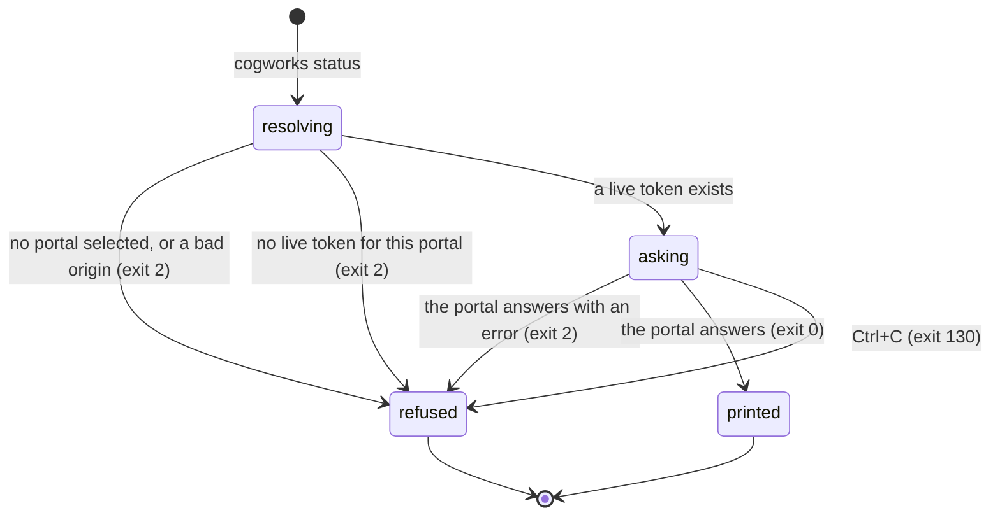

# `cogworks status`

## Summary

`cogworks status` answers one question: what does the portal think this machine is? It prints seven lines naming the GitHub account behind the link, the team, the repository, whether the team has chosen a Discord channel, this device's name, when the link expires, and which portal origin all of that came from. It is the only command that shows the device expiry, and the only place a student can learn from a terminal whether their team has a Discord channel at all.

It is reached by typing `cogworks status` in any directory. `cogworks --help` lists it as "show this device's CogPortal connection" (`python/cogbench/src/cogbench/cli.py:127`). Unlike `check`, `run`, and `test`, it takes no `--benchmark`, does not read the repository it is standing in, and does not care whether that directory is a git worktree. It takes one option, `--portal`, and has no `--json` mode. Nothing is written to disk and nothing is sent except one authenticated GET.

## The simple case

A student who has already run `cogworks link` types `cogworks status` and gets seven aligned lines:

```
GitHub   @octocat
Team     Team Bagel
Repo     CogWorksBWSI/team-bagel-2026
Discord  team channel chosen
Device   CogWorks CLI
Expires  Nov 29 (in 59 days)
Portal   https://cogportal.example
```

The command exits 0. Nothing changed anywhere; running it twice prints the same thing twice.

The `Discord` line is a yes or a no: `team channel chosen` when the team has bound a channel and `team channel not chosen` when it has not (`python/cogbench/src/cogbench/cli.py:1347`). It never names the channel.

The `Device` line is the name typed in the browser when the link was approved, which defaults to `CogWorks CLI` (`apps/portal/src/routes/ConnectionsPage.tsx:46`). It is not the hostname `cogworks link` printed; see [`link.md`](link.md#edge-cases).

The `Expires` line is a short date followed by one of `(today)`, `(in 1 day)`, `(in N days)`, `(1 day ago)`, or `(N days ago)` (`python/cogbench/src/cogbench/cli.py:263`). Both the date and the day count are worked out in UTC, so a student far enough west, late enough in the evening, reads a date one day ahead of their own. A link lasts sixty days from approval (`apps/portal/worker/routes/connections.ts:39`).

## The ask, event by event


```mermaid
stateDiagram-v2
    [*] --> resolving : cogworks status
    resolving --> refused : no portal selected, or a bad origin (exit 2)
    resolving --> refused : no live token for this portal (exit 2)
    resolving --> asking : a live token exists
    asking --> refused : the portal answers with an error (exit 2)
    asking --> printed : the portal answers (exit 0)
    asking --> refused : Ctrl+C (exit 130)
    printed --> [*]
    refused --> [*]
```

### Asking

Everything is decided before a byte leaves the machine.

First the portal origin is resolved: `--portal`, then `COGPORTAL_URL`, then the active portal saved in the config file. With none of the three set, the command stops with "No CogPortal is selected. Copy `cogworks link --portal ...` from the setup page." An origin that carries a path, a query, a fragment, or credentials is rejected, as is any non-HTTPS origin that is not `localhost`, `127.0.0.1`, or `::1`, with one sentence for every fault: "CogPortal must use HTTPS (HTTP is allowed only for local development)." (`python/cogbench/src/cogbench/cli.py:135`). See [`foundations/the-ask.md`](../foundations/the-ask.md#configuration-precedence).

Then the saved token for that exact origin is read. A token is returned only when its stored expiry is in the future (`python/cogbench/src/cogbench/storage.py:151`), so an expired link and a link that never existed produce the same sentence: "This portal is not linked. Run `cogworks link` first."

> Technical note: expiry is judged against this machine's clock. A laptop whose clock is far ahead treats a live token as expired and sends the student to re-link; a laptop far behind sends a dead token and gets the portal's 401 instead. Neither case mentions a clock.

### Answered without work

Three ways out before any request: no portal selected, an origin that is not a valid HTTPS origin, and no live token for that origin. Each prints one line to stderr prefixed `cogworks: ` and exits 2. Nothing is written, no request is made, and the config file is not touched, not even to clear a token the command just decided was expired.

### The work begins

There is no such moment. The single GET to `/api/v1/cli/device/status` is the whole of the work and writes nothing the student owns. The portal does stamp the device's "last used" time on every authenticated request (`apps/portal/worker/auth/device.ts:41`), which is what the Connections page then shows; that is the only trace the command leaves.

### While it works

One GET with a 15 second timeout, marked retryable. A 429, 500, 502, 503, 504, or a connection failure is retried up to three attempts with 0.25 s doubling backoff (`python/cogbench/src/cogbench/client.py:132`, `:52`). Nothing is printed meanwhile, so on a dead connection the command can sit silent for most of a minute with no spinner and no line saying it is retrying.

### How it ends

On success, seven lines to stdout in a fixed order, labels padded to nine characters, then exit 0 (`python/cogbench/src/cogbench/cli.py:1343`).

On any portal error, one line to stderr and exit 2. The message is the portal's own sentence when it sent one. Two are the likeliest:

- A revoked or portal-expired device: "This CogWorks connection expired or was revoked. Run `cogworks link` to connect this machine again." (`apps/portal/worker/auth/device.ts:38`).
- A device whose account is no longer on a team: "Finish joining a team and connecting its repository first." (`apps/portal/worker/routes/connections.ts:309`). Linking requires a team, so this is reached by being removed from the team, or leaving it, after linking. The sentence does not name the page that fixes it.

Nothing is cached. The next `cogworks status` asks again.

## Modifiers

| Modifier | Set before the ask | Changed while it works |
| --- | --- | --- |
| Who you are | The device token carries the account. A device whose account has no team gets the 403 above rather than a partial answer. An instructor sees the same seven lines as a student, for their own team. | No effect. The token is read once. |
| Where your team and repository stand | The point of the command. A team always has a repository, so `Repo` is never blank. `Discord` is the only line that reports a state rather than a name. | No effect within one invocation. |
| Which week's benchmark | No effect. `status` takes no `--benchmark` and reports nothing per benchmark: not the week, not the quota, not the last run. | No effect. |
| Practice or leaderboard | No effect. Neither runs nor leaderboard entries appear. | No effect. |
| Flags, options, and where you are typing | `--portal` ("use this CogPortal address instead of the saved one", `cli.py:130`) overrides the environment variable and the saved portal for this invocation and does not change which portal is active afterwards. No `--json`, so a script parses fixed-width text. Output has no colour and no width detection, so a pipe and a terminal get identical bytes. | No effect. |

## Cancel and interrupt

| Event | Before the work begins | While it works |
| --- | --- | --- |
| You stop it yourself | Ctrl+C during argument parsing or config reading prints `cogworks: interrupted` on stderr and exits 130. | Ctrl+C during the request prints the same line and exits 130. The request may still have reached the portal; it was a read. |
| You do something else mid-way | No effect. A second `cogworks` command in another terminal is independent. | No effect. |
| A teammate acts at the same time | A teammate renaming the team or choosing a Discord channel a moment earlier changes what this prints. Nothing marks the answer as fresh or stale. | A change that lands mid-flight is not in this answer. |
| The network or the portal fails | Not detected here; it surfaces in the next phase. | Retried up to three attempts. Then one line: "Could not reach CogPortal: {reason}" for a transport failure, the portal's own message for an HTTP error, or "CogPortal returned HTTP {code}." when the body did not parse (`client.py:57`). Exit 2. |
| The page or the process goes away | Closing the terminal kills the command. Nothing is left behind. | The same. |
| The thing being measured changes | A token that expires or is revoked between the local check and the request gets the portal's 401 sentence above rather than "not linked". | The same. |
| Refused, or out of credit | Credit is not consulted. A team with no practice runs left gets the same seven lines as a team with ten. | No effect. |

## Interactions with other systems

**Who may do this.** Anyone holding a live device token for the origin whose account is on a team. The answer is always about the token's own account; nobody can ask about another student's device.

**The team owns it.** Three of the seven lines describe the team: its name, repository, and Discord channel. The GitHub login, device name, and expiry are personal, and the `Portal` line says where the answer came from.

**Credit.** None spent, none reported. Remaining practice runs are not visible from any terminal command.

**What the portal claims.** Every line is the portal's own record, so all seven are safe under [`foundations/what-the-portal-claims.md`](../foundations/what-the-portal-claims.md). The command claims nothing about the machine it runs on, not even that the directory is a repository.

**What the benchmark supplied.** Nothing. No benchmark is loaded.

**Live updates and reconnection.** None. One request, no stream, no polling.

**Discord.** The one Discord line reports whether a channel is bound and stops there. The unbound case does not say who can bind one or how, while `cogworks run --live` says "a team maintainer can choose the Discord channel with /cog" for the same absence (`python/cogbench/src/cogbench/cli.py:1080`).

**Configuration.** `--portal`, then `COGPORTAL_URL`, then the active portal in `~/.cogbench/config.json`, or wherever `COGBENCH_CONFIG` points. `status` reads that file and never writes it.

## Edge cases

- **A student linked to two portals.** The config file holds one token per origin plus one active portal. `cogworks status` reports the active one only, and nothing lists the others; the `Portal` line is the only hint which one answered.
- **A response missing a field.** The values are read by subscript. A response without `githubLogin`, `teamName`, `repositoryFullName`, `deviceName`, or `deviceExpiresAt` raises `KeyError`, which is outside the caught tuple (`python/cogbench/src/cogbench/cli.py:1361`), so the student gets a Python traceback and exit 1. The wire schema requires all five (`packages/contracts/src/schema.ts:910`), so this needs a misbehaving portal or version skew.
- **A non-numeric expiry.** `deviceExpiresAt` goes through `int()` (`cli.py:1353`). A value that will not convert raises `ValueError`, which is caught, so the student reads `cogworks: invalid literal for int() with base 10: ...` and exit 2.
- **The membership query takes the first row.** `limit(1)` with no ordering (`apps/portal/worker/routes/connections.ts:307`) is safe because `team_members` is unique on `userId` (`apps/portal/worker/db/schema.ts:196`).
- **Long values.** Nothing is truncated; a long repository or team name wraps at the terminal edge, which keeps it copyable.
- **The first line names GitHub, not the portal account.** A development sign-in has no GitHub identity, and the portal falls back to the account login (`accountLogin`), so something under a `GitHub` label did not come from GitHub.

## Open questions and verification

- A missing field produces a traceback and exit 1 rather than a sentence and exit 2. The same tuple gap reaches `cogworks report` (observed there; see [`report.md`](report.md#edge-cases)). Carried as B-34.
- The retry window is silent. Three 15 second attempts with backoff can keep the command quiet for about 45 seconds. Not timed.
- No `--json` mode. Whether anything scripts against this output is not established.
- The CLI the candidate's setup page installs (`40d31a2`, see [`check.md`](check.md#summary)) prints this command identically; nothing in `status` changed between that pin and `2ff32fa`.

Read against Cog\*Portal commit `2ff32fa`.
