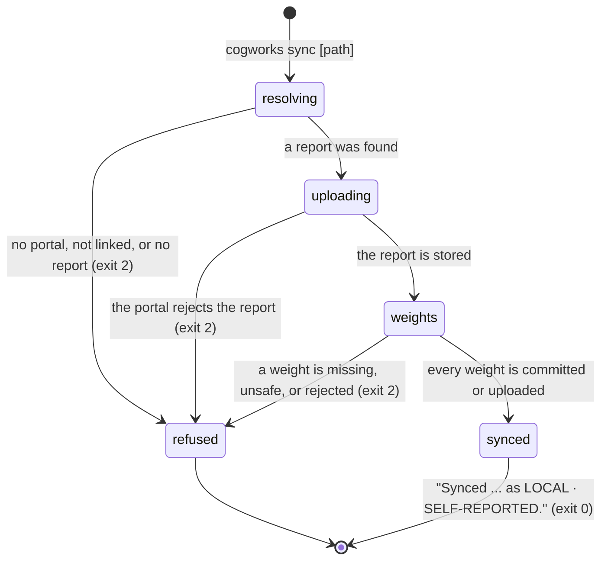

# `cogworks sync`

> **In flight.** The weight-carrying half of this command landed while this document was being drafted, as uncommitted work on top of `f74e087`, and it changed twice during the pass. The files are `python/cogbench/src/cogbench/cli.py` (the `sync` branch), `python/cogbench/src/cogbench/client.py` (`upload_weight`), `apps/portal/worker/routes/local-reports.ts`, `apps/portal/worker/services/weights.ts` and `local-reports.ts`, `apps/portal/worker/routes/runs.ts`, `apps/portal/migrations/0033_weight_artifacts.sql`, `packages/contracts/src/schema.ts` and `protocol.ts`, `apps/portal/worker/execution/runner.ts`, and the prepare script in `apps/runner-modal/src/cogworks_runner/modal_app.py`. What is written below is what the source said at the end of the pass. A verifier must re-read those files rather than trust this prose.

## Summary

`cogworks sync` takes one report a student's own machine produced and hands it to the portal, where it appears for the team marked `LOCAL · SELF-REPORTED`. It is the only way a local result reaches the portal at all: nothing is uploaded in the background, which is why the dashboard's empty state says "No team member has explicitly synced a CogBench report for this benchmark."

It also carries the trained weights that run used, when those weights are not committed to the repository. That is the second half of a three-part path: `cogworks run` records which weight files it read, `cogworks sync` uploads the ones git does not carry, and a hosted run on the same commit downloads them before scoring. It exists because a Week 3 image side cannot be measured without weights, and committing a large checkpoint to a course repository is a worse answer than uploading it once.

The command takes an optional report path and `--portal`. With no path it syncs the most recently modified report in `.cogbench/reports/`. It requires a linked device.

## The simple case

A student who has just run `cogworks run` types `cogworks sync`:

```
Synced local_9f2c1e4a7b3d8065c1f2a9e0b4d7c536 as LOCAL · SELF-REPORTED.
```

Exit 0. The report is now on the dashboard under the team's synced reports, attributed to the GitHub login behind the device, with its metrics, its diagnostics, its commit, and whether the working tree was dirty.

Nothing about the repository's contents goes with it. The digest of the predictions is stripped from the payload before it is sent (`python/cogbench/src/cogbench/client.py:88`), so the portal receives numbers and sentences, not evidence it could re-check. That is the honest shape for a claim the portal is going to label self-reported anyway.

When the run used trained weights, a line appears for each one before the confirmation. A weight file git already carries needs nothing:

```
weights: models/image_projection.npz is committed and travels with the repository
Synced local_9f2c... as LOCAL · SELF-REPORTED.
```

One git does not carry is uploaded:

```
weights: weights/projection.npz (7340032 bytes) uploaded to weights/CogWorksBWSI/team-bagel-2026/a1b2c3d.../weights/projection.npz
Synced local_9f2c... as LOCAL · SELF-REPORTED.
```

The confirmation prints last, after every weight has been dealt with, so the last line a student reads is true of the whole command.

## The ask, event by event



### Asking

The portal origin resolves first, by the usual precedence in [`../foundations/the-ask.md`](../foundations/the-ask.md#configuration-precedence). Then the saved token: without a live one, "This portal is not linked. Run `cogworks link` first."

Then the report. A path given on the command line is expanded and resolved as written. With no path, the most recently modified `local_*.json` under `.cogbench/reports/` wins, chosen by file modification time rather than by the timestamps inside the report. None found raises "No local reports found. Run `cogworks run` first."

The file is parsed before anything is sent. Which weight files the run read was recorded when the report was made, not now, so a student cannot add one by editing the repository between the run and the sync.

### Answered without work

Four ways out with nothing sent: no portal selected, an origin that is not a valid HTTPS origin, no live token, and no report. All are one line on stderr and exit 2.

Note what is not checked here. The command does not confirm that the report belongs to the repository the current directory holds, or that the benchmark is the team's current week, or that the report has not already been synced. All three are the portal's job, and the portal answers with its own sentences: "That report ID belongs to another account.", "That report ID is already in use."

### The work begins

The moment `POST /api/v1/local-reports` is sent. That request is marked retryable, so a 429 or a 5xx is retried up to three attempts with backoff. Once the portal accepts it, the report is durable and visible to the whole team, and nothing later in this command removes it.

The report has to land before any weight can, because the upload route looks the report up to decide where the file belongs. So the ordering is not incidental: the report is the thing that says which repository and which commit these weights are the weights of.

### While it works

Nothing is printed during the report upload. A report is small, at most 32 metrics and 32 diagnostics of 240 characters each, so it is one quick request.

Each weight file is then handled in turn. The command first refuses any path that is absolute or contains `..`, with "Weight path must stay inside the repository: {path}". Then it asks git whether the file is tracked, using `git ls-files --error-unmatch`. A tracked file is left alone and reported. An untracked file that does not exist raises "Weight file does not exist: {path}". Everything else is uploaded.

The upload is a single `PUT` with a 15 second timeout and no retry, and the file is read into memory whole. There is no progress line. A large checkpoint is therefore a silent pause of whatever length the transfer takes, and one that runs past 15 seconds fails.

> Technical note: the portal caps a weight file at 200 MiB and enforces it twice, once against the declared `Content-Length` before reading and once against the running total as the stream arrives (`apps/portal/worker/services/weights.ts`). It stages the upload under a temporary key, hashes it with SHA-256 as it goes, copies it to its final key only after the size is confirmed, and deletes the temporary object in a `finally`. So a truncated or oversized upload cannot leave a half-written file where a hosted run would find it.

### How it ends

Every weight line prints as it is handled, then the confirmation, then exit 0.

Any failure in the weight phase ends the command with exit 2 and one line on stderr. An upload rejected by the portal is wrapped as "Failed to sync weight {path}: {message}", so the student sees both which file and why. The report itself stays synced, because it was accepted before the weight phase began, and the confirmation line does not print. That is a deliberate improvement over the earlier shape, where the success line printed first and a later failure contradicted it.

The portal's own refusals a student can meet here:

- "Weight path must stay inside the repository." if a path survives the client-side check and still looks unsafe.
- "That report belongs to another account." if the report id is not this device's.
- "That weight path is not part of this report." if the path was not among the ones the run recorded.
- "The report has no repository revision for this weight." if the report was made outside a git worktree, so there is no commit to file the weights under.
- "Weight files may not exceed 200 MiB."

## What a hosted run does with them

A hosted run started on the same commit lists the weights stored under that repository and commit, and the prepare stage downloads each one into the project before anything is scored. The sandbox's outbound allowlist, which otherwise holds only GitHub and PyPI hosts, gains the portal's own hostname for exactly this (`apps/runner-modal/src/cogworks_runner/modal_app.py:1168`). The same 200 MiB ceiling is checked again inside the sandbox, against both the declared length and the running total.

The linkage is the commit. Weights are stored under `weights/{repository}/{commit}/{path}`, so a hosted run on a different commit sees none of them, and a team that pushes a new commit has to sync again from a local run at that commit. Nothing in the product says so on any screen, which is worth confirming against the Week 3 diagnostic that now tells teams to use this path.

## Modifiers

| Modifier | Set before the ask | Changed while it works |
| --- | --- | --- |
| Who you are | The device token decides the account. The report is attributed to that account's GitHub login on the dashboard, and a weight upload is refused unless the report belongs to the same account. A device whose account is not on a team is rejected by the portal with "Finish joining a team and connecting its repository first." | No effect. |
| Where your team and repository stand | The portal scopes a listed report to the team's members and the team's repository, so a report made in a different repository is accepted but will not appear in the team's list. A report made outside a git worktree can be synced but cannot carry weights, because there is no commit to file them under. | No effect. |
| Which week's benchmark | Week 3 is the reason this path exists; its absent-weights diagnostic now tells teams to keep the file out of git and let `cogworks sync` carry it. Nothing stops another week's report from carrying weights, and nothing else asks for them. | No effect. |
| Practice or leaderboard | A synced report can never be promoted or published. It is self-reported and stays that way. What the weights change is the next hosted run, which can be promoted. | No effect. |
| Flags, options, and where you are typing | `--portal` redirects this one invocation. There is no `--json`, no `--dry-run`, and no flag to skip the weight phase, so a student who does not want to upload a checkpoint has to commit it, delete it from the report, or not sync. Output is identical in a terminal and in a pipe. | No effect. |

Nothing here can change mid-ask.

## Cancel and interrupt

| Event | Before the work begins | While it works |
| --- | --- | --- |
| You stop it yourself | Ctrl+C before the request prints `cogworks: interrupted` and exits 130. Nothing was sent. | Ctrl+C after the report request leaves the report synced. During the weight phase it leaves earlier weights uploaded and later ones not, with nothing printed to say where it stopped and no confirmation line. Running the command again is safe and picks up the rest. |
| You do something else mid-way | No effect. | Running a second `cogworks sync` for the same report races on the same report id; the portal answers the loser with "That report ID is already in use." A weight upload is idempotent, so a repeat overwrites with the same bytes. |
| A teammate acts at the same time | No effect. | A teammate syncing their own report is independent. A teammate's report cannot collide with this one; a report id is a fresh UUID per run. |
| The portal fails | Not detected; it surfaces below. | The report upload retries three times on 429 and 5xx. The weight upload does not retry at all, so one transient failure ends the command with the report already stored and the confirmation not printed. |
| The process goes away | Nothing sent, nothing changed. | Whatever the portal already accepted stays accepted, including partially uploaded weights, since each file is a complete request or nothing. The local report file is untouched either way; `sync` never writes to disk. |
| The thing being measured changes | The report is a file; editing the repository after making it does not change what is synced. That is the point of a report. | Committing the weight file between the run and the sync flips it from uploaded to "committed and travels with the repository", which is the right answer either way. |
| Refused, or out of credit | Credit is not consulted. Syncing is free and unlimited. | The 200 MiB ceiling is the only limit, and it refuses with a sentence rather than truncating. |

After an interrupt the local report file is exactly as it was. `sync` is the only command that sends something durable and writes nothing.

## Interactions with other systems

**Who may do this.** Anyone with a live device token whose account is on a team. Weight uploads are additionally scoped to the report's own account, so one student cannot attach a file to another's report.

**The team owns it.** The report is listed for the team, capped at 50 rows, scoped to team members and the team's repository. The weights are stored per repository and commit, so a teammate's hosted run at the same commit uses them without either student doing anything more.

**Credit.** None. Local practice is unlimited, and the exhausted-practice message on the dashboard says so: "Local practice stays unlimited".

**What the portal claims.** Nothing beyond that it received this. See [`../foundations/what-the-portal-claims.md`](../foundations/what-the-portal-claims.md#self-reported). A hosted run that used uploaded weights records them separately, so what the platform supplied to the run is at least stored; whether any screen shows it is covered in [`../cross-cutting/what-the-benchmark-supplied.md`](../cross-cutting/what-the-benchmark-supplied.md).

**What the benchmark supplied.** Uploaded weights are the team's own, not the benchmark's, so they do not belong in that disclosure. The run's record of them is a different fact: which of the team's files the platform carried on their behalf.

**Live updates and reconnection.** None. `sync` is a one-shot upload. Live progress is `cogworks run --live`, a different mechanism with its own session; see [`run.md`](run.md).

**Discord.** A synced report can appear in the Discord local-notes view, which shows up to eight rows with the author, the commit or `dirty worktree`, and the metric. Syncing does not itself post anything to a channel.

**Configuration.** `--portal`, then `COGPORTAL_URL`, then the active portal. The report path is positional and has no environment variable.

## Edge cases

- **A weight file only reaches a hosted run at the same commit.** The storage key includes the commit, so a team that syncs, then pushes one more commit, then starts a hosted run gets no weights and a withheld overall. Nothing on the dashboard or the run page explains that, and the Week 3 diagnostic that sends teams down this path does not mention it either.
- **git being absent ends the command.** The tracked check runs `git ls-files` and treats any non-zero exit as "not tracked", so a non-repository directory or a strange git state means the file is uploaded rather than skipped. Git missing entirely raises `FileNotFoundError`, which is an `OSError` and is caught, so the student gets a sentence and exit 2 rather than a traceback.
- **The tracked check has no timeout.** Earlier revisions passed one. A git that hangs now hangs the command with nothing on screen.
- **A weight path is capped at 500 characters and a report at 32 of them** by the wire contract. A run recording more would be rejected at the report upload, before any file is read.
- **The report is chosen by file modification time.** Copying a report file, or a build step touching it, changes which report `cogworks sync` with no path picks. The report's own `finishedAt` is not consulted.
- **`outputDigest` is stripped, and the report on disk keeps it.** So the file a student can read holds one more field than the portal ever sees. That is deliberate, and it means comparing the two will always show a difference.
- **Syncing the same report twice** upserts from the same account and re-uploads each untracked weight, which overwrites identical bytes. From a different account it is rejected.

## Open questions and verification

- Nothing in the product tells a student that weights are keyed to a commit, so syncing and then pushing silently un-supplies them. The Week 3 diagnostic now recommends this path without that caveat. Worth treating as a copy gap at least, and possibly as a reason to key the storage differently. **Unverified.**
- The upload has a 15 second timeout, no retry, and no progress line, while the ceiling it enforces is 200 MiB. Those two numbers do not sit well together: a file anywhere near the cap cannot finish inside the timeout on an ordinary connection. Whether any real Week 3 checkpoint approaches the cap was not measured.
- The tracked check lost its timeout during the in-flight edits. Whether that was deliberate was not established.
- Whether a hosted run discloses that it used uploaded weights, on any screen, was not confirmed. The run record has a column for it (`runs.weights_supplied_json`) and the runner event carries it; no view was traced. **Unverified.**
- This document was rewritten twice during the drafting pass as the feature landed, and the source moved again between the last read and the last edit. Treat every line number here as a hint rather than a citation.

Verified against Cog\*Portal commit `f74e087`, plus uncommitted work in the files named at the top.
