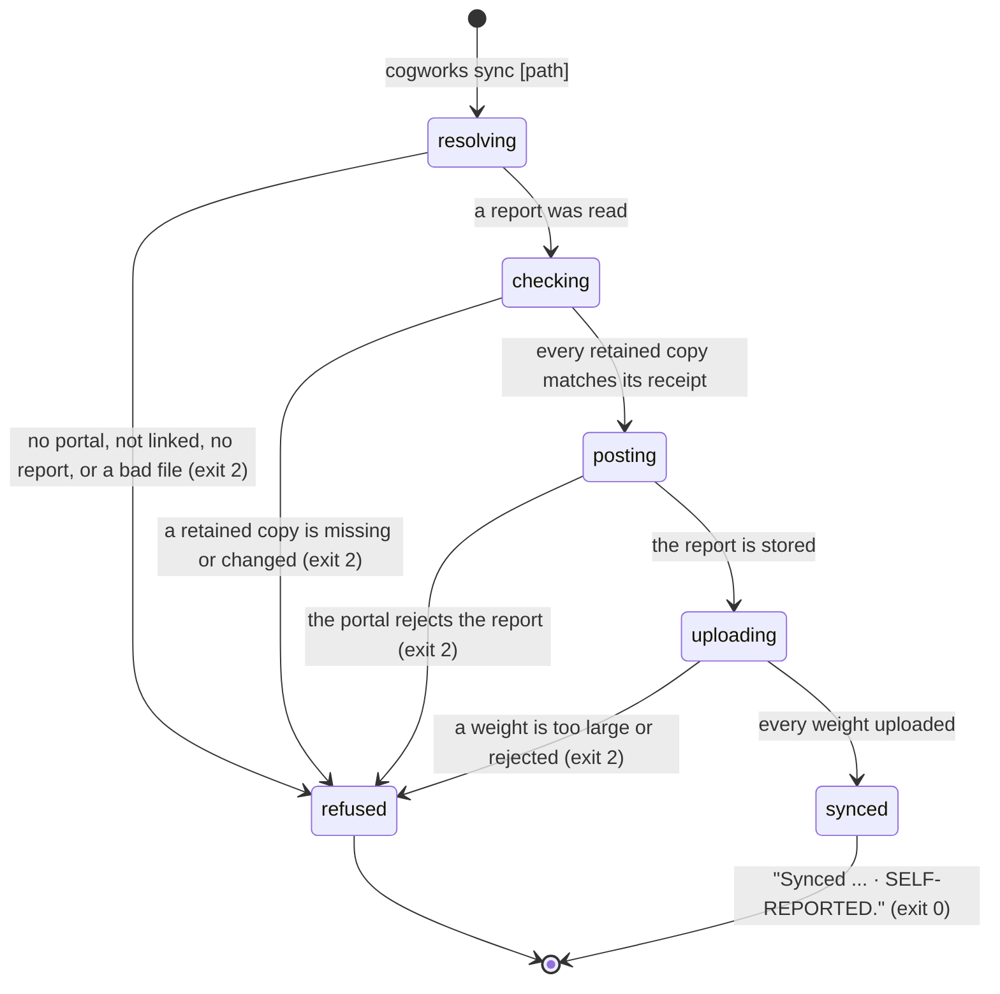

# `cogworks sync`

## Summary

`cogworks sync`, which `cogworks --help` lists as "explicitly sync one local report" (`python/cogbench/src/cogbench/cli.py:117`), takes one report the student's own machine produced and hands it to the portal, where the team sees it marked self-reported. Nothing is uploaded in the background. The one other way a report reaches the portal is the end of a `cogworks run --live`, which sends the report without its weights (see [`run.md`](run.md#how-it-ends)).

It also uploads the trained weights that run scored. `cogworks run` copies each weight file a benchmark loads before loading it and records its path, length and SHA-256; `cogworks sync` uploads those recorded bytes; and a hosted run on the same commit downloads them before scoring. Only Week 3 records weights today. The upload exists because a Week 3 image side cannot be measured without a trained projection, and the Week 3 benchmark tells teams to keep that file out of git and use this path.

The command takes an optional report path and `--portal`. With no path it syncs the most recently modified report in `.cogbench/reports/`. It needs a linked device.

## The simple case

A student who has just run `cogworks run` types `cogworks sync`:

```
Synced local_9f2c1e4a7b3d8065c1f2a9e0b4d7c536 as LOCAL RUN · SELF-REPORTED.
```

Exit 0 (`cli.py:1336`). The label follows the command that made the report, as in [`report.md`](report.md#the-simple-case). The portal stores the metrics, the diagnostics, the commit, whether the tree was dirty, the producing command, and the GitHub login behind the device. The digest of the predictions is stripped before sending (`python/cogbench/src/cogbench/client.py:94`), so the portal receives numbers and sentences, not evidence it could re-check.

A Week 3 report that scored a trained projection prints one line per weight before the confirmation:

```
weights: models/image_projection.npz (411520 bytes) uploaded to weight-objects/cogworksbwsi/team-bagel-2026/a1b2c3d.../9e1f.../models/image_projection.npz
Synced local_9f2c... as LOCAL RUN · SELF-REPORTED.
```

Every scored weight is uploaded, committed or not; the CLI no longer asks git whether a file is tracked. The confirmation prints last, so the last line a student reads is true of the whole command.

## The ask, event by event


```mermaid
stateDiagram-v2
    [*] --> resolving : cogworks sync [path]
    resolving --> refused : no portal, not linked, no report, or a bad file (exit 2)
    resolving --> checking : a report was read
    checking --> refused : a retained copy is missing or changed (exit 2)
    checking --> posting : every retained copy matches its receipt
    posting --> refused : the portal rejects the report (exit 2)
    posting --> uploading : the report is stored
    uploading --> refused : a weight is too large or rejected (exit 2)
    uploading --> synced : every weight uploaded
    synced --> [*] : "Synced ... · SELF-REPORTED." (exit 0)
    refused --> [*]
```

### Asking

The portal resolves by the usual precedence ([`foundations/the-ask.md`](../foundations/the-ask.md#configuration-precedence)), then the saved token: without a live one, "This portal is not linked. Run `cogworks link` first." (`cli.py:1291`).

Then the report: a given path as written, or the newest `local_*.json` by modification time. None found is "No local reports found. Run `cogworks run` first." The file is parsed and its weight receipts validated before anything is sent (`python/cogbench/src/cogbench/models.py:242`).

Which weights belong to the report was decided when the run captured them, so editing the repository between the run and the sync changes nothing that is sent.

### Answered without work

Each of these is one line on stderr and exit 2, with nothing sent:

- No portal, a bad origin, no live token, or no report.
- A report that names weights but carries no receipts, which is what a report from an older CLI looks like: "This report doesn't establish which weight bytes were used. Use an explicit weight input or the retained model loader, then run again before uploading or verifying weights." (`cli.py:1297`).
- A retained copy that is gone: "The retained copy of {path} is missing from this workspace; run the benchmark again to recapture it." (`python/cogbench/src/cogbench/storage.py:421`).
- A retained copy whose bytes changed: "The retained copy of {path} no longer matches the report ({size} bytes, {digest}); run the benchmark again." (`storage.py:428`).

The retained copies live under `.cogbench/weights/{sha256}/{path}` in the project (`storage.py:208`), so deleting `.cogbench/` or syncing from a different checkout lands here. All are checked before the report is posted, so a local failure never leaves a report on the portal naming weights it will not receive (`cli.py:1301`).

### The work begins

When `POST /api/v1/local-reports` is sent. The request retries up to three attempts on 429, 5xx and connection failures (`client.py:95`). Once the portal accepts it, the report is durable and visible to the team, and nothing later in this command removes it.

The report goes first because it publishes the digest each upload is checked against; the portal refuses bytes that are not the ones this run scored.

### While it works

Nothing prints during the report upload. Each weight is then streamed from its retained copy as one `PUT` carrying `Content-Length` and the digest in `X-Cogworks-Weight-SHA256` (`client.py:166`). The timeout is 60 seconds per socket operation, not for the whole transfer, so a large file that keeps moving is not cut off (`client.py:163`). There is no retry and no progress line. The CLI refuses a file over 100 MiB before sending, "Weight files may not exceed 100 MiB: {path}" (`client.py:187`), matching the portal's cap (`packages/contracts/src/protocol.ts:149`). The comment there gives the reason: Workers caps request bodies at 100 MB on some plans, and the largest trained weight in the 2026 corpus is 411 KB.

> Technical note: the portal stores each upload under a key that includes its digest, and passes that digest to R2 so the write fails unless the bytes hash to it. A body shorter or longer than its declared length is refused (`apps/portal/worker/services/weights.ts:251`, `:276`).

### How it ends

Each weight line prints after its upload, then the confirmation, then exit 0.

A failure in the upload phase ends the command with exit 2 and "Failed to sync weight {path}: {message}" (`cli.py:1329`). The report stays synced and the confirmation does not print. The portal's sentences a student can meet here:

- "This portal cannot store trained weights yet. Your report synced; the score stands." when the portal has no storage bound (`apps/portal/worker/routes/local-reports.ts:45`).
- "That report belongs to another account." and "That report does not belong to the uploader's team repository." (`apps/portal/worker/services/local-reports.ts:267`, `:271`).
- "That report does not require an upload for that weight path." and "That report declares a different digest for that weight; sync the report again." (`local-reports.ts:293`, `:296`).
- "The report has no repository revision for this weight." when the run happened outside a git worktree (`local-reports.ts:299`).
- "Weight file did not match its digest." and the two length mismatches (`weights.ts:257`, `:264`, `:271`).

Running `cogworks sync` again is the recovery for all of them: the report upserts and every weight uploads again.

## What a hosted run does with them

When a hosted run is dispatched, the portal takes the newest report any team member synced for the same repository, commit and benchmark (`apps/portal/worker/services/local-reports.ts:319`), and checks that each weight it names is stored with a matching digest (`weights.ts:327`). A report naming more than eight weights is refused. The prepare stage then downloads the files into the project; see [`sandbox/prepare.md`](../sandbox/prepare.md).

The commit is the link. A run on a different commit finds no report and gets no weights, so a team that syncs, pushes one more commit, and starts a hosted run is back to a withheld image score. No screen says so, and the Week 3 sentence that sends teams down this path does not mention the commit: "Keep that weights file out of git. Then run `cogworks run` locally and `cogworks sync`; the hosted run will fetch the weights the local run used." (`benchmarks/week3/language_search_benchmark/roles.py:931` at the pinned submodule commit `94c7e64f`).

When the newest report at that commit names a weight that was never uploaded, the run fails before it starts with "Required weight {path} has not been uploaded; sync the report again." (`weights.ts:369`). `a6eef75` (2026-10-03): the start is now refused with that sentence before any run exists, because a hosted run's job, weights included, is built before it is admitted (`prepareAdmissionJob`, `apps/portal/worker/execution/runner.ts`); nothing is added to the team's history. Two ordinary ways to get there: an upload that failed part way, or a `cogworks run --live` at that commit after the last sync, because a live run stores its report with receipts and uploads no bytes.

## Modifiers

| Modifier | Set before the ask | Changed while it works |
| --- | --- | --- |
| Who you are | The device token decides the account. The report is attributed to that account's login, and uploads are refused unless the report is this account's and names the team's repository. A device whose account has no team is refused with "Finish joining a team and connecting its repository first." | No effect. |
| Where your team and repository stand | The team's list shows reports from its members for its repository, newest 50 (`local-reports.ts:95`). A report from another repository is accepted and not listed. A report made outside a git worktree syncs but cannot carry weights. | No effect. |
| Which week's benchmark | Week 3 is the only week that records weights. Other weeks sync a report and nothing else. | No effect. |
| Practice or leaderboard | A synced report is never promoted or published. The weights change what the next hosted run at that commit can score, and that run can be promoted. | No effect. |
| Flags, options, and where you are typing | `--portal` redirects this one invocation (`cli.py:123`). The path is "saved report file to sync (uses the latest report when omitted)" (`cli.py:121`). No `--json`, no `--dry-run`, and no way to skip the weights. | No effect. |

## Cancel and interrupt

| Event | Before the work begins | While it works |
| --- | --- | --- |
| You stop it yourself | Ctrl+C prints `cogworks: interrupted` and exits 130. Nothing was sent. | After the report is posted, Ctrl+C leaves it synced and some weights uploaded, with no line saying where it stopped. A hosted run at that commit then fails with "Required weight ... has not been uploaded"; running `cogworks sync` again finishes the job. |
| You do something else mid-way | No effect. | A second sync of the same report from the same account upserts the same row. Two first-time syncs racing can get "That report ID is already in use." for the loser (`local-reports.ts:225`). |
| A teammate acts at the same time | No effect. | A teammate's sync at the same commit and benchmark that lands later becomes the report a hosted run uses. |
| The network or the portal fails | Not detected; it surfaces below. | The report post retries three times. Weight uploads do not retry, so one failure ends the command with the report stored and no confirmation. |
| The page or the process goes away | Nothing sent. | Whatever the portal accepted stays; each weight is one complete request or nothing. `sync` writes nothing locally. |
| The thing being measured changes | Editing or deleting the original weight file changes nothing: the retained copy is what uploads. Deleting `.cogbench/weights` stops the sync before anything is sent. | No effect. |
| Refused, or out of credit | Credit is not consulted. Syncing is free and unlimited. | The 100 MiB cap refuses with a sentence; it never truncates. |

## Interactions with other systems

**Who may do this.** Anyone with a live device token whose account is on a team. Uploads are scoped to the report's own account and the team's repository.

**The team owns it.** The report is listed for the team. The weights are stored per repository, commit and digest, so a teammate's hosted run at the same commit uses them.

**Credit.** None. Local practice is unlimited.

**What the portal claims.** Nothing beyond receiving it. See [`foundations/what-the-portal-claims.md`](../foundations/what-the-portal-claims.md#self-reported). The digest check means the weights a hosted run downloads are the bytes the local run scored, which is a claim about provenance, not about the report's numbers.

**What the benchmark supplied.** Uploaded weights are the team's own and do not belong in that disclosure. See [`cross-cutting/what-the-benchmark-supplied.md`](../cross-cutting/what-the-benchmark-supplied.md).

**Live updates and reconnection.** None. `sync` is one-shot.

**Discord.** A synced report can appear in Cog's private local-reports view. Syncing posts nothing to a channel.

**Configuration.** `--portal`, then `COGPORTAL_URL`, then the saved portal.

## Edge cases

- **Weights reach only a hosted run at the same commit.** See above; B-08.
- **The setup page understates what goes up.** Its "Link this device" note says `sync` uploads a report "with any weight file it used that isn't already in your commit" (`apps/portal/src/routes/SetupPage.tsx:236`). Every scored weight is uploaded, committed or not.
- **The report is chosen by modification time.** Touching or copying a report file changes which one a bare `cogworks sync` picks.
- **`outputDigest` is stripped and the file keeps it,** so the local file always holds one field the portal never sees.
- **A report file that is valid JSON but incomplete** gives a traceback and exit 1, as in [`report.md`](report.md#edge-cases).
- **On the candidate's setup-page CLI** (`40d31a2`) the confirmation reads "as LOCAL · SELF-REPORTED." and the portal stores no producing command, because that CLI does not record one.

## Open questions and verification

- Weights keyed to a commit with no word about it on any screen (B-08).
- A `cogworks run --live` after a sync can leave the newest report at that commit naming weights that were never uploaded, and the next hosted run fails before starting. Read from code; new triage item.
- The setup page's sync sentence contradicts the CLI. New triage item, low.
- No progress line during an upload. With the 100 MiB cap and a 411 KB largest corpus weight this matters less than it did; no upload was timed.
- Hosted beta (`4984730`) has the same sync code; it differs only in the CLI its setup page installs (`b6bbffb`, beta `apps/portal/src/lib/benchmark-packages.ts:41`).
- Nothing here was run against a portal.

Read against Cog\*Portal commit `2ff32fa`.
